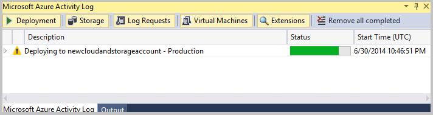

<properties
   pageTitle="Comment migrer et de publier une Application Web à un Service Cloud Azure dans Visual Studio | Microsoft Azure"
   description="Découvrez comment migrer et publiez votre application web à un service cloud Azure à l’aide de Visual Studio."
   services="visual-studio-online"
   documentationCenter="na"
   authors="TomArcher"
   manager="douge"
   editor="" />
<tags
   ms.service="multiple"
   ms.devlang="dotnet"
   ms.topic="article"
   ms.tgt_pltfrm="na"
   ms.workload="multiple"
   ms.date="08/15/2016"
   ms.author="tarcher" />

# <a name="how-to-migrate-and-publish-a-web-application-to-an-azure-cloud-service-from-visual-studio"></a>Comment : migrer et de publier une Application Web à un Service Cloud Azure à partir de Visual Studio

Pour tirer parti des services d’hébergement et extensibilité élevées d’Azure, vous souhaiterez peut-être migrer et publiez votre application web à un service cloud Azure. Vous pouvez exécuter une application web dans Azure avec peu de modifications à votre application existante.

>[AZURE.NOTE] Cette rubrique concerne déploiement aux services cloud, pas aux sites web. Pour plus d’informations sur le déploiement sur des sites web, voir [déployer une application web dans le Service d’application Azure](./app-service-web/web-sites-deploy.md).

Pour obtenir la liste de modèles spécifiques qui sont prises en charge pour c# et Visual Basic, consultez la section **Pris en charge les modèles de projet** plus loin dans cette rubrique.

Vous devez d’abord activer votre application web pour Azure à partir de Visual Studio. L’illustration suivante montre les étapes clés pour publier votre application web existante en ajoutant un projet à utiliser pour le déploiement d’Azure. Ce processus ajoute un projet Azure avec le rôle web nécessaires à votre solution. En fonction du type de projet web que vous avez, les propriétés du projet pour les assemblys sont également mis à jour si le package de service nécessite des assemblys supplémentaires pour le déploiement.


>[AZURE.NOTE] **Convertir**, commande **convertir le projet de Service Cloud Azure** s’affiche uniquement pour le projet web de votre solution. Par exemple, la commande n’est pas disponible pour un projet Silverlight dans votre solution.
Lorsque vous créez un package de service ou publiez votre application sur Azure, avertissements ou des erreurs peuvent se produire. Ces erreurs et les avertissements peuvent vous aider à résoudre les problèmes avant de déployer sur Azure. Par exemple, vous pouvez recevoir un avertissement concernant un assembly manquant. Pour plus d’informations sur la façon de traiter tous les avertissements comme des erreurs, voir [configurer un projet de Service Cloud Azure avec Visual Studio](vs-azure-tools-configuring-an-azure-project.md). Si vous créez votre application, exécutez localement à l’aide de l’émulateur cluster ou publiez sur Azure, l’erreur suivante dans la fenêtre **Liste d’erreurs** peut s’afficher : **le chemin d’accès spécifié, nom de fichier ou les deux sont trop longues**. Cette erreur se produit car la longueur du nom du projet Azure complet est trop longue. La longueur du nom du projet, y compris le chemin d’accès complet, ne peuvent pas être 146 plus de caractères. Par exemple, c’est le nom de projet complet, y compris le chemin d’accès pour un projet Azure qui est créé pour une application Silverlight : `c:\users\<user name>\documents\visual studio 2015\Projects\SilverlightApplication4\SilverlightApplication4.Web.Azure.ccproj`. Vous devrez peut-être déplacer votre solution vers un autre répertoire possédant un chemin d’accès plus court pour réduire la longueur du nom du projet complet.

Pour migrer et publier une application web vers Azure à partir de Visual Studio, procédez comme suit.

## <a name="enable-a-web-application-for-deployment-to-azure"></a>Activer une Application Web pour le déploiement sur Azure

### <a name="to-enable-a-web-application-for-deployment-to-azure"></a>Pour activer une application web pour le déploiement sur Azure

1. Pour permettre à votre application web pour le déploiement sur Azure, ouvrir le menu contextuel pour un projet web de votre solution et choisissez Ajouter un projet de déploiement Azure.

    Les actions suivantes se produisent :

    - Un projet Azure appelé `<name of the web project>.Azure` est ajouté à la solution pour votre application.

    - Un rôle web pour le projet web est ajouté à ce projet Azure.

    - La propriété **Copie locale** est définie sur true pour tous les assemblys requis pour MVC MVC 2, MVC 3, 4 et les Applications de gestion de Silverlight. Ces assemblys est ajouté le package de service qui est utilisé pour le déploiement.

  >[AZURE.IMPORTANT] Si vous avez d’autres assemblys ou les fichiers requis pour cette application web, vous devez définir manuellement les propriétés de ces fichiers. Pour plus d’informations sur la définition de ces propriétés, consultez la section **Inclure les fichiers dans le Package de Service** plus loin dans cet article.

  >[AZURE.NOTE] S’il existe déjà un rôle web pour un projet web spécifique dans un projet Azure dans la solution, **convertir**, **convertir le projet de Service Cloud Azure** s’affiche pas dans le menu contextuel pour ce projet web.

  Si vous avez plusieurs projets web dans votre application web et que vous voulez créer des rôles web pour chaque projet web, vous devez effectuer les étapes de cette procédure pour chaque projet web. Cela crée des projets Azure distincts pour chaque rôle web. Chaque projet web pouvant être publié séparément. Par ailleurs, vous pouvez manuellement ajouter un autre rôle web à un projet existant Azure dans votre application web. Pour ce faire, ouvrir le menu contextuel du dossier **rôles** dans votre projet Azure, choisissez **Ajouter**, puis sur **Le projet de rôle Web dans la solution**, choisissez le projet à ajouter comme un rôle web, puis cliquez sur le bouton **OK** .

## <a name="use-an-azure-sql-database-for-your-application"></a>Utiliser une base de données SQL Azure pour votre Application

Si vous avez une chaîne de connexion pour votre application web qui utilise une base de données SQL Server qui se trouve sur le site, vous devez modifier cette chaîne de connexion à utiliser une instance de base de données SQL Azure hébergeant à la place.

>[AZURE.IMPORTANT] Votre abonnement doit activer vous permet d’utiliser la base de données SQL. Si vous accédez à votre abonnement à partir du [portail classique Azure](http://go.microsoft.com/fwlink/?LinkID=213885), vous pouvez déterminer quels services fournit de votre abonnement. Les instructions suivantes s’appliquent au finale [Azure portal classique](http://go.microsoft.com/fwlink/?LinkID=213885). Si vous utilisez le [portail Azure](http://portal.microsoft.com), passez à la procédure suivante.

### <a name="to-use-a-sql-database-instance-in-your-web-role-for-your-connection-string"></a>Pour utiliser une instance de base de données SQL dans votre rôle web à votre chaîne de connexion

1. Pour créer une instance de base de données SQL dans le [portail classique Azure](http://go.microsoft.com/fwlink/?LinkID=213885), suivez les étapes décrites dans l’article suivant : [créer une base de données SQL Server](http://go.microsoft.com/fwlink/?LinkId=225109).

    >[AZURE.NOTE] Lorsque vous configurez les règles de pare-feu pour l’instance de base de données SQL, vous devez sélectionner la case à cocher **Autoriser d’autres services Azure à accéder à ce serveur** .

1. Pour créer une instance de base de données SQL à utiliser pour votre chaîne de connexion, suivez les étapes décrites dans la section suivante dans l’article suivant : [créer une base de données SQL](http://go.microsoft.com/fwlink/?LinkId=225110).

1. Pour copier la chaîne de connexion ADO.NET à utiliser pour votre chaîne de connexion, effectuez les opérations suivantes dans le [portail classique Azure](http://go.microsoft.com/fwlink/?LinkID=213885).  

  1. Cliquez sur le bouton de la **base de données** et ouvrez le nœud de l’abonnement que vous avez utilisé pour créer votre instance de base de données SQL.

  1. Pour afficher les instances de base de données SQL disponibles, choisissez le nœud **Bases de données SQL** .

  1. Pour afficher les propriétés de la base de données, choisissez la base de données. La vue **Propriétés** s’affiche.

      >[AZURE.NOTE] Si l’affichage de **Propriétés** n’apparaît pas, vous devrez peut-être ouvrir à l’aide de la barre de fractionnement.

  1. Pour afficher les chaînes de connexion, cliquez sur le bouton points de suspension (...) en regard de l’affichage.

    La boîte de dialogue **Chaînes de connexion** s’affiche.

  1. Pour copier la chaîne de connexion ADO.NET, surlignez le texte, puis cliquez sur les touches Ctrl + C.

  1. Pour fermer la boîte de dialogue, cliquez sur le bouton **Fermer** .

1. Pour remplacer la chaîne de connexion dans le fichier web.config pour utiliser cette instance de base de données SQL, ouvrez le fichier web.config, mettez en surbrillance l’entrée de chaîne de connexion existante, puis sur les touches Ctrl + V. La chaîne de connexion ADO.NET pour l’instance de base de données SQL remplace la chaîne de connexion existante.

1. Vous devez également ajouter le paramètre `MultipleActiveResultSets=True` à la chaîne de connexion. La chaîne de connexion doit avoir le format suivant :

    ```
    connectionString=”Server=tcp:<database_server>.database.windows.net,1433;Database=<database_name>;User ID=<user_name>@<database_server>;Password=<myPassword>;Trusted_Connection=False;Encrypt=True;MultipleActiveResultSets=True"
    ```

1. (Facultatif) Une autre méthode par la modification de la chaîne de connexion directement dans le fichier web.config est d’ajouter une section dans un des fichiers de transformation web.config, selon la configuration de génération qui vous permet de créer votre package de services. Ouvrez le fichier Web.Debug.Config ou le fichier Web.Release.Config. Ajoutez la section suivante dans ce fichier :

    ```
    XMLCopy<connectionStrings><addname="DefaultConnection"connectionString="Server=tcp:<database_server>.database.windows.net,1433;Database=<database_name>;User ID=<user_name>@<database_server>;Password=<myPassword>;Trusted_Connection=False;Encrypt=True;MultipleActiveResultSets=True"xdt:Transform="SetAttributes"xdt:Locator="Match(name)"/></connectionStrings>
    ```

1. Enregistrez le fichier que vous avez modifié et republiez votre application.

### <a name="to-use-an-instance-of-sql-database-by-using-the-azure-classic-portal"></a>Pour utiliser une instance de base de données SQL à l’aide du portail classique Azure

1. Dans le [portail classique Azure](http://go.microsoft.com/fwlink/?LinkID=213885), choisissez le nœud bases de données SQL.

  - Si l’instance de base de données SQL que vous voulez utiliser apparaît, choisissez pour l’ouvrir.

  - Si vous n’avez pas créé de toutes les instances, cliquez sur le lien approprié, puis créez une instance.

1. Une fois que vous ouvrez ou créez une instance de base de données, cliquez sur le lien de **Chaînes de connexion** .

1. Dans la partie inférieure de la page, cliquez sur le lien pour configurer les paramètres de pare-feu et acceptez les valeurs par défaut ou configurer les valeurs dont vous avez besoin.

1. Copiez la chaîne de connexion ADO.NET, collez-le dans votre fichier web.config au-dessus de la chaîne de connexion ancien pour la base de données locale et veillez à ajouter `MultipleActiveResultSets=True`.

## <a name="publish-a-web-application-to-azure"></a>Publier une Application Web vers Azure

### <a name="to-publish-a-web-application-to-azure"></a>Pour publier une application Web vers Azure

1. Pour tester l’application dans le développement local environnement à l’aide de la Azure calcule émulateur, ouvrez le menu contextuel pour le projet Azure pour le rôle web et sélectionnez **définir comme projet de démarrage**. Puis cliquez sur **Déboguer**, **Démarrer le débogage** (clavier : **F5**).

    La boîte de dialogue **Démarrer l’environnement de débogage Azure** s’ouvre et démarrage de l’application dans le navigateur. Pour plus d’informations spécifiques sur le démarrage de chaque type d’application web dans l’émulateur cluster, voir le tableau dans cette section.

1. Pour configurer les services pour votre application publier sur Azure, vous devez disposer d’un compte Microsoft et un abonnement Azure. Suivez les étapes dans la rubrique suivante pour configurer vos services : [préparer pour publier ou déployer une application Azure depuis Visual Studio](vs-azure-tools-cloud-service-publish-set-up-required-services-in-visual-studio.md).

1. Pour publier l’application web vers Azure, ouvrir le menu contextuel pour le projet web et choisissez **publier sur Azure**.

    La boîte de dialogue **Publier Azure Application** s’ouvre et Visual Studio démarre le processus de déploiement. Pour plus d’informations sur la publication de l’application, consultez la section **publier une Application Azure à partir de Visual Studio** dans [la publication d’un Service en nuage en utilisant les outils Azure](vs-azure-tools-publishing-a-cloud-service.md).

    >[AZURE.NOTE] Vous pouvez également publier à l’application web à partir du projet Azure. Pour ce faire, ouvrez le menu contextuel pour le projet Azure et choisissez **Publier**.

1. Pour afficher la progression du déploiement, vous pouvez afficher la fenêtre du **Journal d’activité Azure** . Ce journal s’affiche automatiquement au démarrage du processus de déploiement. Vous pouvez développer l’élément de ligne dans le journal d’activité pour afficher des informations détaillées, comme le montre l’illustration suivante :

    

1. (Facultatif) Pour annuler le processus de déploiement, ouvrez le menu contextuel pour la ligne dans le journal d’activité, puis sélectionnez **Annuler et supprimer**. Cela arrête le processus de déploiement et supprime l’environnement de déploiement d’Azure.

    >[AZURE.NOTE] Pour supprimer cet environnement déploiement après que qu’il a été déployé, vous devez utiliser le [portail classique Azure](http://go.microsoft.com/fwlink/?LinkID=213885).

1. (Facultatif) Une fois que vos instances de rôles ont commencé, Visual Studio affiche automatiquement l’environnement de déploiement dans le nœud **De calcul Azure** **Cloud Explorer** ou **l’Explorateur de serveurs**. À partir de là, vous pouvez afficher l’état des instances de rôle individuels.

    L’illustration suivante montre les instances de rôle dans **l’Explorateur de serveurs** lorsqu’ils sont toujours dans l’état de l’initialisation :

    

1. Pour accéder à votre application après le déploiement, cliquez sur la flèche en regard de votre déploiement lorsque l’état **est terminé** apparaît dans le **journal d’activité Azure**. Cela permet d’afficher l’URL de votre application web dans Azure. Consultez le tableau suivant pour obtenir des informations sur le démarrage d’un type spécifique d’application web à partir d’Azure.

    Le tableau suivant répertorie les détails sur la façon de démarrer des applications web spécifiques à partir d’Azure ou d’exécuter ou déboguer une application web localement à l’aide de l’émulateur de calcul Azure :

  	|Type d’Application Web|Exécuter/déboguer localement à l’aide de l’émulateur de calcul|En cours d’exécution dans Azure|
  	|---|---|---|
  	|Application Web ASP.NET|Dans la barre de menus, choisissez **Déboguer**, **Démarrer le débogage** (clavier : cliquez sur la touche **F5** .).|Cliquez sur le lien hypertexte URL affiché dans l’onglet **déploiement** pour le **journal d’activité Azure** charger la page de démarrage dans le navigateur.|
  	|Application Web ASP.NET MVC 2|Dans la barre de menus, choisissez **Déboguer**, **Démarrer le débogage** (clavier : cliquez sur la touche **F5** .).|Cliquez sur le lien hypertexte URL affiché dans l’onglet **déploiement** pour le **journal d’activité Azure** charger la page de démarrage dans le navigateur.|
  	|Application Web ASP.NET MVC 3|Dans la barre de menus, choisissez **Déboguer**, **Démarrer le débogage** (clavier : cliquez sur la touche **F5** .).|Cliquez sur le lien hypertexte URL affiché dans l’onglet **déploiement** pour le **journal d’activité Azure** charger la page de démarrage dans le navigateur.|
  	|Application Web ASP.NET MVC 4|Dans la barre de menus, choisissez **Déboguer**, **Démarrer le débogage** (clavier : cliquez sur la touche **F5** .).|Cliquez sur le lien hypertexte URL affiché dans l’onglet **déploiement** pour le **journal d’activité Azure** charger la page de démarrage dans le navigateur.|
  	|Application Web ASP.NET vide|Vous devez ajouter une page .aspx dans l’application que vous avez défini comme la page de démarrage pour votre projet web. Dans la barre de menus, puis **Déboguer**, **Démarrer le débogage** (clavier : cliquez sur la touche **F5** .).|Si vous avez une page .aspx par défaut dans votre application, cliquez sur le lien hypertexte URL affiché dans l’onglet **déploiement** pour le **journal d’activité Azure** et cette page est chargée dans le navigateur. Si vous avez une page .aspx différents, vous devez accéder à cette page spécifique au format suivant pour l’url de votre :`<url for deployment>/<name of page>.aspx`|
  	|Application Silverlight|Dans la barre de menus, choisissez **Déboguer**, **Démarrer le débogage** (clavier : cliquez sur la touche **F5** .).|Vous devez accéder à la page pour votre application en utilisant le format suivant pour votre url spécifique :`<url for deployment>/<name of page>.aspx`|
  	|Application de gestion de Silverlight|Dans la barre de menus, choisissez **Déboguer**, **Démarrer le débogage** (clavier : cliquez sur la touche **F5** .).|Vous devez accéder à la page pour votre application en utilisant le format suivant pour votre url spécifique :`<url for deployment>/<name of page>.aspx`|
  	|Application de Navigation Silverlight|Dans la barre de menus, choisissez **Déboguer**, **Démarrer le débogage** (clavier : cliquez sur la touche **F5** .).|Vous devez accéder à la page pour votre application en utilisant le format suivant pour votre url spécifique :`<url for deployment>/<name of page>.aspx`|
  	|Application de Service WCF|Vous devez définir le fichier .svc comme page de démarrage pour votre projet de Service WCF. Dans la barre de menus, puis **Déboguer**, **Démarrer le débogage** (clavier : cliquez sur la touche **F5** .).|Vous devez accéder au fichier svc pour votre application en utilisant le format suivant pour votre url :`<url for deployment>/<name of service file>.svc`|
  	|Application de Service WCF du flux de travail|Vous devez définir le fichier .svc comme page de démarrage pour votre projet de Service WCF. Dans la barre de menus, puis **Déboguer**, **Démarrer le débogage** (clavier : cliquez sur la touche **F5** .).|Vous devez accéder au fichier svc pour votre application en utilisant le format suivant pour votre url :`<url for deployment>/<name of service file>.svc`|
  	|Entités Dynamic ASP.NET|Dans la barre de menus, choisissez **Déboguer**, **Démarrer le débogage** (clavier : cliquez sur la touche **F5** .).|Vous devez mettre à jour la chaîne de connexion (voir la section suivante). Vous devez également permettant d’accéder à la page pour votre application en utilisant le format suivant pour votre url spécifique :`<url for deployment>/<name of page>.aspx`|
  	|ASP.NET Dynamic Data ASP.NET Linq à SQL|Dans la barre de menus, choisissez **Déboguer**, **Démarrer le débogage** (clavier : cliquez sur la touche **F5** .).|Vous devez suivre les étapes décrites dans cette procédure : utiliser une base de données SQL Azure pour votre application (voir la section précédente dans cette rubrique). Vous devez également permettant d’accéder à la page pour votre application en utilisant le format suivant pour votre url spécifique :`<url for deployment>/<name of page>.aspx`|

## <a name="update-a-connection-string-for-aspnet-dynamic-entities"></a>Mise à jour une chaîne de connexion pour entités Dynamic ASP.NET

### <a name="to-update-a-connection-string-for-aspnet-dynamic-entities"></a>Mettre à jour une chaîne de connexion pour entités Dynamic ASP.NET

1. Pour créer une base de données SQL Azure qui peut être utilisé pour une application web ASP.NET dynamique entités, suivez les étapes décrites dans la procédure **utiliser une base de données SQL Azure pour votre application** précédemment dans cette rubrique.

1. Ajoutez les tables et les champs dont vous avez besoin pour cette base de données à partir du [portail classique Azure](http://go.microsoft.com/fwlink/?LinkID=213885).

1. Chaîne de connexion pour ce type d’application a le format suivant dans le fichier web.config :  

    ```
    <addname="tempdbEntities"connectionString="metadata=res://*/Model1.csdl|res://*/Model1.ssdl|res://*/Model1.msl;provider=System.Data.SqlClient;provider connection string=&quot;data source=<server name>\SQLEXPRESS;initial catalog=<database name>;integrated security=True;multipleactiveresultsets=True;App=EntityFramework&quot;"providerName="System.Data.EntityClient"/>
    ```

    Mettre à jour la valeur *connectionString* avec la chaîne de connexion ADO.NET pour votre base de données SQL Azure comme suit :

    ```
    XMLCopy<addname="tempdbEntities"connectionString="metadata=res://*/Model1.csdl|res://*/Model1.ssdl|res://*/Model1.msl;provider=System.Data.SqlClient;provider connection string=&quot;Server=tcp:<SQL Azure server name>.database.windows.net,1433;Database=<database name>;User ID=<user name>;Password=<password>;Trusted_Connection=False;Encrypt=True;multipleactiveresultsets=True;App=EntityFramework&quot;"providerName="System.Data.EntityClient"/>
    ```

1. Pour enregistrer le fichier web.config avec les modifications que vous avez apportées à la chaîne de connexion, dans la barre de menus choisissez **fichier**, **enregistrez ce fichier**.

## <a name="supported-project-templates"></a>Modèles de projet pris en charge

Pour publier une application web sur Azure, l’application doit utiliser un des modèles de projet pour c# ou Visual Basic, qui est répertorié dans le tableau ci-dessous.

|Groupe de modèle de projet|Modèle de projet|
|---|---|
|Web|Application Web ASP.NET|
|Web|Application Web ASP.NET MVC 2|
|Web|Application Web ASP.NET MVC 3|
|Web|Application Web ASP.NET MVC4|
|Web|Application Web ASP.NET vide|
|Web|Application Web vide ASP.NET MVC 2|
|Web|Application Web entités Dynamic Data ASP.NET|
|Web|Dynamic ASP.NET données Linq à Application Web SQL|
|Silverlight|Application Silverlight|
|Silverlight|Application de gestion de Silverlight|
|Silverlight|Application de Navigation Silverlight|
|WCF|Application de Service WCF|
|WCF|Application de Service WCF du flux de travail|
|Flux de travail|Application de Service WCF du flux de travail|

## <a name="next-steps"></a>Étapes suivantes
Pour plus d’informations sur la publication, voir [préparer permettant de publier ou déployer une Application Azure à partir de Visual Studio](vs-azure-tools-cloud-service-publish-set-up-required-services-in-visual-studio.md). Consultez également [Paramètre la nommé informations d’identification](vs-azure-tools-setting-up-named-authentication-credentials.md).
