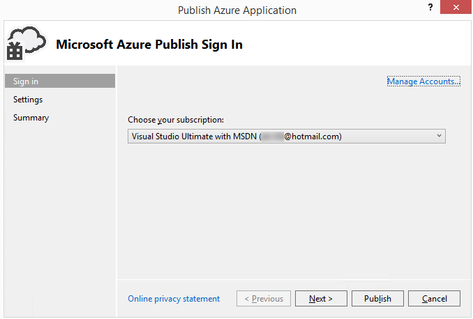

<properties 
   pageTitle="Assistant Application Azure | Microsoft Azure"
   description="Publier Assistant Application Azure"
   services="visual-studio-online"
   documentationCenter="na"
   authors="TomArcher"
   manager="douge"
   editor="" />
<tags 
   ms.service="multiple"
   ms.devlang="multiple"
   ms.topic="article"
   ms.tgt_pltfrm="na"
   ms.workload="na"
   ms.date="08/15/2016"
   ms.author="tarcher" />

# Publier Assistant Application Azure

## Vue d’ensemble

Une fois que vous développez une application web dans Visual Studio, vous pouvez publier cette application plus facilement à un service cloud Azure à l’aide de l’Assistant **Application de Azure publier** . La première section décrit les étapes que vous devez effectuer avant que vous utilisez l’Assistant et les sections restantes décrivent les fonctionnalités de l’Assistant.

>[AZURE.NOTE] Cette rubrique concerne déploiement aux services cloud, pas aux sites web. Pour plus d’informations sur le déploiement sur des sites web, voir [comment déployer un Site Web Azure](https://social.msdn.microsoft.com/Search/windowsazure?query=How%20to%20Deploy%20an%20Azure%20Web%20Site&Refinement=138&ac=4#refinementChanges=117&pageNumber=1&showMore=false).

## Conditions préalables

Avant de pouvoir publier votre application web vers Azure, vous devez disposer d’un compte Microsoft et un abonnement Azure, et vous devez associer votre application web à un service cloud Azure. Si vous avez déjà effectué ces tâches, vous pouvez passer à la section suivante.

1. Obtenir un compte Microsoft et un abonnement Azure. Vous pouvez essayer un abonnement Azure gratuit gratuit d’un mois suivant [ici](https://azure.microsoft.com/pricing/free-trial/)

1. Créer un service cloud et un compte de stockage sur Azure. Vous pouvez le faire à partir de l’Explorateur de serveurs dans Visual Studio, ou à l’aide du [portail classique Azure](http://go.microsoft.com/fwlink/?LinkID=213885).

1. Permettez à votre application web pour Azure. Pour permettre à votre application web doit être publié sur Azure à partir de Visual Studio, vous devez associer à un projet de service cloud Azure dans Visual Studio. Pour créer le projet de service cloud associé, ouvrir le menu contextuel pour le projet pour votre application web, puis sur Convertir, **convertir le projet de Service Cloud Azure**.

1. Une fois que le projet de service cloud est ajouté à votre solution, ouvrez à nouveau le même menu contextuel, puis sur **Publier**. Pour plus d’informations sur l’activation des applications pour Azure, voir [Comment : migrer et de publier une Application Web à un Service Cloud Azure à partir de Visual Studio](https://msdn.microsoft.com/library/azure/hh420322.aspx).

>[AZURE.NOTE] Veillez à démarrer Visual Studio en tant qu’administrateur (exécuter en tant qu’administrateur).

1. Lorsque vous êtes prêt à publier votre application, ouvrez le menu contextuel pour le projet de service cloud Azure, puis sur **Publier**. Les étapes suivantes indiquent l’Assistant Application de Azure publier.

## Choix de votre abonnement

### Pour choisir un abonnement

1. Avant d’utiliser l’Assistant pour la première fois, vous devez vous connecter. Cliquez sur le lien **Sign In** . Connectez-vous au portail Azure lorsque vous y êtes invité, puis fournir votre nom d’utilisateur Azure et le mot de passe. 

    

    La liste des abonnements remplit avec les abonnements associés à votre compte. Vous pouvez également voir abonnements à partir de n’importe quel fichiers d’abonnement que vous avez importé précédemment.

1. Dans la liste **Choisir votre abonnement** , sélectionnez l’abonnement à utiliser pour ce déploiement.

   Si vous choisissez **< gérer... >**, la boîte de dialogue **Gérer les abonnements** apparaît et vous pouvez choisir le compte d’utilisateur et d’abonnement que vous voulez utiliser. L’onglet **comptes** affiche tous vos comptes et l’onglet **abonnements** affiche tous les abonnements associés avec les comptes. Vous pouvez également choisir une région à partir de laquelle utiliser les ressources Azure, ainsi que créer ou importer des certificats pour votre abonnement à partir du portail Azure. Si vous avez importé tous les abonnements à partir d’un fichier d’abonnement, les certificats associées seront affichent sous l’onglet **certificats** . Lorsque vous avez terminé, cliquez sur le bouton **Fermer** .

    

    >[AZURE.NOTE] Un fichier d’abonnement peut contenir plusieurs abonnements.

1. Cliquez sur le bouton **suivant** pour continuer. 

    Si des services cloud n’apparaissent pas dans votre abonnement, vous devez créer un service cloud dans Azure pour héberger votre projet. La boîte de dialogue **créer un Service Cloud et compte de stockage** s’affiche.

    Spécifiez un nouveau nom pour le service cloud. Le nom doit être unique dans Azure. Puis spécifiez une région ou groupe affinité d’un centre de données qui se trouve à proximité vous ou la plupart de vos clients. Ce nom est également utilisé pour un nouveau compte de stockage Azure crée pour votre service cloud.

1. Modifier les paramètres souhaités pour ce déploiement, puis le publier en cliquant sur le bouton **Publier** (la section suivante fournit davantage de détails sur les différents paramètres). Pour passer en revue les paramètres avant la publication, cliquez sur le bouton **suivant** .

    >[AZURE.NOTE] Si vous avez choisi de publier dans cette étape, vous pouvez surveiller l’état de ce déploiement dans Visual Studio.

Vous pouvez modifier les paramètres avancés et courants pour un déploiement à l’aide de l’Assistant **Application de Azure publier** . Par exemple, vous pouvez choisir un paramètre à déployer votre application dans un environnement de test avant de la diffuser. L’illustration suivante montre l’onglet **Paramètres communs** pour un déploiement d’Azure.

## Configuration de vos paramètres de publication

### Pour configurer les paramètres de publication

1. Dans la liste des **services Cloud** , effectuez l’une des ensembles d’étapes suivantes :

   1. Dans la zone de liste déroulante, choisissez un service cloud existant. L’emplacement du centre de données pour le service apparaît. Vous devez note de cet emplacement et assurez-vous que votre emplacement de compte de stockage se trouve dans le même centre de données.

    1. Sélectionnez **Créer un nouveau** pour créer un service cloud qui héberge Azure. Dans la boîte de dialogue **Créer un Service Cloud** , indiquez un nom pour le service et spécifiez une région ou groupe affinité pour spécifier l’emplacement du centre de données que vous souhaitez héberger ce service cloud. Le nom doit être unique dans Azure.

1. Dans la liste **environnement** , choisissez **Production** ou **intermédiaire**. Sélectionnez l’environnement intermédiaire si vous voulez déployer votre application dans un environnement de test. Vous pouvez déplacer votre application dans l’environnement de production ultérieurement.

1. Dans la liste **configuration de génération** , choisissez **Déboguer** ou **Release**.

1. Dans la liste de **configuration du Service** , choisissez **Cloud** ou **Local**.

    Activez la case à cocher **Activer le Bureau à distance pour tous les rôles** si vous voulez être en mesure de se connecter à distance au service. Cette option est utilisée principalement pour résoudre les problèmes. Lorsque vous sélectionnez cette case à cocher, la boîte de dialogue **Configuration de bureau à distance** s’affiche. Cliquez sur le lien paramètres pour modifier la configuration.

    Activez la case à cocher **Activer le déploiement Web pour tous les rôles web** pour activer le déploiement web pour le service. Vous devez activer Bureau à distance utiliser cette fonctionnalité. Pour plus d’informations, voir [[publication d’un Service de nuage en utilisant les outils Azure](https://msdn.microsoft.com/library/azure/ff683672.aspx)](https://msdn.microsoft.com/library/azure/ff683672.aspx). Pour plus d’informations sur le déploiement Web, voir [[publication d’un Service de nuage en utilisant les outils Azure](https://msdn.microsoft.com/library/azure/ff683672.aspx)](https://msdn.microsoft.com/library/azure/ff683672.aspx).

1. Sélectionnez l’onglet **Paramètres avancés** . Dans le champ **étiquette de déploiement** , acceptez le nom par défaut, ou entrez un nom de votre choix. Pour ajouter la date à l’étiquette de déploiement, laissez la case à cocher.

    

1. Dans la liste **compte de stockage** , sélectionnez le compte de stockage à utiliser pour ce déploiement. Comparez les emplacements des centres de données pour votre service cloud et votre compte de stockage. Dans l’idéal, ces emplacements doivent être identiques.

    >[AZURE.NOTE] Le compte de stockage Azure stocke le package pour le déploiement des applications. Une fois que l’application est déployée, le package est supprimé à partir du compte de stockage.

1. Activez la case à cocher **déploiement mise à jour** si vous voulez déployer uniquement les composants mis à jour. Ce type de déploiement peut être plus rapide qu’un déploiement complet. Cliquez sur le lien **paramètres** pour ouvrir la boîte de dialogue **mettre à jour les paramètres de déploiement** indiquée dans l’illustration suivante. 

    

    Vous pouvez choisir une des deux options pour le déploiement de mise à jour, incrémentiel ou simultanément. Un déploiement incrémentiel met à jour une instance déployée à la fois, afin que votre application reste en ligne et disponible pour les utilisateurs. Un déploiement sonnerie met à jour toutes les instances déployés en même temps. Mise à jour simultanée est plus rapide que la mise à jour incrémentiel, mais si vous choisissez cette option, votre application ne soient pas disponible au cours du processus de mise à jour.

    Vous devez sélectionner la case à cocher si déploiement ne peut pas être mis à jour, effectuez un déploiement complet si vous souhaitez que le déploiement complet pour avoir lieu automatiquement en cas d’échec un déploiement de mise à jour. Un déploiement complet réinitialise l’adresse IP virtuelle (VIP) pour le service cloud. Pour plus d’informations, voir [Comment : conserver une adresse IP virtuelle constante d’un Service Cloud](https://msdn.microsoft.com/library/azure/jj614593.aspx).

1. Pour déboguer votre service, activez la case à cocher **Activer IntelliTrace** , ou si vous déployez une configuration **Déboguer** et que vous souhaitez déboguer votre service cloud dans Azure, activez la case à cocher **Activer le débogueur distant pour tous les rôles** pour déployer les services de débogage à distance.

2. Pour l’application de profil, activez la case à cocher **Activer le profil** et puis cliquez sur le lien **paramètres** pour afficher les options de profilage. 

    >[AZURE.NOTE] Vous devez utiliser Visual Studio intégrale activer IntelliTrace ou couche Interaction profil TIP (), et vous ne pouvez pas activer les deux simultanément.

    Pour plus d’informations, consultez [débogage d’un Service Cloud publié avec IntelliTrace et Visual Studio](https://msdn.microsoft.com/library/azure/ff683671.aspx) et [tester les performances d’un Service Cloud](https://msdn.microsoft.com/library/azure/hh369930.aspx).

1. Cliquez sur **suivant** pour afficher la page Résumé de l’application.

## Publication de votre Application

1. Vous pouvez choisir de créer un profil de publication à partir des paramètres que vous avez choisi. Par exemple, vous pouvez créer un profil pour un environnement de test et l’autre pour production. Pour enregistrer ce profil, cliquez sur l’icône **Enregistrer** . L’Assistant crée le profil et enregistre dans le projet Visual Studio. Pour modifier le nom du profil, ouvrez la liste des **profils cible** , puis sélectionnez puis **< gérer... >**.

    

    >[AZURE.NOTE] Le profil de publication s’affiche dans l’Explorateur de solutions dans Visual Studio, et les paramètres de profil sont écrits dans un fichier avec une extension .azurePubxml. Paramètres sont enregistrés en tant qu’attributs des balises XML.

1. Cliquez sur **Publier** pour publier votre application. Vous pouvez surveiller l’état du processus dans la fenêtre de **sortie** dans Visual Studio.

## Voir aussi

[Comment : migrer et de publier une Application Web à un Service Cloud Azure à partir de Visual Studio](https://msdn.microsoft.com/library/azure/hh420322.aspx)

[Publication d’un Service de nuage en utilisant les outils d’Azure](https://msdn.microsoft.com/library/azure/ff683672.aspx)

[Débogage d’un Service Cloud publiés avec IntelliTrace et Visual Studio](https://msdn.microsoft.com/library/azure/ff683671.aspx)

[Tester les performances d’un Service Cloud](https://msdn.microsoft.com/library/azure/hh369930.aspx)

