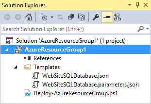
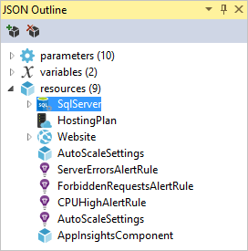
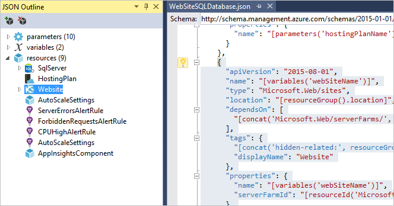
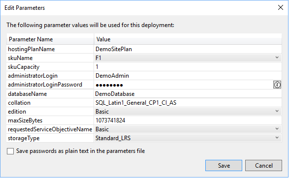
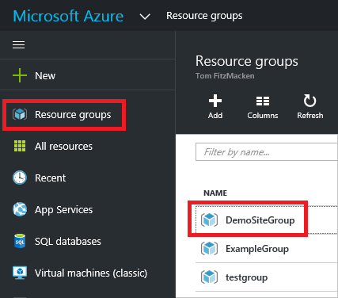
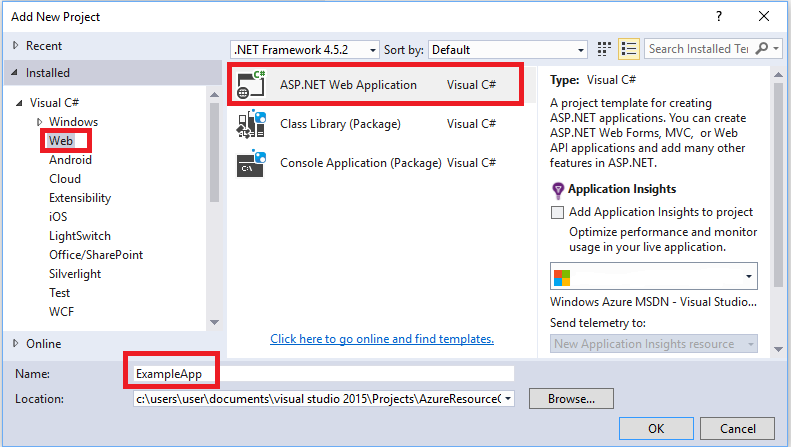
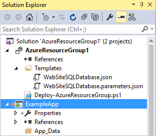
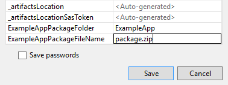

<properties
   pageTitle="Projets ressource groupe Visual Studio Azure | Microsoft Azure"
   description="Utilisez Visual Studio pour créer un projet de groupe de ressources Azure et déployer les ressources sur Azure."
   services="azure-resource-manager"
   documentationCenter="na"
   authors="tfitzmac"
   manager="timlt"
   editor="tysonn" />
<tags
   ms.service="azure-resource-manager"
   ms.devlang="multiple"
   ms.topic="get-started-article"
   ms.tgt_pltfrm="na"
   ms.workload="na"
   ms.date="09/20/2016"
   ms.author="tomfitz" />

# Créer et déployer des groupes de ressources Azure via Visual Studio

Avec Visual Studio et le [Kit de développement logiciel Azure](https://azure.microsoft.com/downloads/), vous pouvez créer un projet qui déploie votre infrastructure et votre code sur Azure. Par exemple, vous pouvez définir l’hôte web, le site web et la base de données pour votre application et déployer que l’infrastructure ainsi que le code. Ou bien, vous pouvez définir une Machine virtuelle, le réseau virtuel et le compte de stockage et déployer qu’une infrastructure ainsi qu’un script qui s’exécute sur Machine virtuelle. Le projet de déploiement de **Groupe de ressources Azure** vous permet de déployer toutes les ressources nécessaires dans une seule opération répétitif. Pour plus d’informations sur le déploiement et la gestion de vos ressources, voir [vue d’ensemble du Gestionnaire de ressources Azure](azure-resource-manager/resource-group-overview.md).

Groupe de ressources Azure projets contiennent des modèles Azure Gestionnaire de ressources JSON qui définissent les ressources qui vous déployez Azure. Pour en savoir plus sur les éléments du Gestionnaire de ressources du modèle, voir [Gestionnaire de ressources Azure de création de modèles](resource-group-authoring-templates.md). Visual Studio permet de modifier ces modèles et fournit des outils qui simplifient l’utilisation des modèles.

Dans cette rubrique, vous déployez une application web et la base de données SQL. Toutefois, les étapes sont pratiquement identiques pour n’importe quel type de ressource. Vous pouvez facilement déployer une Machine virtuelle et ses ressources connexes. Visual Studio propose de nombreux modèles différents starter pour le déploiement des scénarios courants.

Cet article vous explique Visual Studio 2015 mise à jour 2 et Kit de développement Microsoft Azure pour .NET 2,9. Si vous utilisez Visual Studio 2013 avec Azure SDK 2,9, votre expérience est largement la même. Vous pouvez utiliser les versions du Kit de développement Azure de 2.6 ou version ultérieure ; Toutefois, votre expérience de l’interface utilisateur peut être différent de celui de l’interface utilisateur décrite dans cet article. Nous vous recommandons vivement d’installer la dernière version du [Kit de développement logiciel Azure](https://azure.microsoft.com/downloads/) avant de commencer les étapes ci-dessous. 

## Projet créer un groupe de ressources Azure

Dans cette procédure, vous créez un projet de groupe de ressources Azure avec un modèle **d’application Web + SQL** .

1. Dans Visual Studio, cliquez sur **fichier**, **Nouveau projet**, sélectionnez **c#** ou **Visual Basic**. Sélectionnez ensuite **Cloud**, puis projet de **Groupe de ressources Azure** .

    

1. Choisissez le modèle que vous voulez déployer au Gestionnaire de ressources Azure. Notez qu’il existe de nombreuses options différentes en fonction du type de projet que vous souhaitez déployer. Pour cette rubrique, choisissez le modèle **d’application Web + SQL** .

    

    Le modèle que vous avez choisi est simplement un point de départ. Vous pouvez ajouter et supprimer des ressources pour répondre à votre scénario.

    >[AZURE.NOTE] Visual Studio récupère une liste des modèles disponibles en ligne. La liste peut changer.

    Visual Studio crée un projet de déploiement de groupe de ressources pour l’application web et base de données SQL.

1. Pour voir ce que vous avez créé, développez les nœuds dans le projet de déploiement.

    

    Étant donné que nous avons choisi l’application Web + modèle SQL pour cet exemple, vous consultez les fichiers suivants : 

  	|Nom de fichier|Description|
  	|---|---|
  	|AzureResourceGroup.ps1 déployer|Un script PowerShell qui appelle des commandes PowerShell pour déployer au Gestionnaire de ressources Azure. **Remarque** Visual Studio utilise ce script PowerShell pour déployer votre modèle. Les modifications que vous apportez à ce script affecter le déploiement dans Visual Studio, veillez.|
  	|WebSiteSQLDatabase.json|Le modèle de gestionnaire de ressources qui définit l’infrastructure que vous voulez déployer sur Azure, ainsi que les paramètres que vous pouvez fournir au cours du déploiement. Il définit également les dépendances entre les ressources afin que le Gestionnaire de ressources déploie les ressources dans l’ordre correct.|
  	|WebSiteSQLDatabase.parameters.json|Un fichier de paramètres qui contient les valeurs requises par le modèle. Vous passez de valeurs de paramètre à personnaliser chaque déploiement.|

    Tous les projets de déploiement de groupe de ressources contiennent ces fichiers de base. D’autres projets peuvent contenir des fichiers supplémentaires pour prendre en charge des autres fonctionnalités.

## Personnaliser le modèle de gestionnaire de ressources

Vous pouvez personnaliser un projet de déploiement en modifiant les modèles JSON qui décrivent les ressources que vous voulez déployer. JSON signifie JavaScript Object Notation et est un format de série de données facile à utiliser. Les fichiers JSON utilisent un schéma auxquels vous faites référence dans la partie supérieure de chaque fichier. Si vous souhaitez comprendre le schéma, vous pouvez télécharger et les analyser. Le schéma définit quels éléments sont valides, les types et formats des champs, les valeurs possibles de valeurs énumérées et ainsi de suite. Pour en savoir plus sur les éléments du Gestionnaire de ressources du modèle, voir [Gestionnaire de ressources Azure de création de modèles](resource-group-authoring-templates.md).

Pour travailler sur votre modèle, ouvrez **WebSiteSQLDatabase.json**.

L’éditeur Visual Studio fournit des outils pour vous aider à la modification du modèle de gestionnaire de ressources. La fenêtre **Plan de JSON** rend facile de voir les éléments définis dans votre modèle.

Sélection d’un des éléments dans le plan vous permet d’accéder à la partie du modèle et met en surbrillance le JSON correspondant.

Vous pouvez ajouter une ressource en sélectionnant le bouton **Ajouter une ressource** en haut de la fenêtre Plan de JSON, ou en cliquant **ressources** et en sélectionnant **Ajouter une nouvelle ressource**.

Pour ce didacticiel, sélectionnez le **Compte de stockage** et lui donner un nom. Attribuez un nom qui n’est pas plus de 11 caractères et contient uniquement des nombres et des lettres minuscules.

Notez que non seulement a été la ressource ajoutée, mais également un paramètre du compte de stockage de type et une variable pour le nom du compte de stockage.

Le paramètre **storageType** est prédéfini avec les types d’autorisés et un type par défaut. Vous pouvez laisser ces valeurs ou les modifier pour votre scénario. Si vous ne voulez pas que tout le monde à déployer un compte de stockage **Premium_LRS** à ce modèle, supprimez-le les types autorisés. 

    "storageType": {
      "type": "string",
      "defaultValue": "Standard_LRS",
      "allowedValues": [
        "Standard_LRS",
        "Standard_ZRS",
        "Standard_GRS",
        "Standard_RAGRS"
      ]
    }

Visual Studio fournit également intellisense pour vous aider à comprendre les propriétés qui sont disponibles lorsque vous modifiez le modèle. Par exemple, pour modifier les propriétés de votre plan de services d’application, accédez à la ressource **HostingPlan** , puis ajoutez une valeur pour les **Propriétés**. Notez qu’intellisense répertorie les valeurs disponibles et fournit une description de cette valeur.

Vous pouvez définir **numberOfWorkers** 1.

    "properties": {
      "name": "[parameters('hostingPlanName')]",
      "numberOfWorkers": 1
    }

## Déployer le projet de groupe de ressources dans Azure

Vous êtes maintenant prêt à déployer votre projet. Lorsque vous déployez un projet de groupe de ressources Azure, vous le déployez dans un groupe de ressources Azure. Le groupe de ressources est un regroupement logique de ressources qui partagent un cycle de vie courant.

1. Dans le menu contextuel du nœud du projet de déploiement, sélectionnez **déployer** > **Nouveau déploiement**.

    

    La boîte de dialogue **déployer au groupe de ressources** s’affiche.

    

1. Dans la zone de liste déroulante **groupe de ressources** , sélectionnez un groupe de ressources existant ou créez-en un. Pour créer un groupe de ressources, ouvrez la liste déroulante **Groupe de ressources** , puis sélectionnez **Créer un nouveau**.

    

    La boîte de dialogue **Créer un groupe de ressources** s’affiche. Attribuer un nom et un emplacement à votre groupe, puis sélectionnez le bouton **créer** .

    
   
1. Modifier les paramètres pour le déploiement en cliquant sur le bouton **Modifier les paramètres** .

    

1. Indiquez les valeurs pour les paramètres vides et sélectionnez le bouton **Enregistrer** . Les paramètres vides sont **hostingPlanName**, **administratorLogin**, **administratorLoginPassword**et **databaseName**.

    **hostingPlanName** spécifie un nom pour le [plan de services d’application](./app-service/azure-web-sites-web-hosting-plans-in-depth-overview.md) à créer. 
    
    **administratorLogin** indique le nom d’utilisateur pour l’administrateur de SQL Server. N’utilisez pas des noms d’administration communs comme **sa** ou **d’administrateur**. 
    
    **administratorLoginPassword** indique un mot de passe pour l’administrateur de SQL Server. L’option **Enregistrer les mots de passe en tant que texte brut dans le fichier de paramètres** n’est pas sécurisée ; Par conséquent, ne sélectionnez pas cette option. Étant donné que le mot de passe n’est pas enregistré en tant que texte brut, vous devrez fournir ce mot de passe à nouveau pendant le déploiement. 
    
    **databaseName** spécifie un nom pour la base de données à créer. 

    
    
1. Cliquez sur le bouton **déployer** à déployer le projet Azure. Une console PowerShell s’ouvre en dehors de l’instance de Visual Studio. Dans la console PowerShell lorsque vous y êtes invité, entrez le mot de passe administrateur SQL Server. **Votre console PowerShell peut être masqué par d’autres éléments ou réduit dans la barre des tâches.** Recherchez cette console et sélectionnez-la pour fournir le mot de passe.

    >[AZURE.NOTE] Visual Studio peut vous demander d’installer les applets de commande PowerShell Azure. Vous devez les applets de commande PowerShell Azure pour déployer groupes de ressources. Si vous y êtes invité, installez-les.
    
1. Le déploiement peut prendre quelques minutes. Dans la fenêtre de **sortie** , vous voyez l’état du déploiement. Lorsque le déploiement est terminé, le dernier message indique un déploiement réussi avec un écran semblable à :

        ... 
        18:00:58 - Successfully deployed template 'c:\users\user\documents\visual studio 2015\projects\azureresourcegroup1\azureresourcegroup1\templates\websitesqldatabase.json' to resource group 'DemoSiteGroup'.

1. Dans un navigateur, ouvrez le [portail Azure](https://portal.azure.com/) et se connecter à votre compte. Pour afficher le groupe de ressources, sélectionnez les **groupes de ressources** et le groupe de ressources que vous avez déployé sur.

    

1. Vous consultez toutes les ressources déployés. Notez que le nom du compte de stockage n’est pas exactement ce que vous avez spécifié lors de l’ajout de cette ressource. Le compte de stockage doit être unique. Le modèle ajoute automatiquement une chaîne de caractères pour le nom que vous avez fourni pour fournir un nom unique. 

    

1. Si vous apportez des modifications et que vous souhaitez redéployez votre projet, sélectionnez le groupe de ressources existant dans le menu contextuel du projet de groupe de ressources Azure. Dans le menu contextuel, sélectionnez **déployer**, puis le groupe de ressources que vous avez déployé.

    

## Déployer le code à votre infrastructure

À ce stade, vous avez déployé l’infrastructure de votre application, mais aucun code réel déployé avec le projet. Cette rubrique vous explique comment déployer une application web et des tables de base de données SQL pendant le déploiement. Si vous déployez une Machine virtuelle plutôt que dans une application web, vous voulez exécuter du code sur l’ordinateur dans le cadre du déploiement. Le processus de déploiement de code pour une application web ou de configuration d’une Machine virtuelle est presque identiques.

1. Ajouter un projet à votre solution Visual Studio. Avec le bouton droit de la solution, puis sélectionnez **Ajouter** > **Nouveau projet**.

    

1. Ajouter une **Application Web ASP.NET**. 

    
    
1. Sélectionnez **MVC** et désactivez le champ **hôte dans le cloud** , car le projet de groupe de ressources exécute cette tâche.

    
    
1. Une fois que Visual Studio créé votre application web, vous voyez les deux projets dans la solution.

    

1. À présent, vous avez besoin pour vous assurer que votre projet de groupe de ressources est prenant en charge du nouveau projet. Revenez à votre projet de groupe de ressources (AzureResourceGroup1). Cliquez sur **références** , puis sélectionnez **Ajouter une référence**.

    

1. Sélectionnez le projet d’application web que vous avez créé.

    
    
    En ajoutant une référence, vous liez le projet de l’application web au projet de groupe de ressources et définissez automatiquement trois principales propriétés. Vous consultez ces propriétés dans la fenêtre des **Propriétés** de la référence.

      
    
    Les propriétés sont :

    - Les **Propriétés supplémentaires** contient le package de déploiement web emplacement qui a été basculé vers le stockage Azure intermédiaire. Remarque le dossier (ExampleApp) et le fichier (package.zip). Vous devez fournir ces valeurs en tant que paramètres lors du déploiement de l’application. 
    - Le **Chemin d’accès de fichier Include** contient le chemin d’accès où le package est créé. Les **Cibles inclure** contient la commande déploiement s’exécute. 
    - La valeur par défaut **créer ; Package** permet le déploiement générer et créer un package de déploiement web (package.zip).  
    
    Vous n’avez pas besoin d’un profil de publication comme le déploiement Obtient les informations nécessaires à partir des propriétés pour créer le package.
      
1. Ajouter une ressource au modèle.

    

1. Cette fois sélectionnez **Déploiement Web pour les applications Web**. 

    
    
1. Redéployez votre projet de groupe de ressources au groupe de ressources. Cette fois il existe quelques nouveaux paramètres. Vous n’avez pas besoin fournir des valeurs pour **_artifactsLocation** ou **_artifactsLocationSasToken** étant donné que Visual Studio génère automatiquement ces valeurs. Toutefois, vous devez définir le dossier et le nom de fichier pour le chemin d’accès qui contient le package de déploiement (affiché sous **ExampleAppPackageFolder** et **ExampleAppPackageFileName** dans l’image ci-dessous). Fournir les valeurs que vous avez vu plus haut dans les propriétés de référence (**ExampleApp** et **package.zip**).

    
    
    Pour le **compte de stockage d’objet**, sélectionnez l’option déployé avec ce groupe de ressources.
    
1. Une fois le déploiement terminé, sélectionnez votre application web dans le portail. Sélectionnez l’URL pour accéder au site.

    

1. Notez que vous avez correctement déployé l’application ASP.NET par défaut.

    

## Étapes suivantes

- Pour en savoir plus sur la gestion des ressources de votre via le portail, voir [l’aide du portail pour gérer vos ressources Azure Azure](./azure-portal/resource-group-portal.md).
- Pour plus d’informations sur les modèles, voir [Gestionnaire de ressources Azure de création de modèles](resource-group-authoring-templates.md).
