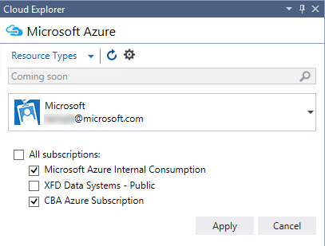

<properties 
   pageTitle="Gestion des ressources Azure avec l’Explorateur Cloud | Microsoft Azure"
   description="Découvrez comment utiliser Cloud Explorer pour parcourir et gérer les ressources Azure dans Visual Studio."
   services="visual-studio-online"
   documentationCenter="na"
   authors="TomArcher"
   manager="douge"
   editor="" />
<tags 
   ms.service="multiple"
   ms.devlang="dotnet"
   ms.topic="article"
   ms.tgt_pltfrm="na"
   ms.workload="multiple"
   ms.date="08/15/2016"
   ms.author="tarcher" />

# Gestion des ressources Azure avec l’Explorateur de Cloud

##Vue d’ensemble

Explorer cloud est conçu pour vous permettre de rapidement et plus facilement parcourir et gérer vos ressources Azure dans Visual Studio IDE. Vous pouvez, par exemple, utilisez-le pour ouvrir une application Web dans le [portail Azure](http://go.microsoft.com/fwlink/p/?LinkID=525040) ou dans un navigateur, ou joindre un débogueur, ou vous pouvez afficher les propriétés d’un conteneur blob et ouvrez-le dans l’éditeur de conteneur Blob.

Explorer cloud est basée sur la pile de gestionnaire ressource Azure, comme le [portail Azure](http://go.microsoft.com/fwlink/p/?LinkID=525040). Il comprend les ressources comme des groupes de ressources Azure et Azure services tels que les applications logique et applications API, et il prend en charge [d’un contrôle d’accès basé sur un rôle](./active-directory/role-based-access-control-configure.md) . Pour voir les ressources Azure qui ont été ajoutés ou modifiés, cliquez sur le bouton **Actualiser** dans la barre d’outils Cloud Explorer.

Explorer cloud est installé dans le cadre de Visual Studio Tools pour Azure SDK 2.7. 

## Conditions préalables

- Visual Studio 2015 RTM.

- Les outils Visual Studio pour Azure SDK. 
- Vous devez également avoir un compte Azure et être connecté à pour afficher les ressources Azure dans l’Explorateur de Cloud. Si vous n’en avez pas, vous pouvez créer un compte dans quelques minutes. Si vous avez un abonnement MSDN, voir [Azure avantage pour les abonnés MSDN](https://azure.microsoft.com/pricing/member-offers/msdn-benefits-details/). Dans le cas contraire, voir [créer un compte d’évaluation gratuit](https://azure.microsoft.com/pricing/free-trial/).

- Si Cloud Explorer n’est pas visible, vous pouvez l’afficher en cliquant sur **affichage**, **Autres fenêtres,** **Cloud Explorer** dans la barre de menus.

## Gérer les abonnements et comptes Azure

Pour afficher vos ressources Azure dans l’Explorateur de Cloud, vous devez se connecter à un compte Azure avec un ou plusieurs abonnements actifs. Si vous avez plusieurs comptes Azure, vous pouvez les ajouter dans l’Explorateur de Cloud, puis sélectionnez les abonnements que vous voulez inclure dans l’affichage des ressources Cloud Explorer.

Si vous n’avez pas utilisé Azure avant ou si vous n’avez pas ajouté les comptes nécessaires pour Visual Studio, vous êtes invité à le faire.

## Pour ajouter des comptes Azure vers Cloud Explorer

1. Sélectionnez l’icône Paramètres dans la barre d’outils Cloud Explorer.

1. Cliquez sur le lien **Ajouter un compte** . Connectez-vous au compte Azure dont vous voulez parcourir les ressources. Le compte que vous venez d’ajouter doit déjà être sélectionné dans la liste déroulante de sélecteur compte. Les abonnements pour ce compte s’affichent sous l’entrée de compte.

    

    

1. Activez les cases à cocher pour les abonnements de compte que vous voulez parcourir, puis sélectionnez le bouton **Appliquer** .

    Les ressources Azure pour les abonnements sélectionnés apparaissent dans l’Explorateur de Cloud.

## Supprimer un compte Azure

1. Cliquez sur **fichier**, **Paramètres de compte** dans la barre de menus.

1. Dans la section **Tous les comptes** de la boîte de dialogue **Paramètres du compte** , sélectionnez la commande **Supprimer** en regard du compte que vous voulez supprimer. Notez que cette commande supprime uniquement le compte à partir de Visual Studio – it n’affecte pas le compte Azure lui-même.

## Afficher les types de ressources ou des groupes

Pour afficher vos ressources Azure, vous pouvez choisir l’affichage de **Groupes de ressources** ou **Types de ressources** .

- **Types de ressources** , qui est également la vue courantes utilisée dans le [portail Azure](http://go.microsoft.com/fwlink/p/?LinkID=525040), affiche votre Azure ressources classés selon leur type, tels que des applications web, comptes de stockage et machines virtuelles. Cela revient à des ressources comment Azure apparaissent dans l’Explorateur de serveur.

- Affichage des groupes ressources attribuer une catégorie Azure ressources par groupe de ressources Azure qu'auxquels elles sont associées.

 
    Un groupe de ressources est un ensemble de ressources Azure, généralement utilisée par une application spécifique. Pour en savoir plus sur les groupes de ressources Azure, voir [Vue d’ensemble du Gestionnaire de ressources Azure](./resource-group-overview.md).

## Afficher et parcourir les ressources

Pour accéder à une ressource Azure et consulter ses informations dans l’Explorateur de Cloud, développez type ou groupe de ressources de l’élément, puis choisissez la ressource. Lorsque vous choisissez une ressource, les informations apparaissent dans les deux onglets en bas de l’Explorateur de Cloud.

- L’onglet **Actions** affiche les actions que vous pouvez effectuer dans l’Explorateur de Cloud pour la ressource sélectionnée. Vous pouvez également afficher les actions disponibles dans le menu contextuel de la ressource.

- L’onglet **Propriétés** affiche les propriétés de la ressource, telles que son groupe type, les paramètres régionaux et les ressources, qu'il est associé.

Chaque ressource a l’action **Ouvrir dans le portail**. Lorsque vous choisissez cette action, Cloud Explorer affiche la ressource sélectionnée dans le [portail Azure](http://go.microsoft.com/fwlink/p/?LinkID=525040). Cette fonctionnalité est particulièrement utile pour parcourir les ressources imbriquées.

Autres actions et valeurs de propriété peuvent également s’afficher en fonction de la ressource Azure. Par exemple, applications web et applications logique disposent également d’actions **ouvert dans un navigateur** et **débogueur joindre** outre **ouverts dans le portail**. Actions pour ouvrir les éditeurs apparaissent lorsque vous choisissez un blob de compte de stockage, file d’attente ou une table. Applications Azure ont **URL** et **état** , tandis que les ressources de stockage ont des propriétés de chaîne de connexion et de clé.

## Ressources de recherche

Pour trouver les ressources avec un nom spécifique dans vos abonnements compte Azure, entrez le nom dans la zone de recherche dans l’Explorateur de Cloud.

Lorsque vous entrez des caractères dans la zone de recherche, seules les ressources qui correspondent à ces caractères apparaissent dans l’arborescence de la ressource.

