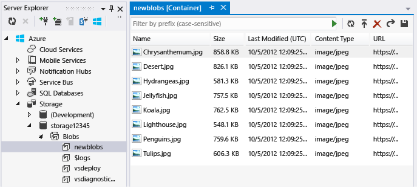
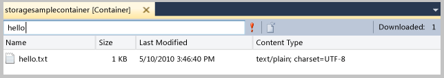
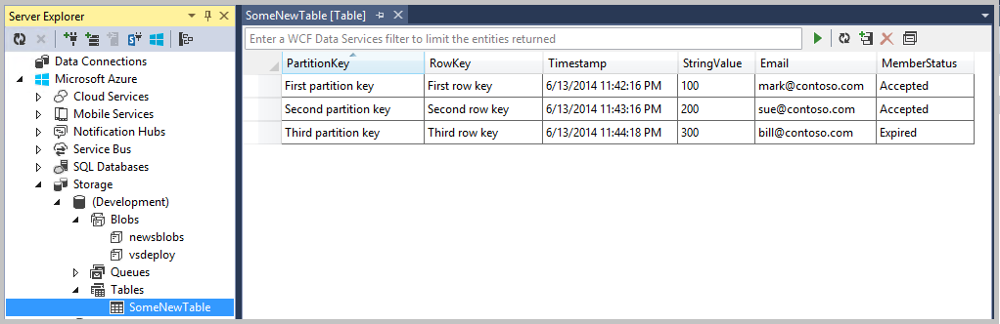
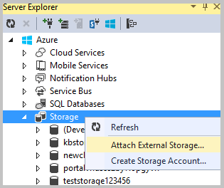

<properties
   pageTitle="Navigation et la gestion des ressources de stockage avec l’Explorateur de serveur | Microsoft Azure"
   description="Navigation et la gestion des ressources de stockage avec l’Explorateur de serveur"
   services="visual-studio-online"
   documentationCenter="na"
   authors="TomArcher"
   manager="douge"
   editor="" />
<tags
   ms.service="storage"
   ms.devlang="multiple"
   ms.topic="article"
   ms.tgt_pltfrm="na"
   ms.workload="na"
   ms.date="07/18/2016"
   ms.author="tarcher" />

# Navigation et la gestion des ressources de stockage avec l’Explorateur de serveur

[AZURE.INCLUDE [storage-try-azure-tools](../includes/storage-try-azure-tools.md)]

## Vue d’ensemble
Si vous avez installé les outils Azure pour Microsoft Visual Studio, vous pouvez afficher des objets blob, file d’attente et tableau de données à partir de vos comptes de stockage pour Azure. Le nœud de stockage Azure dans l’Explorateur de serveurs affiche les données qui se trouve dans votre compte émulateur stockage local et vos autres comptes de stockage Azure.

Pour afficher l’Explorateur de serveurs dans Visual Studio, dans la barre de menus, choisissez **affichage**, **Explorateur de serveurs**. Le nœud de stockage affiche tous les comptes de stockage qui existent sous chaque abonnement Azure/certificat que vous êtes connecté à. Si votre compte de stockage ne s’affiche pas, vous pouvez l’ajouter en suivant les instructions [plus loin dans cette rubrique](#add-storage-accounts-by-using-server-explorer).

Démarrage dans Azure SDK 2.7, vous pouvez également utiliser le nouvel Explorateur Cloud pour afficher et gérer vos ressources Azure. Pour plus d’informations, voir [Gestion des ressources Azure avec l’Explorateur de Cloud](./vs-azure-tools-resources-managing-with-cloud-explorer.md) .

## Afficher et gérer des ressources de stockage dans Visual Studio

Explorateur de serveurs affiche automatiquement une liste d’objets BLOB, files d’attente et les tables dans votre compte émulateur de stockage. Le compte émulateur stockage est répertorié dans l’Explorateur de serveurs sous le nœud de stockage en tant que le nœud de **développement** .

Pour afficher les ressources du compte émulateur stockage, développez le nœud de **développement** . Si l’émulateur de stockage n’a pas été démarré lorsque vous développez le nœud de **développement** , il démarre automatiquement. Cela peut prendre quelques secondes. Vous pouvez continuer à travailler dans d’autres zones de Visual Studio pendant le démarrage de l’émulateur de stockage.

Pour afficher les ressources dans un compte de stockage, développez nœud de compte de stockage dans l’Explorateur de serveur. Les nœuds sous-adresse suivants s’affichent :

- Objets BLOB

- Files d’attente

- Tables

## Travailler avec des ressources Blob

Le nœud des objets BLOB affiche une liste de conteneurs pour le compte de stockage sélectionné. Conteneurs BLOB contiennent des fichiers blob, et vous pouvez répartir ces objets BLOB dans les dossiers et les sous-dossiers. Pour plus d’informations, voir [comment utiliser le stockage Blob de .NET](./storage/storage-dotnet-how-to-use-blobs.md) .

### Pour créer un conteneur blob

1. Ouvrir le menu contextuel pour le nœud **des objets BLOB** , puis sur **Créer un conteneur Blob**.

1. Entrez le nom du nouveau conteneur dans la boîte de dialogue **Créer un conteneur Blob** , puis choisissez **Ok**

    >[AZURE.NOTE] Le nom du conteneur blob doit commencer par un chiffre (0 à 9) ou minuscule (a à z).

### Pour supprimer un conteneur blob

- Ouvrir le menu contextuel pour le conteneur blob que vous voulez supprimer, puis sélectionnez **Supprimer**.

### Pour afficher une liste des éléments contenus dans un conteneur blob

- Ouvrir le menu contextuel pour un nom de conteneur blob dans la liste, puis choisissez **Affichage Blob conteneur**.

    Lorsque vous affichez le contenu d’un conteneur blob, il apparaît dans un onglet appelé l’affichage conteneur blob.

    

    Vous pouvez effectuer les opérations suivantes sur des objets BLOB en utilisant les boutons dans le coin supérieur droit de l’affichage de conteneur blob :

    - Entrez une valeur de filtre et l’appliquer

    - Actualiser la liste des objets BLOB dans le conteneur

    - Télécharger un fichier

    - Supprimer un blob

      >[AZURE.NOTE] Suppression d’un fichier à partir d’un conteneur blob ne supprime pas le fichier sous-jacent ; Il supprime uniquement à partir du conteneur blob.

    - Ouvrir un blob

    - Enregistrer un blob sur l’ordinateur local

### Pour créer un dossier ou un sous-dossier dans un conteneur blob

1. Choisissez le conteneur blob dans l’Explorateur de serveur. Dans la fenêtre conteneur, cliquez sur le bouton **Télécharger Blob** .

    

1. Dans la boîte de dialogue **Télécharger un nouveau fichier** , cliquez sur le bouton **Parcourir** pour spécifier le fichier que vous voulez télécharger et puis entrez un nom de dossier dans la zone **dossier (facultatif)** .

    Vous pouvez ajouter des sous-dossiers dans dossiers conteneur en suivant la procédure. Si vous ne spécifiez un nom de dossier, le fichier sera téléchargé vers le niveau supérieur du conteneur blob. Le fichier s’affiche dans le dossier spécifié dans le conteneur.

    

1. Double-cliquez sur le dossier ou appuyez sur ENTRÉE pour voir le contenu du dossier. Lorsque vous êtes dans le dossier du conteneur, vous pouvez accéder à la racine du conteneur en cliquant sur le bouton **Open Directory Parent** (flèche haut).

### Pour supprimer un dossier conteneur

 - Supprimer tous les fichiers dans le dossier

    >[AZURE.NOTE] Étant donné que les dossiers dans des conteneurs blob sont des dossiers virtuels, vous ne pouvez pas créer un dossier vide, ni vous pouvez supprimer un dossier pour supprimer le contenu du fichier. Vous devez supprimer tout le contenu d’un dossier pour supprimer le dossier.

### Pour filtrer les objets BLOB dans un conteneur

Vous pouvez filtrer les objets BLOB qui sont affichent en spécifiant un préfixe commun.

Par exemple, si vous entrez le préfixe `hello` dans le texte du filtre zone, puis choisissez l' **exécuter** (**!**) bouton, uniquement les objets BLOB qui commencent par « hello » s’affiche.

>[AZURE.NOTE] Le champ filtre respecte la casse et non prises en charge en filtrant avec des caractères génériques. Objets BLOB peuvent uniquement être filtrées par préfixe. Le préfixe peut-être inclure un délimiteur si vous utilisez un séparateur pour organiser les objets BLOB dans une hiérarchie virtuelle. Par exemple, de filtrage sur le préfixe HelloFabric / renvoie tous les objets BLOB commençant par cette chaîne.

### Pour transférer des données blob

- Dans l' **Explorateur de serveurs**, ouvrir le menu contextuel pour un ou plusieurs des objets BLOB et puis cliquez sur **Ouvrir**, ou sélectionnez le nom d’objets blob puis cliquez sur le bouton **Ouvrir** ou double-cliquez sur le nom d’objets blob.

    La progression du téléchargement d’une blob apparaît dans la fenêtre du **Journal d’activité Azure** .

    Le blob s’ouvre dans l’éditeur par défaut pour ce type de fichier. Si le système d’exploitation reconnaît le type de fichier, le fichier s’ouvre dans une application installée localement ; dans le cas contraire, vous êtes invité à choisir une application appropriée pour le type de fichier du blob. Le fichier local est créé lorsque vous téléchargez un blob est marqué en lecture seule.

    Données BLOB sont mis en cache localement et vérifiées heure de dernière modification de blob dans le service d’objets Blob. Si le blob a été mis à jour dans la mesure où il a été téléchargé dernière, il sera téléchargé à nouveau ; dans le cas contraire le blob sera chargé à partir du disque local. Par défaut, un blob est téléchargé dans un répertoire temporaire. Pour télécharger des objets BLOB vers un répertoire spécifique, ouvrir le menu contextuel pour les noms d’objets blob sélectionné et cliquez sur **Enregistrer sous**. Lorsque vous enregistrez un blob de cette manière, le fichier blob n’est pas ouvert et le fichier local est créé avec les attributs de lecture seule.

### Pour télécharger des objets BLOB

- Cliquez sur le bouton **Télécharger Blob** lorsque le conteneur est ouvert pour l’affichage dans la vue de conteneur blob.

    Vous pouvez choisir un ou plusieurs fichiers à télécharger, et vous pouvez télécharger des fichiers de n’importe quel type. Le **Journal d’activité Azure** affiche la progression du téléchargement. Pour plus d’informations sur l’utilisation des données blob, voir [comment utiliser le Service de stockage d’objets Blob Azure dans .NET](http://go.microsoft.com/fwlink/p/?LinkId=267911).

### Pour afficher les journaux transférés vers des objets BLOB

- Si vous utilisez Azure Diagnostics pour enregistrer les données à partir de votre application Azure et que vous avez transféré les journaux à votre compte de stockage, vous verrez conteneurs qui ont été créés par Azure pour ces fichiers journaux. Afficher ces fichiers journaux dans l’Explorateur de serveur est un moyen facile pour identifier les problèmes avec votre application, surtout si elle a été déployé sur Azure. Pour plus d’informations sur les Diagnostics Azure, voir [Collecter les données journalisation par à l’aide de diagnostic Azure](https://msdn.microsoft.com/library/azure/gg433048.aspx).

### Pour obtenir l’URL pour un blob

- Ouvrir le menu contextuel de blob, puis sélectionnez **Copier l’URL**.

### Pour modifier un blob

- Sélectionnez le blob, puis sur le bouton **Ouvrir Blob** .

    Le fichier est téléchargé dans un emplacement temporaire et ouvert sur l’ordinateur local. Vous devez télécharger le blob à nouveau une fois que vous apportez des modifications.

## Travailler avec des ressources file d’attente

Files d’attente de stockage services sont hébergés dans un compte de stockage Azure et vous pouvez les utiliser pour autoriser votre cloud rôles de service communiquer avec eux et avec d’autres services par un message mécanisme de passage. Vous pouvez accéder par programme la file d’attente via un service cloud et sur un service web pour les clients externes. Vous pouvez également accéder à la file d’attente directement à l’aide de l’Explorateur de serveur dans Visual Studio.

Lorsque vous développez un service cloud qui utilise des files d’attente, vous souhaiterez peut-être utiliser Visual Studio pour créer des files d’attente et utiliser les interactivité pendant que vous développez et testez votre code.

Dans l’Explorateur de serveur, vous pouvez afficher les files d’attente dans un compte de stockage, créer et supprimer des files d’attente, ouvrir une file d’attente pour afficher ses messages et ajouter des messages dans une file d’attente. Lorsque vous ouvrez une file d’attente pour l’affichage, vous pouvez afficher les messages individuels, et vous pouvez effectuer les opérations suivantes dans la file d’attente en utilisant les boutons dans le coin supérieur gauche :

- Actualiser l’affichage de la file d’attente

- Ajouter un message dans la file d’attente

- Retirer le premier message.

- Effacer la file d’attente entière

L’image suivante montre une file d’attente qui contient deux messages.

Pour plus d’informations sur le stockage des services files d’attente, consultez [Comment : utiliser le Service de stockage file d’attente](http://go.microsoft.com/fwlink/?LinkID=264702). Pour plus d’informations sur le service web des files d’attente de services de stockage, voir [Concepts de Service file d’attente](http://go.microsoft.com/fwlink/?LinkId=264788). Pour plus d’informations sur l’envoi de messages à une file d’attente de services de stockage à l’aide de Visual Studio, consultez [Envoi de Messages à une file d’attente de Services de stockage](https://msdn.microsoft.com/library/azure/jj649344.aspx).

>[AZURE.NOTE] Files d’attente de services de stockage sont différents des files d’attente de bus de service. Pour plus d’informations sur les files d’attente de bus de service, voir files d’attente de Service Bus, rubriques et abonnements.

## Utiliser les ressources de Table

Le service de stockage de Table Azure stocke les grandes quantités de données structurées. Le service est un magasin de données NoSQL qui accepte authentifié appels à partir de l’intérieur et extérieur le cloud Azure. Tables Azure sont parfaites pour le stockage de données structurées et non relationnelles.

### Pour créer une table

1. Dans l’Explorateur de serveur, sélectionnez le nœud **Tables** du compte de stockage, puis **Créer un tableau**.

1. Dans la boîte de dialogue **Créer un tableau** , entrez un nom pour la table.

### Pour afficher les données de tableau

1. Dans l’Explorateur de serveurs, ouvrez le nœud **Azure** et ouvrez le nœud de **stockage** .

1. Ouvrez le nœud de compte de stockage qui vous intéresse et ouvrez le nœud **Tables** pour afficher la liste des tables pour le compte de stockage.

1. Ouvrir le menu contextuel pour une table, puis sélectionnez **Afficher la Table**.

    

Le tableau est organisé par entités (comme illustrées dans les lignes) et les propriétés (comme illustrées dans les colonnes). Par exemple, l’illustration suivante montre entités répertoriées dans le **Concepteur de tables**:

### Pour modifier les données de tableau

1. Dans le **Concepteur de tables**, ouvrez le menu contextuel d’une entité (une seule ligne) ou d’une propriété (une seule cellule), puis sélectionnez **Modifier**.

    

    Entités dans une seule table n’est pas nécessaires d’avoir le même ensemble de propriétés (colonnes). N’oubliez pas les restrictions suivantes sur l’affichage et modification des données de tableau.
    - Vous ne pouvez pas afficher ou modifier des données binaires (type byte[]), mais vous pouvez l’enregistrer dans un tableau.

    - Vous ne pouvez pas modifier les valeurs **PartitionKey** ou **RowKey** , car le stockage de tables dans Azure ne prend pas en charge cette opération.

    - Vous ne pouvez pas créer une propriété appelée horodatage, le stockage Azure services utilisent une propriété portant le même nom.

    - Si vous entrez une valeur de date/heure, vous devez suivre un format qui convient aux paramètres de région et langue de votre ordinateur (par exemple, des hh : mm : JJ/MM/AAAA [AM | PM] pour l’anglais américain).

### Pour ajouter des entités

1. Dans le **Concepteur de tables**, cliquez sur le bouton **Ajouter une entité** , c'est-à-dire près du coin supérieur droit de l’affichage tableau.

    

1. Dans la boîte de dialogue **Ajouter une entité** , entrez les valeurs des propriétés **PartitionKey** et **RowKey** .

    

    Entrez les valeurs avec soin, car vous ne pouvez pas les modifier une fois que vous fermez la boîte de dialogue, sauf si vous supprimez l’entité et l’ajoutez à nouveau.

### Pour filtrer les entités

Vous pouvez personnaliser le jeu d’entités qui s’affichent dans une table si vous utilisez le Générateur de requêtes.

1. Pour ouvrir le Générateur de requêtes, ouvrez la table pour l’affichage.

1. Cliquez sur le bouton plus à droite dans la barre d’outils de la vue du tableau.

    La boîte de dialogue **Générateur de requêtes** s’affiche. L’illustration suivante présente une requête qui est créée dans le Générateur de requêtes.

    

1. Lorsque vous avez terminé création de la requête, fermez la boîte de dialogue. Le formulaire de texte résultant de la requête apparaît dans une zone de texte sous la forme d’un filtre WCF Data Services.

1. Pour exécuter la requête, cliquez sur l’icône triangle vert.

    Vous pouvez également filtrer les données d’entité qui s’affiche dans le **Concepteur de tables** si vous entrez une chaîne de filtrage WCF Data Services directement dans le champ de filtre. Ce type de chaîne est semblable à une clause WHERE SQL mais est envoyé au serveur dans une requête HTTP. Pour plus d’informations sur la façon de créer des chaînes de filtrage, voir [Construire des chaînes de filtrage pour le Concepteur de tables](https://msdn.microsoft.com/library/azure/ff683669.aspx).

    L’illustration suivante montre un exemple d’une chaîne de filtre valide :

    

### Actualiser les données de stockage

Lorsque l’Explorateur de serveur se connecte à ou extrait des données d’un compte de stockage, il peut prendre jusqu'à une minute pour l’opération se termine. S’il ne peut pas se connecter, l’opération peut avoir expiré. Tandis que les données soient récupérées, vous pouvez continuer à travailler dans d’autres parties de Visual Studio. Pour annuler l’opération si elle prend trop de temps, cliquez sur le bouton **Arrêter l’actualisation** sur la barre d’outils de l’Explorateur de serveurs.

#### Pour actualiser les données de conteneur blob

- Sélectionnez le nœud **des objets BLOB** en dessous de **stockage** et cliquez sur le bouton **Actualiser** dans la barre d’outils de l’Explorateur de serveurs.

- Pour actualiser la liste des objets BLOB qui s’affiche, cliquez sur le bouton **exécuter** .

#### Pour actualiser les données de tableau

- Sélectionnez le nœud **Tables** en dessous de **stockage** et cliquez sur le bouton **Actualiser** .

- Pour actualiser la liste des entités qui s’affiche dans le **Concepteur de tables**, cliquez sur le bouton **exécuter** dans le **Concepteur de tables**.

#### Pour actualiser les données de file d’attente

- Sélectionnez le nœud **files d’attente** , puis cliquez sur le bouton **Actualiser** .

#### Pour actualiser tous les éléments d’un compte de stockage

- Sélectionnez le nom du compte, puis le bouton **Actualiser** dans la barre d’outils pour Explorer de serveur.

### Ajouter des comptes de stockage à l’aide de l’Explorateur de serveur

Il existe deux façons d’ajouter des comptes de stockage à l’aide de l’Explorateur de serveur. Vous pouvez créer un nouveau compte de stockage dans votre abonnement Azure, ou vous pouvez associer un compte de stockage existant.

#### Créer un nouveau compte de stockage à l’aide de l’Explorateur de serveur

1. Dans l’Explorateur de serveurs, ouvrez le menu contextuel pour le nœud de stockage, puis sur Créer un compte de stockage.

    

1. Sélectionnez ou entrez les informations suivantes pour le nouveau compte de stockage dans la boîte de dialogue **Créer un compte de stockage** .

    - L’abonnement Azure auquel vous souhaitez ajouter le compte de stockage.

    - Le nom que vous voulez utiliser pour le nouveau compte de stockage.

    - La région ou un groupe d’affinité (par exemple, US Ouest ou Extrême-Orient).

    - Le type de réplication que vous souhaitez utiliser pour le compte de stockage, par exemple Geo redondants.

1. Cliquez sur **créer**.

    Le nouveau compte de stockage apparaît dans la liste de **stockage** dans l’Explorateur de solutions.

#### Pour joindre un compte de stockage existant à l’aide de l’Explorateur de serveur

1. Dans l’Explorateur de serveurs, ouvrez le menu contextuel pour le nœud de stockage Azure, puis **Joindre le stockage externe**.

    

1. Sélectionnez ou entrez les informations suivantes pour le nouveau compte de stockage dans la boîte de dialogue **Créer un compte de stockage** .

    - Le nom du compte de stockage existant que vous souhaitez joindre. Vous pouvez entrer un nom ou sélectionnez-le dans la liste.

    - La clé pour le compte de stockage sélectionné. Cette valeur est généralement fournie pour vous lorsque vous sélectionnez un compte de stockage. Si vous souhaitez que Visual Studio n’oubliez pas de la clé de compte de stockage, activez la case Mémoriser clée le compte.

    - Le protocole à utiliser pour vous connecter au compte de stockage, tels que HTTP, HTTPS ou un point de terminaison personnalisé. Découvrez [comment configurer des chaînes de connexion](https://msdn.microsoft.com/library/azure/ee758697.aspx) pour plus d’informations sur les points de terminaison personnalisés.

### Pour afficher les points de terminaison secondaires

- Si vous avez créé un compte de stockage à l’aide de l’option de réplication **Accès en lecture Geo redondantes** , vous pouvez afficher ses points de terminaison secondaires. Ouvrir le menu contextuel pour le nom du compte, puis **Propriétés**.

    

### Pour supprimer un compte de stockage à partir de l’Explorateur de serveurs

- Dans l’Explorateur de serveurs, ouvrez le menu contextuel pour le nom du compte et choisissez **Supprimer**. Si vous supprimez un compte de stockage, toute information de clé enregistrée pour ce compte est également supprimée.

    >[AZURE.NOTE] Si vous supprimez un compte de stockage à partir de l’Explorateur de serveurs, il n’affecte pas votre compte de stockage ou toutes les données qu’il contient ; Il supprime simplement la référence à partir de l’Explorateur de serveurs. Pour supprimer définitivement un compte de stockage, utiliser le [portail classique Azure](http://go.microsoft.com/fwlink/?LinkID=213885).

## Étapes suivantes

Pour en savoir que plus, voir utilisent les services de stockage Azure, voir [accédez aux Services de stockage Azure](https://msdn.microsoft.com/library/azure/ee405490.aspx).
