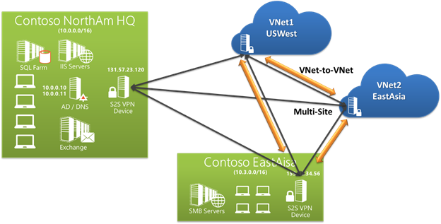

<properties
    pageTitle="Créer des images dans démarque"
    description="Explique comment créer des images dans démarque selon les directives définies pour les référentiels Azure."
    services=""
    solutions=""
    documentationCenter=""
    authors="kenhoff"
    manager="ilanas"
    editor="tysonn"/>

<tags
    ms.service="contributor-guide"
    ms.devlang=""
    ms.topic="article"
    ms.tgt_pltfrm=""
    ms.workload=""
    ms.date="06/25/2015"
    ms.author="kenhoff" />

# <a name="create-images-in-markdown"></a>Créer des images dans démarque

## <a name="image-folder-creation-and-link-syntax"></a>Syntaxe de la création et la liaison de dossier image

Pour un nouvel article, vous devez créer un dossier à l’emplacement suivant :

    /articles/<service-directory>/media/<article-name>/

Par exemple :

    /articles/app-service/media/app-service-enterprise-multichannel-apps/

Après avoir créé le dossier et les images ajoutées à celui-ci, utilisez la syntaxe suivante pour créer des images dans votre article :

```

```
Exemple :

Voir [le modèle démarque](../markdown%20templates/markdown-template-for-new-articles.md) pour obtenir un exemple.  Les liens de référence images dans ce modèle démarque sont conçues pour être en bas du modèle.

## <a name="guidelines-specific-to-azuremicrosoftcom"></a>Instructions spécifiques à azure.microsoft.com

Captures d’écran sont actuellement invités si elle n’est pas possible d’inclure les étapes de reproduction. Écrire des votre contenu afin que le contenu peut être sans les captures d’écran si nécessaire.

Suivez les instructions suivantes lorsque vous créez et y compris les fichiers image clipart :
- Ne pas partager les fichiers clipart dans tous les documents. Copiez le fichier que vous avez besoin et ajoutez au dossier media sur votre sujet spécifique. Partage de fichiers n’est pas recommandée, car il est plus facile à supprimer déconseillée contenu et les images qui le conserve la mis en pension nettoyer.

- Formats de fichiers : utiliser les fichiers .png - ils sont une meilleure qualité et à gérer leur qualité pendant le processus de localisation. Autres formats de fichier ne conservent pas ainsi que leur qualité. Le format .jpeg est autorisé, mais pas par défaut.  Aucun fichier image GIF animée.

- Utiliser des carrés rouges de la largeur par défaut fournies dans Paint (5 px) pour attirer l’attention sur certains éléments dans les captures d’écran.  

    Exemple :

    

- S’il est préférable, n’hésitez pas à rogner des images afin que les éléments de l’interface utilisateur seront affichera en plein écran. Vérifiez que le contexte est désactivée pour les utilisateurs, cependant.

- Évitez d’espaces blancs sur les bords de captures d’écran. Si vous rognez une capture d’écran d’une manière qui laisse arrière-plan blanc sur les bords, ajouter une bordure seul pixel gris autour de l’image.  Si vous utilisez Paint, utilisez le gris plus clair dans la palette de couleurs par défaut (0xC3C3C3). Si vous utilisez une autre application graphique, la couleur RGB est R195, G195, 195. Vous pouvez facilement ajouter une bordure grise autour d’une image dans Visio--pour ce faire, sélectionnez l’image, sélectionnez ligne et assurer la la couleur appropriée est définie et choisissez l’épaisseur de trait pt 1 1/2.  Captures d’écran doit avoir une bordure de gris 1 pixels de large afin que les zones blanches de la capture d’écran ne pas flou dans la page web.

    Exemple :

    
    
    Pour un outil automatiser la procédure d’ajout de la bordure requise aux images, voir [AddACOMBorder outil - comment faire pour automatiser la procédure d’ajout de la bordure de 1 pixel requis gris aux images ACOM](https://github.com/Azure/Azure-CSI-Content-Tools/tree/master/Tools/AddACOMImageBorder).

- Images conceptuelles avec espaces blancs n’avez pas besoin d’une bordure grise.  

    Exemple :

    

- Essayez de ne pas créer une image trop large.  Images seront automatiquement redimensionnées s’ils sont trop larges. Toutefois, le redimensionnement parfois entraîne la tolérance, nous vous recommandons de limiter la largeur de vos images à 780 px et manuellement redimensionner les images avant l’envoi si nécessaire.

- Afficher des sorties de commande dans les captures d’écran.  Si votre article inclut les étapes dans lequel l’utilisateur travaille dans un shell, il est utile pour afficher le résultat de la commande de captures d’écran. Dans ce cas, la restriction votre largeur shell à environ 72 caractères généralement garantit que votre image ne sera pas inclus dans la règle de largeur px 780. Avant de prendre une capture d’écran de sortie, redimensionnez la fenêtre afin que simplement la commande pertinent et le résultat est affiché (vous pouvez également avec une ligne vide sur les côtés).

- Prendre des captures d’écran entier de windows lorsque cela est possible. Lorsque vous prenez une capture d’écran d’une fenêtre de navigateur, redimensionnez la fenêtre du navigateur à 780 px large ou moins et conserver la hauteur de la fenêtre du navigateur sous forme abrégée que possible tel que votre application ne dépasse pas la fenêtre.

    Exemple :

    

- Soyez prudent avec les informations qui sont affichées dans les captures d’écran.  Ne révélez pas les informations personnelles ou internes de l’entreprise.

- Image conceptuelle ou des diagrammes, suivez les icônes officiels dans l’ensemble de symbole et icône de Cloud et d’entreprise. Un ensemble public est disponible sur http://aka.ms/CnESymbols.

- Remplacer les informations personnelles ou privées dans captures d’écran avec du texte d’espace réservé entourée crochets. Cela inclut les noms d’utilisateur, ID d’abonnement et d’autres informations connexes. Les noms personnels peuvent être remplacés par un [nom fictifs sur approuvé](https://aka.ms/ficticiousnames)(lien employé uniquement). N’utilisez pas le Conseil crayon ou un marqueur dans Paint pour masquer ou flou des informations personnelles ou confidentielles.

  L’image suivante a été correctement mis à jour pour remplacer l' **ID de l’abonnement** avec les informations d’espace réservé :

  

### <a name="contributors-guide-links"></a>Liens de Guide des collaborateurs

- [Article de présentation](./../README.md)
- [Index des articles sur les instructions](./contributor-guide-index.md)
