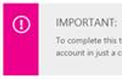
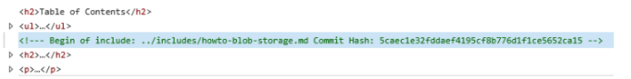

<properties
    title="required"
    pageTitle="Extensions de démarque personnalisées utilisées dans notre articles techniques"
    description="Répertorie les extensions démarque personnalisé qui permettent de vidéos incorporées, notes et conseils, un contenu réutilisable et autres éléments figurant dans les articles techniques azure.microsoft.com."
    services=""
    solutions=""
    documentationCenter=""
    authors="tysonn"
    manager="carolz"
    editor=""/>

<tags
    ms.service="contributor-guide"
    ms.devlang=""
    ms.topic="article"
    ms.tgt_pltfrm=""
    ms.workload=""
    ms.date="01/22/2015"
    ms.author="tysonn"/>

## Démarque pour Azure.microsoft.com

Pour obtenir des conseils démarque générales, voir [Concepts de base démarque](https://help.github.com/articles/markdown-basics/) et notre [démarque Fiche récapitulative](./media/documents/markdown-cheatsheet.pdf?raw=true). Si vous avez besoin créer l’article croisements dans démarque, reportez-vous à le [aide liaison] (. / create-links-markdown.md#markdown-syntax-for-acom-relative-links.md/).

Azure.Microsoft.com prend en charge [extraits des blocs de code](https://help.github.com/articles/github-flavored-markdown/#fenced-code-blocks) et [mise en évidence](https://help.github.com/articles/github-flavored-markdown/#syntax-highlighting). Toutefois, ACOM prend en charge une syntaxe de la mise en surbrillance du jeu de couleurs, quelle que soit la langue que vous spécifiez dans un bloc de code.

## Extensions de démarque personnalisé utilisées dans notre articles techniques

Notre articles utilisent démarque AROMATISES GitHub pour mettre en forme la plupart des article - paragraphes, des liens, des listes, des en-têtes, etc.. Mais nous utilisons extensions démarque personnalisée dans lequel nous avons besoin de la mise en forme plus riche dans les pages rendues sur azure.microsoft.com. Voici les extensions que nous utilisons :

+ [Remarques et conseils]
+ [Inclut]
+ [Vidéos incorporées]
+ [Sélecteurs de plateforme et technologie]

## Remarques et conseils

Vous pouvez choisir parmi 4 types de notes et des conseils :

- AZURE. REMARQUE
- AZURE. AVERTISSEMENT
- AZURE. TIPss
- AZURE. IMPORTANT

###Utilisation
En règle générale, utilisez des notes et des conseils avec parcimonie dans l’ensemble de vos articles. Lorsque vous utilisez les, choisissez le type de note ou Conseil approprié :

- Utilisez AZURE. Remarque pour mettre en évidence des informations neutres ou positives qui met l’accent sur ou complètent des principaux points du texte principal. Une note fournit des informations qui s’applique uniquement dans les cas particuliers.

  

- Utilisez AZURE. Message d’avertissement pour avertir l’utilisateur d’une condition qui peut-être provoquer un problème à l’avenir. Par exemple, sélection d’une option certaine ou effectuer certain choix peut-être définitivement verrouiller vous dans un scénario particulier.

  

- Utilisez AZURE. Conseil pour aider vos utilisateurs à appliquer les techniques et les procédures décrites dans le texte à leurs besoins spécifiques. Une info-bulle peut également proposer d’autres méthodes peuvent ne pas être évidentes. Obtenir des conseils, cependant, ne sont pas essentiels pour comprendre la base du texte.

  

- Utilisez AZURE. IMPORTANT de fournir des informations essentielles à l’exécution d’une tâche.

  

Ces notes et des conseils prend en charge des liens, des images, des listes et des blocs de code, essayez de conserver vos notes et conseils simple et rapide. Si vous créez des notes complexes avec un grand nombre de mise en forme, qui peuvent être de connexion que vous avez simplement besoin d’une autre section dans le texte principal de l’article. Et, trop de notes dans un article peuvent être gênants et difficile à analyser ou à lire.

###Démarque exemple

Les exemples de tous les afficher un AZURE. NOTE. Pour utiliser une info-bulle, un avertissement ou un IMPORTANT, remplacez « Notes » dans la démarque :

    > [AZURE.TIP]

    > [AZURE.WARNING]

    > [AZURE.IMPORTANT]

Paragraphe :

    > [AZURE.NOTE] Pour effectuer ce didacticiel, vous devez disposer d’un compte Microsoft Azure actif. Si vous n’avez pas un compte, vous pouvez créer un compte d’évaluation gratuit en quelques minutes.

Multiparagraph :

    > [AZURE.NOTE] Pour effectuer ce didacticiel, vous devez disposer d’un compte Microsoft Azure actif.
    >
    > Si vous n’avez pas un compte, vous pouvez [créer un compte d’évaluation gratuit](http://www.windowsazure.com/pricing/free-trial/) en quelques minutes.

## Inclut

Texte réutilisable dans notre référentiel GitHub réside dans les fichiers que nous appelons « contient ». Lorsque vous avez du texte qui doit être utilisé dans plusieurs articles, vous incluez une référence à ce fichier des informations réutilisables. Le champ inclure elle-même est un fichier simple démarque (.md). Il peut contenir tout démarque valide, notamment texte, des liens et des images. Toutes les incluent démarque fichiers doivent se trouver dans [le / inclut répertoire](https://github.com/Azure/azure-content/tree/master/includes) à la racine du référentiel. Lorsque l’article est publié, l’inclure le texte s’intègrent dans la rubrique publiée.

- Nous utilisons une syntaxe spécifique pour faire référence à une inclusion.

- Fichiers multimédias que vous stockez dans une inclusion doivent être créés dans un dossier de fichiers multimédias spécifiques à inclure. Inclut les dossiers de support pour appartiennent dans [le dossier azure-contenu/inclut/media](https://github.com/Azure/azure-content/tree/master/includes/media). Le répertoire multimédia ne doit pas contenir toutes les images dans sa racine. Si le champ inclure n’a pas d’images, un répertoire media correspondant n’est pas obligatoire.

###Utilisation

- Utilisation inclut à l’endroit où vous devez le même texte doit apparaître dans plusieurs articles.

- Inclut sont destinés à être utilisés pour beaucoup de contenu - un paragraphe ou deux, une procédure partagée ou une section partagée. N’utilisez pas les que rien n’est inférieure à une phrase ; **ils ne sont pas des noms de produits**.

- Vérifiez que tout le texte dans un inclure écrit dans les phrases complètes ou des expressions qui ne dépendent pas de texte précédent ou suivant dans l’article qui fait référence à inclure. Ignorer ce guide crée une chaîne raison dans l’article de sauts de l’expérience localisé. 

- Ne pas incorporer inclut les autres inclut. Ils ne sont pas pris en charge par le STD système de publication.

- Ne pas partager médias entre les fichiers. Utiliser un fichier séparé avec un nom unique pour chaque inclure et article. Stockez le fichier multimédia dans le dossier media associé à inclure.

- N’utilisez pas un inclure en tant que seul le contenu d’un article.  Inclut destinés à être supplémentaires au contenu dans le reste de l’article.

- Étant donné que toutes les inclusions doit être placé dans le / inclut répertoire, le chemin d’accès à une inclusion à partir d’un article est toujours

    .. / inclut

- Ne pas répéter une référence de nom de fichier lien ou une image dans l’article et inclure. Ajouter «-inclure « au lien référence ou media nom de fichier pour éviter de répéter la référence :

 **Référence du lien**

 Modification : odata.org à : inclure odata.org

 **Référence d’image**

 Modification : table.png à : include.png de table

###Démarque exemple
La syntaxe d’ajout d’un inclure à un article de la documentation est la suivante :

    [AZURE.INCLUDE [include-short-name](../includes/include-file-name.md)]

Exemple

    [AZURE.INCLUDE [howto-blob-storage](../includes/howto-blob-storage.md)]

La première partie de l’inclure est le nom inclure sans le chemin d’accès et sans l’extension .md. La deuxième partie est le chemin d’accès relatif à l’inclure dans la / inclut répertoire, avec l’extension .md.

###Rendu

Dans la page GitHub rendue, l’inclure rendront comme suit :

 [AZURE. INCLURE le stockage d’objets blob faire]

Dans le code HTML affiché sur azure.microsoft.com, le code HTML à partir de l’inclut sont fusionnées dans le reste du code HTML du document. Toutefois, le code HTML contiendra un élément HTML commentaire avec la cellule d’origine inclure démarque filename et du hachage de valider GitHub. Ce commentaire est inclus pour résoudre ce problème afin que le contenu de la source peut être facilement identifié et figurant dans GitHub :

  

## Vidéos incorporées

Notre articles techniques prend en charge les vidéos embeddeded dans les articles techniques dans la mesure où les vidéos se trouvent sur le site de Microsoft [Channel 9](http://channel9.msdn.com/) . Les vidéos à partir d’un canal 9 doivent être intégrés à [l’azure.microsoft.com vidéo centre](http://azure.microsoft.com/documentation/videos/home/). Nous actuellement ne pas prennent en charge les vidéos YouTube incorporées ; Si vous êtes un collaborateur communautaire, n’hésitez pas à créer un lien vers YouTube si la vidéo que vous voulez proposer publiée il. Les collaborateurs Microsoft doivent utiliser Channel 9 et le centre de la vidéo.

### Utilisation

- Vérifiez que la vidéo est dans le centre de la vidéo.

- Copiez l’ID de vidéo à partir de l’URL conviviale de la vidéo sur Channel 9 ou à partir du centre de vidéo Azure. Par exemple, l’ID de vidéo de la vidéo à [http://azure.microsoft.com/documentation/videos/azure-scheduler-unusual-schedules/](http://azure.microsoft.com/documentation/videos/azure-scheduler-unusual-schedules/) est **azure-scheduler-inhabituels-planifications**.

### Syntaxe

    > [AZURE.VIDEO video-id-string]

### Rendu

GitHub activé : [https://github.com/Azure/azure-content-pr/blob/master/articles/web-sites-backup.md](https://github.com/Azure/azure-content-pr/blob/master/articles/web-sites-backup.md)

Article publié : [http://azure.microsoft.com/documentation/articles/web-sites-backup/](http://azure.microsoft.com/documentation/articles/web-sites-backup/)

## Sélecteurs de plateforme et technologie

Utilisez des consoles technologie et la plate-forme articles techniques lorsque vous créez plusieurs versions de l’article même pour différences adresse mise en œuvre dans l’ensemble de technologies d’assistance ou plateformes. Il s’agit généralement plus applicable à notre contenu plate-forme mobile pour les développeurs. Il existe actuellement deux types de sélecteurs, [sélecteurs simples](#simple-selectors) et de [sélecteurs à double sens](#two-way-selectors).

Étant donné que la même démarque sélecteur se trouvent dans chaque sujet de la sélection, nous vous recommandons en plaçant le sélecteur de votre sujet dans une inclusion, puis en référençant qui comprennent dans l’ensemble de vos rubriques qui utilisent le même sélecteur.

###Sélecteurs simples

Simples sélecteurs (à sens unique) sont affichés sous forme d’un ensemble de cases d’option juste en dessous du titre. Utilisez ces boutons lorsque les clients doivent choisissez rubriques dans un seul ensemble plate-forme ou technologie, tels que .NET Node.js et Java.  Utiliser l’extension démarque personnalisé pour n’importe quel sélecteurs : n’utilisez pas HTML pour sélecteurs.  

Voir [prise en main avec Hubs de Notification](http://azure.microsoft.com/documentation/articles/notification-hubs-windows-phone-get-started/) pour voir comment l’auteur créé 8 versions du même article, mais sélecteurs utilisés pour activer la navigation au sein de tous les.

####Syntaxe

    > [AZURE.SELECTOR]
    - [Créer un lien étiquette #1](link #1 url)
    - [étiquette du lien n ° 2](link #2 url)

Exemple :

    > [AZURE.SELECTOR]
    - [Windows universel](../articles/notification-hubs-windows-store-dotnet-get-started/)
    - [Windows Phone](../articles/notification-hubs-windows-phone-get-started/)
    - [iOS](../articles/notification-hubs-ios-get-started/)
    - [Android](../articles/notification-hubs-android-get-started/)
    - [Kindle](../articles/notification-hubs-kindle-get-started/)
    - [Baidu](../articles/notification-hubs-baidu-get-started/)
    - [Xamarin.iOS](../articles/partner-xamarin-notification-hubs-ios-get-started/)
    - [Xamarin.Android](../articles/partner-xamarin-notification-hubs-android-get-started/)

#### Rendu

L’image ci-dessus montre le rendu sur azure.microsoft.com. Dans les pages GitHub rendus, sélecteurs sont affichés sous forme de liste à puces des liens.

###Sélecteurs à double sens

Sélecteurs bidirectionnelles permet aux utilisateurs de sélectionner un rubriques à partir d’une matrice bidirectionnelle. Il est essentiel lorsqu’une technologie Azure, tels que les Services mobiles, prend en charge plusieurs plateformes serveur principal, ainsi que plusieurs clients. Gardez à l’esprit les points suivants :

- Tandis qu’il a été conçu en tant que `(Platform | Backend)`, le texte dropwdown peut désormais être personnalisé.
- Vous n’avez pas besoin d’un élément de liste pour chaque point dans votre matrice, mais avez un élément dans lequel une URL de la rubrique existe et n’est pas un doublon.
- Le lien peut être n’importe quelle URL, mais il s’agit généralement un autre sujet GitHub.

Pour voir comment l’auteur créé 15 versions du même article (9 plateformes de client mobile et 2 plateformes principale), mais sélecteurs utilisés pour activer la navigation au sein de tous les, voir [prise en main Services mobiles](http://azure.microsoft.com/en-us/documentation/articles/mobile-services-ios-get-started/) . Notez que 3 articles n’ont pas les deux versions du serveur principal.

####Syntaxe

    > [AZURE. LISTE de sélection (Dropdown1 | Dropdown2)]     -  [(Dropdown1Text1 | Dropdown2Text1)](../articles/dropdown1-text1-dropdown2-text1.md)
    - [(Dropdown1Text1 | Dropdown2Text2)](../articles/dropdown1-text1-dropdown2-text1.md)
    - [(Dropdown1Text2 | Dropdown2Text3)](../articles/dropdown1-text1-dropdown2-text1.md)
    - [(Dropdown1Text3 | Dropdown2Text4)](../articles/dropdown1-text1-dropdown2-text1.md)

Exemple :

    > [AZURE. LISTE de sélection (plateforme | Serveur principal)]     -  [(iOS | .NET)](./mobile-services-dotnet-backend-ios-get-started-push.md)
    - [(iOS | JavaScript)](./mobile-services-javascript-backend-ios-get-started-push.md)
    - [(Windows universel c# | .NET)](./mobile-services-dotnet-backend-windows-universal-dotnet-get-started-push.md)
    - [(Windows universel c# | JavaScript)](./mobile-services-javascript-backend-windows-universal-dotnet-get-started-push.md)
    - [(Windows Phone | .NET)](./mobile-services-dotnet-backend-windows-phone-get-started-push.md)
    - [(Windows Phone | JavaScript)](./mobile-services-javascript-backend-windows-phone-get-started-push.md)
    - [(Android | .NET)](./mobile-services-dotnet-backend-android-get-started-push.md)
    - [(Android | JavaScript)](./mobile-services-javascript-backend-android-get-started-push.md)
    - [(iOS Xamarin | JavaScript)](./partner-xamarin-mobile-services-ios-get-started-push.md)
    - [(Xamarin Android | JavaScript)](./partner-xamarin-mobile-services-android-get-started-push.md)

#### Rendu

L’image ci-dessus montre le rendu sur azure.microsoft.com. Dans les pages GitHub rendus, sélecteurs sont affichés sous forme de liste à puces des liens.

<!--Anchors-->
[Remarques et conseils]: #notes-and-tips
[Inclut]: #includes
[Vidéos incorporées]: #embedded-videos
[Sélecteurs de plateforme et technologie]: #technology-and-platform-selectors

###Liens de Guide des collaborateurs

- [Article de présentation](./../README.md)
- [Index des articles sur les instructions](./contributor-guide-index.md)
