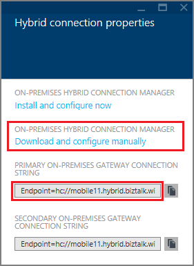
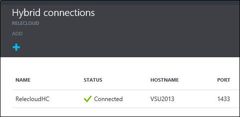

1. Dans la carte de **connexions hybride** , cliquez sur la connexion hybride que vous venez de créer, puis cliquez sur **Le programme d’installation récepteur**.
    
    
    
4. La carte de **Propriétés de connexion hybride** s’ouvre. Sous **Gestionnaire de connexions hybrides en local**, cliquez sur **Téléchargez et configurez manuellement**, enregistrer le package HybridConnectionManager.msi téléchargé et copiez la chaîne de connexion passerelle.
    
    
    
5. À partir d’une invite de commandes administrateur, tapez la commande suivante pour démarrer le programme d’installation :

        start HybridConnectionManager.msi
 
7. Une fois que le programme d’installation s’exécute, cliquez sur **pas maintenant**, puis accédez au dossier %ProgramFiles%\Microsoft\HybridConnectionManager, exécuter HCMConfigWizard.exe et cliquez sur **Oui** dans la boîte de dialogue **Contrôle de compte d’utilisateur** .
        
7. Collez la chaîne de connexion hybride que vous avez copiée précédemment, puis cliquez sur **OK**. 
    
    
    
8. Une fois l’installation terminée, cliquez sur **Fermer**.
    
    
    
    Sur la carte de **connexions hybride** , la colonne **statut** indique maintenant **connecté**. 
    
    