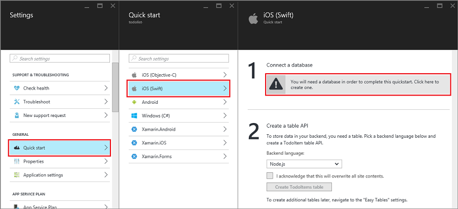

1. Ouvrez une session sur le [portail Azure].

2. Cliquez sur **+ Nouveau** > **Web + Mobile** > **Application Mobile**, puis attribuez un nom à votre version de serveur de l’application Mobile.

3. Pour le **Groupe de ressources**, sélectionnez un groupe de ressources existant ou créez-en un nouveau (en utilisant le même nom en tant que votre application.) 
 
    Vous pouvez sélectionner un autre plan de services d’application ou créez-en une. Pour plus d’informations sur les Services d’application plans et comment créer un plan dans un autre tarifs niveau et dans l’emplacement souhaité, voir [vue d’ensemble détaillée de Service d’application Azure offres](../articles/app-service/azure-web-sites-web-hosting-plans-in-depth-overview.md).

4. Pour le **plan de services d’application**, le plan par défaut (dans la [couche Standard](https://azure.microsoft.com/pricing/details/app-service/)) est sélectionné. Vous pouvez également sélectionner un autre plan ou [créez-en une](../app-service/azure-web-sites-web-hosting-plans-in-depth-overview.md#create-an-app-service-plan). Paramètres de l’offre Service d’application déterminent les [emplacement, fonctionnalités, des coûts et ressources de calcul](https://azure.microsoft.com/pricing/details/app-service/) associé à votre application. 

    Après avoir décidé du plan, cliquez sur **créer**. Cela crée le système principal de l’application Mobile. 
    
6. Dans la carte de **paramètres** pour le nouveau système principal de l’application Mobile, cliquez sur **démarrage rapide** > votre plateforme d’application client > **se connecter une base de données**. 

    

7. Dans la carte de **connexion de données ajouter** , cliquez sur **Base de données SQL** > **créer une nouvelle base de données**, tapez le **nom**de la base de données, choisissez un niveau de tarification, puis cliquez sur **le serveur**.  Vous pouvez réutiliser cette nouvelle base de données. Si vous avez déjà une base de données au même emplacement, vous préférez **utiliser une base de données existante**. N’est pas recommandé d’utiliser une base de données dans un autre emplacement en raison des coûts de bande passante et latence plus élevée.
 
    

8. Dans la carte **serveur nouveau** , tapez un nom unique dans le champ **nom du serveur** , fournissent une connexion et un mot de passe, contactez les **services autoriser azure pour accéder à server**, puis cliquez sur **OK**. Cela crée la nouvelle base de données.

9. Dans la carte de **connexion de données ajouter** , cliquez sur la **chaîne de connexion**, tapez les valeurs de nom d’utilisateur et mot de passe de votre base de données, puis sur **OK**. Patientez quelques minutes pour que la base de données à déployer correctement avant de poursuivre.

<!-- URLs. -->
[Portail Azure]: https://portal.azure.com/
