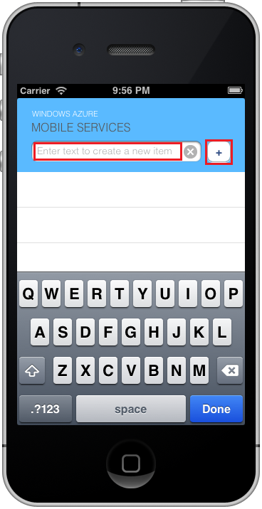

1. Sur votre Mac, visitez le [Portail Azure]. Cliquez sur **Rechercher tout** > **Applications Mobile** > le système principal que vous venez de créer. Dans les paramètres de l’application mobile, cliquez sur **démarrage rapide** > **iOS (objectif-C)**. Si vous préférez Swift, cliquez sur **démarrage rapide** > **iOS (Swift)** à la place. Sous **télécharger et exécuter votre projet iOS**, cliquez sur **Télécharger**. Ceci permet de télécharger un projet Xcode complet pour une application préconfigurée pour vous connecter à votre serveur principal. Ouvrez le projet à l’aide de Xcode.

2. Appuyez sur le bouton **exécuter** pour générer le projet et lancer l’application dans le simulator iOS.

3. Dans l’application, tapez le texte significatif, tels que _le didacticiel achevé_ , puis cliquez sur le signe plus (**+**) icône. Cela envoie une demande de publication sur le serveur principal Azure que vous déployé précédemment. La version serveur l’insertion de données à partir de la demande est dans la table TodoItem SQL et renvoie des informations sur les éléments nouvellement stockées revenir à l’application mobile. L’application mobile affiche ces données dans la liste. 

    

[Portail Azure]: https://portal.azure.com/
