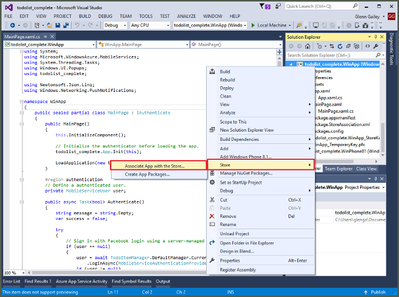

1. Dans Visual Studio Solution Explorer, clic droit sur le projet de l’application du Windows Store, cliquez sur **banque** > **Application associer avec le magasin...**.

    

2. Dans l’Assistant, cliquez sur **suivant**, connectez-vous avec votre compte Microsoft, tapez un nom pour votre application en **réserve un nouveau nom de l’application**, puis cliquez sur **réserver**.

3. Une fois l’inscription de l’application est créée, sélectionnez le nouveau nom de l’application et cliquez sur **suivant**, puis cliquez sur **associer**. Cela ajoute les informations d’enregistrement du Windows Store requises au manifeste d’application.

7. Répétez les étapes 1 et 3 pour le projet de l’application Windows Phone Store à l’aide du même type d’enregistrement que vous avez créé précédemment pour l’application Windows Store.  

7. Accédez au [Centre de développement Windows](https://dev.windows.com/en-us/overview), se connecter avec votre compte Microsoft, cliquez sur le nouvel enregistrement de l’application dans **Mes applications**, puis développez **Services** > **notifications de transmission**.

8. Dans la page **notifications de transmission** , cliquez sur **site Live Services** sous **Services de Notification Push Windows (WNS) et les applications Microsoft Azure Mobile**et prenez note des valeurs de l' **Identificateur de Package de sécurité** et la valeur *actuelle* dans **l’Application code Secret**. 

    

    > [AZURE.IMPORTANT] L’application secret et le package identificateur de sécurité sont les informations d’identification de sécurité importants. Vous ne pouvez partager ces valeurs avec tout le monde ou les distribuer avec votre application.
