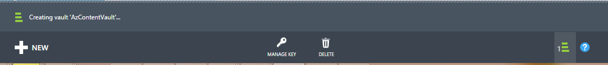
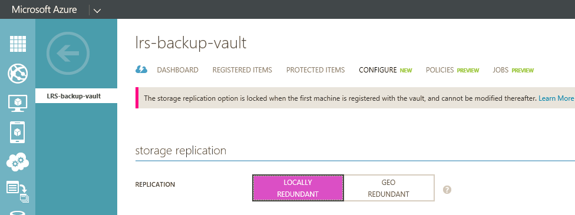

## Créer un archivage sécurisé sauvegarde
Pour sauvegarder des fichiers et des données à partir de Windows Server ou Data Protection Manager (DPM) pour Azure ou lorsque vous sauvegardez IaaS machines virtuelles vers Azure, vous devez créer un archivage sécurisé sauvegarde dans la région géographique dans lequel vous voulez stocker les données.

Les étapes suivantes vous guidera tout au long de la création de l’archivage sécurisé permet de stocker des sauvegardes.

1. Connectez-vous au [portail de gestion](https://manage.windowsazure.com/)
2. Cliquez sur **Nouveau** > **Data Services** > **Services de récupération** > **Sauvegarde l’archivage sécurisé** et choisissez **Création rapide**.

    

3. Pour le paramètre **nom** , entrez un nom convivial pour identifier l’archivage sécurisé sauvegarde. Il doit être unique pour chaque abonnement.

4. Pour le paramètre de **région** , sélectionnez la région géographique pour l’archivage sécurisé sauvegarde. Le choix détermine la région géographique à laquelle vos données de sauvegarde sont envoyées. En choisissant une région géographique près de votre emplacement, vous pouvez encore réduire la latence du réseau lorsque vous sauvegardez vers Azure.

5. Cliquez sur **Créer l’archivage sécurisé** pour terminer le flux de travail. Il peut prendre un certain temps pour l’archivage sécurisé sauvegarde à créer. Pour vérifier l’état, vous pouvez surveiller les notifications en bas du portail.

    

6. Une fois que l’archivage sécurisé sauvegarde a été créé, un message vous signale que la archivage sécurisé a été créé. L’archivage sécurisé est également répertorié dans les ressources pour les Services de récupération comme étant **actif**.

    

### Sauvegarde Azure - Options de stockage de redondance

>[AZURE.IMPORTANT] Le meilleur moment pour identifier votre option de redondance de stockage est juste après la création de l’archivage sécurisé, et avant que tous les ordinateurs sont enregistrés à l’archivage sécurisé. Une fois qu’un élément a été enregistré à l’archivage sécurisé, l’option de redondance de stockage est verrouillée et ne peut pas être modifiée.

Besoins de votre entreprise doivent déterminer la duplication de stockage du stockage et sauvegarde Azure. Si vous utilisez Azure comme un point de terminaison de stockage de sauvegarde principal (par exemple, vous sauvegardez sur Azure à partir de Windows Server), vous devez prendre en compte en sélectionnant (par défaut) Geo redondants option de stockage. Il est vu sous l’option **configuration** de votre l’archivage sécurisé sauvegarde.

#### Stockage geo redondantes (GRS)
GRS conserve six copies de vos données. Avec GRS, vos données sont répliquées trois fois dans la zone principale et sont également répliquées trois fois dans une zone secondaire des centaines de miles en dehors de la région principale, assurant le niveau le plus élevé de durabilité. En cas de panne la région principale, par le stockage de données dans GRS, Azure sauvegarde garantit que vos données sont résistants dans deux régions distinctes.

#### Stockage localement redondante (LRS)
Stockage localement redondante (LRS) gère trois copies de vos données. LRS est répliquée trois fois dans un site unique dans une seule région. LRS protège vos données contre les défaillances matérielles normal, mais pas à partir de l’échec d’une installation Azure entière.

Si vous utilisez Azure comme point de terminaison troisième stockage de sauvegarde (par exemple, vous utilisez SCDPM pour disposer d’une sauvegarde locale copier en local et l’utilisation de Azure pour votre rétention à long terme doit), vous devriez choisir stockage redondants localement à partir de l’option **configuration** de votre l’archivage sécurisé de sauvegarde. Cela vers le bas du coût de stockage des données dans Azure, tout en fournissant un niveau inférieur de durabilité pour vos données peuvent être acceptables pour la troisième copies.

