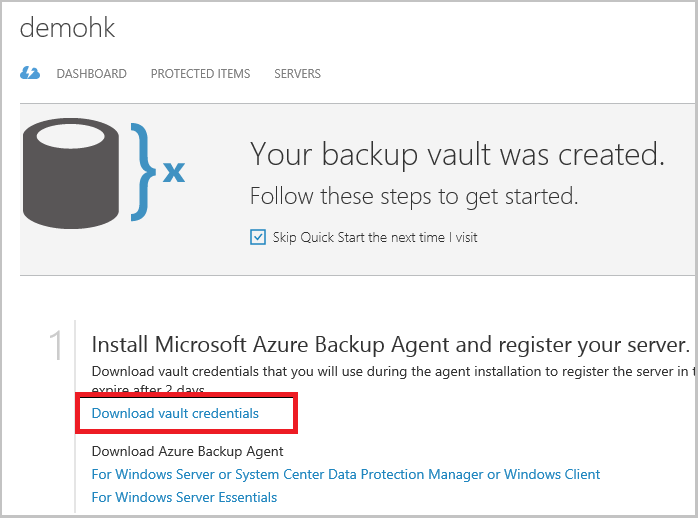

## À l’aide de l’archivage sécurisé les informations d’identification pour vous authentifier avec le service de sauvegarde d’Azure

Le serveur local (Windows client ou serveur Windows Server ou Data Protection Manager) doit être authentifié avec un archivage sécurisé sauvegarde qu’il puisse sauvegarder données Azure. L’authentification est obtenue à l’aide de « vault informations d’identification ». Le concept d’informations d’identification de l’archivage sécurisé est similaire au concept d’un fichier « paramètres de publication » qui est utilisé dans Azure PowerShell.

### Quel est le fichier d’informations d’identification de l’archivage sécurisé ?

Le fichier d’informations d’identification de l’archivage sécurisé est un certificat généré par le portail pour chaque l’archivage sécurisé sauvegarde. Le portail télécharge puis la clé publique à Access Control Service (ACS). La clé privée du certificat est rendue disponible à l’utilisateur dans le cadre du flux de travail qui est indiquée comme une entrée dans le flux de travail de l’enregistrement automatique. Cela authentifie l’ordinateur pour envoyer des données de sauvegarde à un archivage sécurisé identifié dans le service de sauvegarde Azure.

Les informations d’identification de l’archivage sécurisé sont utilisée uniquement pendant le flux de travail d’inscription. Il est responsable de l’utilisateur pour vous assurer que le fichier d’informations d’identification de l’archivage sécurisé n’est pas compromis. S’il se trouve dans les mains d’un utilisateur non fiables, le fichier d’informations d’identification de l’archivage sécurisé peut servir à enregistrer des autres ordinateurs contre l’archivage sécurisé même. Toutefois, comme les données de sauvegarde sont chiffrées à l’aide d’un mot de passe qui appartient au client, données de sauvegarde existantes ne peuvent pas être compromises. Pour atténuer ce problème, les informations d’identification de l’archivage sécurisé sont configurées pour expirer dans 48hrs. Vous pouvez télécharger les informations d’identification de l’archivage sécurisé d’un archivage sécurisé sauvegarde autant de fois – mais seulement le fichier de d’informations d’identification de l’archivage sécurisé plus récent est applicable pendant le flux de travail d’inscription.

### Téléchargez le fichier d’informations d’identification de l’archivage sécurisé

Le fichier d’informations d’identification de l’archivage sécurisé est téléchargé via un canal sécurisé à partir du portail Azure. Le service de sauvegarde Azure n’a pas connaissance de la clé privée du certificat et la clé privée n’est pas conservée dans le portail ou le service. Suivez les étapes suivantes pour télécharger le fichier d’informations d’identification de l’archivage sécurisé sur un ordinateur local.

1.  Connectez-vous au [portail de gestion](https://manage.windowsazure.com/)
2.  Dans le volet de navigation gauche, cliquez sur **Services de récupération** et sélectionnez l’archivage sécurisé sauvegarde que vous avez créée. Cliquez sur l’icône de cloud pour accéder à la vue de démarrage rapide de l’archivage sécurisé sauvegarde.

    

3.  Dans la page de démarrage rapide, cliquez sur **télécharger les informations d’identification de l’archivage sécurisé**. Le portail génère le fichier d’informations d’identification de l’archivage sécurisé, qui sera disponible au téléchargement.

    

4.  Le portail génère une information d’identification de l’archivage sécurisé à l’aide d’une combinaison du nom de l’archivage sécurisé et la date du jour. Cliquez sur **Enregistrer** pour télécharger les informations d’identification de l’archivage sécurisé au dossier des téléchargements du compte local, ou sélectionnez Enregistrer sous dans le menu Enregistrer pour spécifier un emplacement pour les informations d’identification de l’archivage sécurisé.

### Remarque
- Vérifiez que les informations d’identification de l’archivage sécurisé est enregistré dans un emplacement accessible à partir de votre ordinateur. S’il est stocké dans un partage de fichier/PME, recherchez les autorisations d’accès.
- Le fichier d’informations d’identification de l’archivage sécurisé est utilisé uniquement pendant le flux de travail d’inscription.
- Le fichier d’informations d’identification de l’archivage sécurisé expire après 48hrs et peut être téléchargé à partir du portail.
- Reportez-vous à la sauvegarde Azure [Forum aux questions sur](../articles/backup/backup-azure-backup-faq.md) vous avez des questions sur le flux de travail.
