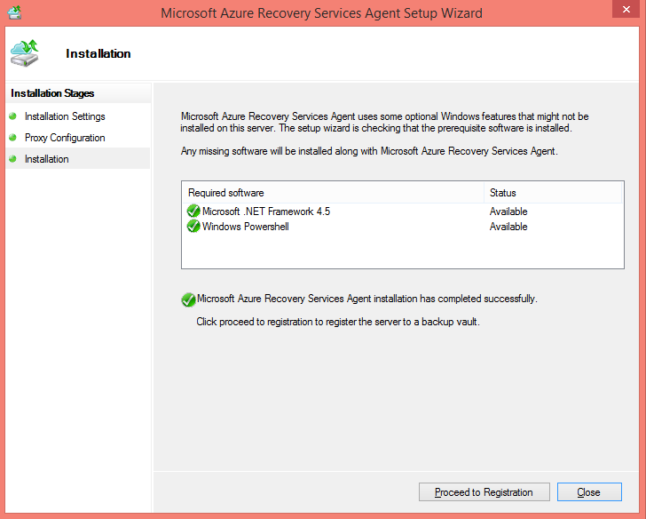

## Télécharger, installer et inscrire l’agent de sauvegarde Azure

Après avoir créé l’archivage sécurisé sauvegarde Azure, un agent doit être installé sur chacun de vos ordinateurs Windows (Windows Server, client Windows, System Center Data Protection Manager server ou machine Azure sauvegarde serveur) qui permet de sauvegarder des données et applications vers Azure.

1. Connectez-vous au [portail de gestion](https://manage.windowsazure.com/)

2. Cliquez sur **Services de récupération**, puis sélectionnez l’archivage sécurisé sauvegarde que vous voulez enregistrer avec un serveur. La page de démarrage rapide pour que l’archivage sécurisé sauvegarde s’affiche.

    

3. Dans la page de démarrage rapide, cliquez sur l’option **de Windows Server System Center Data Protection Manager ou Windows client** sous **Télécharger l’Agent**. Cliquez sur **Enregistrer** pour copier vers l’ordinateur local.

    

4. Une fois que l’agent est installé, double-cliquez sur MARSAgentInstaller.exe pour lancer l’installation de l’agent de sauvegarde Azure. Choisissez le dossier d’installation et un dossier de travail requise pour l’agent. L’emplacement du cache spécifié comporter qu’un espace, ce qui correspond au moins 5 % des données de sauvegarde.

5.  Si vous utilisez un serveur proxy pour vous connecter à internet, dans l’écran de **configuration du serveur Proxy** , entrez les détails du serveur proxy. Si vous utilisez un proxy authentifié, entrez les informations de nom et mot de passe utilisateur dans cet écran.

6.  L’agent de sauvegarde Azure installe .NET Framework 4.5 et Windows PowerShell (si elle n’est pas disponible déjà) pour terminer l’installation.

7.  Une fois que l’agent est installé, cliquez sur le bouton **continuer à la page inscription** pour continuer le flux de travail.

    

8. Dans l’écran d’informations d’identification de l’archivage sécurisé, recherchez et sélectionnez le fichier d’informations d’identification de l’archivage sécurisé qui a été précédemment téléchargé.

    

    Le fichier d’informations d’identification de l’archivage sécurisé est valide uniquement pour 48 heures (après son téléchargement à partir du portail). Si vous rencontrez l’erreur de cet écran (par exemple « fichier d’informations d’identification de l’archivage sécurisé fourni a expiré »), connexion au portail Azure et de télécharger à nouveau le fichier d’informations d’identification de l’archivage sécurisé.

    Vérifiez que le fichier d’informations d’identification de l’archivage sécurisé est disponible dans un emplacement accessible par l’application de configuration. Si vous rencontrez des erreurs connexes d’accès, copiez le fichier d’informations d’identification de l’archivage sécurisé vers un emplacement temporaire sur cet ordinateur et recommencez l’opération.

    Si vous rencontrez une erreur d’informations d’identification de l’archivage sécurisé non valides (par exemple « non valides de l’archivage sécurisé informations d’identification fournies ») le fichier est endommagé ou les dernières informations d’identification avec le service de récupération signifie avez pas associé. Recommencez l’opération après avoir téléchargé un nouveau fichier d’informations d’identification de l’archivage sécurisé à partir du portail. Cette erreur se produite généralement si l’utilisateur clique sur l’option de **télécharger les informations d’identification de l’archivage sécurisé** dans le portail Azure, rapidement. Dans ce cas, seul le deuxième fichier de d’informations d’identification de l’archivage sécurisé est valide.

9. Dans l’écran **paramètres de chiffrement** , vous pouvez générer un mot de passe ou fournir un mot de passe (minimum de 16 caractères). N’oubliez pas d’enregistrer le mot de passe dans un emplacement sécurisé.

    

    > [AZURE.WARNING] Si le mot de passe est perdu ou oublié ; Microsoft ne peut pas vous aider à récupérer les données de sauvegarde. L’utilisateur final possède le mot de passe de chiffrement et Microsoft n’a pas de visibilité sur le mot de passe utilisé par l’utilisateur final. Enregistrez le fichier dans un emplacement sécurisé qu’il est nécessaire au cours d’une opération de récupération.

10. Une fois que vous cliquez sur le bouton **Terminer** , l’ordinateur a été enregistré à l’archivage sécurisé et vous êtes maintenant prêt à démarrer la sauvegarde sur Microsoft Azure.

11. Lorsque vous utilisez Microsoft Azure sauvegarde autonome, vous pouvez modifier les paramètres spécifiés pendant le flux de travail d’inscription en cliquant sur l’option **Modifier les propriétés** dans le composant logiciel enfichable mmc de sauvegarde Azure dans.

    

    Par ailleurs, lorsque vous utilisez Data Protection Manager, vous pouvez modifier les paramètres spécifiés pendant le flux de travail d’inscription en cliquant sur l’option **configurer** en sélectionnant **Online** sous l’onglet **gestion** .

    
