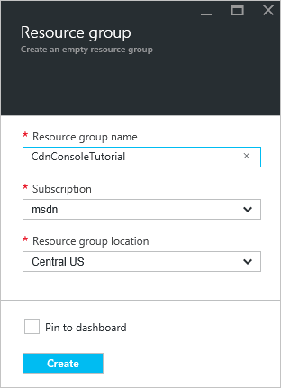
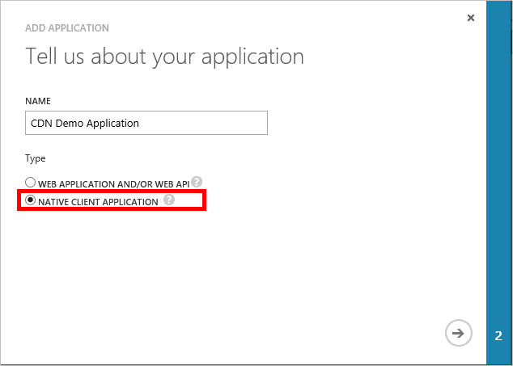

## Conditions préalables

Avant que nous pouvons écrire du code de gestion des CDN, nous avons besoin effectuer certaines tâches de préparation pour permettre à notre code interagir avec le Gestionnaire de ressources Azure.  Pour ce faire, vous devez :

* Créer un groupe de ressources pour contenir du profil CDN que nous créer dans ce didacticiel
* Configurer Azure Active Directory pour fournir une authentification pour notre application
* Appliquer des autorisations au groupe de ressources afin que seuls les utilisateurs autorisés à partir de notre client Azure AD peuvent interagir avec notre profil CDN

### Création du groupe de ressources

1. Connectez-vous au [portail Azure](https://portal.azure.com).

2. Cliquez sur le bouton **Nouveau** dans le coin supérieur gauche, puis **gestion**et **Groupe de ressources**.
    
    

3. Appeler votre groupe de ressources *CdnConsoleTutorial*.  Sélectionnez votre abonnement et choisissez un emplacement près de chez vous.  Si vous le souhaitez, vous pouvez cliquer sur la case à cocher **Ajouter au tableau de bord** pour épingler le groupe de ressources au tableau de bord dans le portail.  Cela facilitera la retrouver ultérieurement.  Une fois que vous avez effectué vos sélections, cliquez sur **créer**.

    

4. Une fois que le groupe de ressources est créé, si vous n’avez pas l’épingler à votre tableau de bord, vous la trouverez en cliquant sur **Parcourir**, puis **Groupes de ressources**.  Cliquez sur le groupe de ressources pour l’ouvrir.  Prenez note de votre **ID de l’abonnement**.  Nous en aurez besoin ultérieurement.

    

### Création de l’application Azure AD et appliquer des autorisations

Il existe deux manières d’authentification de l’application avec Azure Active Directory : les utilisateurs individuels ou un principal de service. Un service principal est similaire à un compte de service dans Windows.  Au lieu d’octroyer des autorisations pour interagir avec les profils CDN un utilisateur particulier, nous accordez à la place les autorisations pour le service principal.  Principaux de service est généralement utilisés pour les processus automatisés, non interactif.  Bien que ce didacticiel écrit une application console interactive, nous allons nous concentrer sur l’approche principal de service.

Création d’un principal de service se compose de plusieurs étapes, y compris la création d’une application Azure Active Directory.  Pour ce faire, nous allons [Suivez ce didacticiel](../articles/resource-group-create-service-principal-portal.md).

> [AZURE.IMPORTANT] Veillez à suivre toutes les étapes décrites dans le [didacticiel liée](../articles/resource-group-create-service-principal-portal.md).  Il est *très important* terminer exactement comme indiqué.  Veillez à noter votre **ID de client**, **nom de domaine client** (fréquemment un *. onmicrosoft.com* domaine, sauf si vous avez spécifié un domaine personnalisé), **Réf client**et **clé d’authentification client**, comme nous avons besoin de ces versions ultérieures.  Veillez à protéger votre **ID client** et la **clé d’authentification client**, car ces informations d’identification peuvent être utilisées par tout le monde à exécuter des opérations en tant que l’entité de service. 
>   
> Lorsque vous arrivez à l’étape de [configuration d’application cliente multiples](../articles/resource-group-create-service-principal-portal.md#configure-multi-tenant-application), sélectionnez **non**.
> 
> Lorsque vous arrivez à l’étape [affecter application au rôle](../articles/resource-group-create-service-principal-portal.md#assign-application-to-role), utilisez le groupe de ressources que nous avons créé précédemment, *CdnConsoleTutorial*, mais plutôt que le rôle de **lecteur** , attribuer le rôle de **Collaborateur de profil CDN** .  Après avoir affecté à l’application le rôle de **Collaborateur de profil CDN** sur votre groupe de ressources, revenir à ce didacticiel. 

Une fois que vous avez créé votre service principal et le rôle de **Collaborateur de profil CDN** , la carte **utilisateurs** pour votre groupe de ressources doit ressembler à ceci.

### Authentification des utilisateurs interactifs

Si, au lieu d’une entité de service, vous préférez que l’authentification des utilisateurs individuels interactifs, le processus est très similaire à celui d’une entité de service.  En fait, vous devez suivre la même procédure, mais apporter quelques modifications mineures.

> [AZURE.IMPORTANT] Suivez ces étapes suivantes uniquement si vous préférez utiliser l’authentification des utilisateurs individuels à la place d’un service principal.

1. Lorsque vous créez votre application, au lieu de l' **Application Web**, cliquez sur **application Native**. 
    
    
    
2. Dans la page suivante, vous demandera un **Rediriger URI**.  L’URI ne validé, mais n’oubliez pas ce que vous avez entré.  Vous en aurez besoin ultérieurement. 

3. Il est inutile de créer une **clé d’authentification client**.

4. Au lieu de l’affectation d’un principal de service pour le rôle de **Collaborateur de profil CDN** , nous allons affecter des utilisateurs individuels ou des groupes.  Dans cet exemple, vous pouvez voir que j’ai affecté *Canada-démo utilisateur* au rôle de **Collaborateur de profil CDN** .  
    
    

