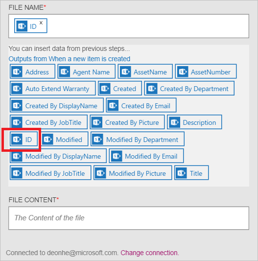

Maintenant que vous avez ajouté un déclencheur, il est temps de faire quelque chose intéressantes avec les données qui sont générées par le déclencheur. Suivez ces étapes pour ajouter un l’action **SharePoint Online : créer le fichier** . Cette action crée un fichier dans SharePoint Online chaque fois que le nouveau déclencheur d’élément s’exécute. 

Pour configurer cette action, vous devrez fournir les informations suivantes. Vous remarquerez qu’il est facile d’utilisation données générées par le déclencheur comme entrée pour certaines des propriétés pour le nouveau fichier :

|Créer des propriétés de fichier|Description|
|---|---|
|URL du site|Il s’agit de l’URL du site SharePoint Online dans lequel vous voulez créer le nouveau fichier. Sélectionnez le site dans la liste affichée.|
|Chemin d’accès de dossier|C’est le dossier (à l’URL du Site) où le nouveau fichier sera placé. Recherchez et sélectionnez le dossier.|
|Nom de fichier|Il s’agit du nom du fichier en cours de création.|
|Contenu du fichier|Le contenu qui est écrites dans le fichier.|

1. Sélectionnez **+ nouvelle étape** pour ajouter l’action.  
  
- Sélectionnez le lien **Ajouter une action** . Ce bouton ouvre la zone de recherche qui permet de rechercher d’une action que vous voulez prendre. Dans cet exemple, les actions de SharePoint sont utiles.    
    
- Entrez *sharepoint* pour rechercher des actions associées à SharePoint.
- Sélectionnez **SharePoint Online : créer le fichier** en tant que l’action à effectuer.   **Remarque**: vous devrez autoriser votre application logique pour accéder à votre compte SharePoint si vous n'avez pas fait précédemment.    
    
- Le contrôle de **créer un fichier** s’ouvre.   
     
- Sélectionnez **L’URL du Site** , puis naviguez jusqu’au site à l’endroit où vous voulez créer le fichier.     
  
- Sélectionnez le **chemin du dossier** et recherchez le dossier où le nouveau fichier sera placé.  
  
- Sélectionnez le contrôle de **nom de fichier** , entrez le nom du fichier que vous voulez créer. Pour le nom du fichier, notez que vous pouvez utiliser les propriétés à partir du déclencheur que vous avez créé précédemment en le sélectionnant simplement dans la liste affichée.     
  
- Sélectionnez le contrôle de **contenu du fichier** , entrez le contenu qui est écrites dans le fichier qui sera créé. Pour le contenu du fichier, notez que vous pouvez utiliser les propriétés à partir du déclencheur que vous avez créé précédemment. Sélectionnez les propriétés de la liste affichée. Par ailleurs, vous pouvez entrer le **contenu d’un fichier** texte directement dans le contrôle. Dans cet exemple, j’ai sélectionné certaines propriétés et ajouter des espaces et des traits d’union entre chaque propriété.        
  
- Enregistrer les modifications dans votre flux de travail  
