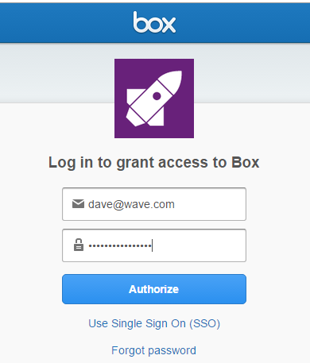

### Conditions préalables

- Un compte de [zone](http://box.com)  

Avant de pouvoir utiliser votre compte de la boîte de dialogue dans une application logique, vous devez autoriser l’application logique pour vous connecter à votre compte de la boîte de dialogue. Peut être effectué en, vous pouvez faire ceci facilement à partir d’au sein de votre application logique sur le portail Azure.  

Voici les étapes pour autoriser votre application logique pour vous connecter à votre compte de zone :  
1. Pour créer une connexion à la boîte de dialogue, dans le Concepteur d’application logique, sélectionnez **afficher Microsoft managed API** dans la liste déroulante, puis entrez *zone* dans la zone de recherche. Sélectionnez l’ou les actions que vous allez utiliser :  
  
2. Si vous n’avez pas créé de toutes les connexions à la zone avant, vous devez obtenir invité à fournir vos informations d’identification de la zone. Ces informations d’identification seront utilisées pour autoriser votre application logique pour vous connecter à et accéder aux données de votre compte zone :  
  
3. Fournir la zone Nom d’utilisateur et mot de passe pour autoriser votre application logique :  
   
4. Nous permettent à se connecter à :  
  
5. Avez-vous remarqué la connexion a été créée et vous êtes maintenant libres de continuer avec les autres étapes dans votre application logique :  
  
