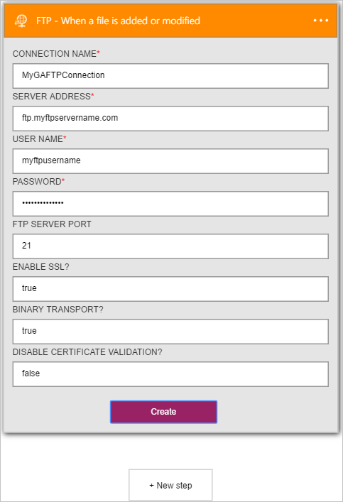
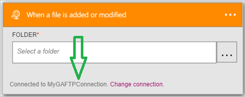

### Conditions préalables

- Un compte [FTP](https://wikipedia.org/wiki/File_Transfer_Protocol)  

Avant de pouvoir utiliser votre compte FTP dans une application logique, vous devez autoriser l’application logique pour vous connecter à votre compte FTP. Peut être effectué en, vous pouvez faire ceci facilement à partir d’au sein de votre application logique sur le portail Azure.  

Voici les étapes pour autoriser votre application logique pour vous connecter à votre compte FTP :  
1. Pour créer une connexion à FTP, dans le Concepteur d’application logique, sélectionnez **afficher Microsoft managed API** dans la liste déroulante, puis entrez *FTP* dans la zone de recherche. Sélectionnez l’ou les actions que vous allez utiliser :  
  
2. Si vous n’avez pas créé de toutes les connexions à FTP avant, vous devez obtenir invité à fournir vos informations d’identification FTP. Ces informations d’identification seront utilisées pour autoriser votre application logique pour vous connecter à et accéder aux données de votre compte FTP :  
  
3. Avez-vous remarqué la connexion a été créée et vous êtes maintenant libres de continuer avec les autres étapes dans votre application logique :  
   
