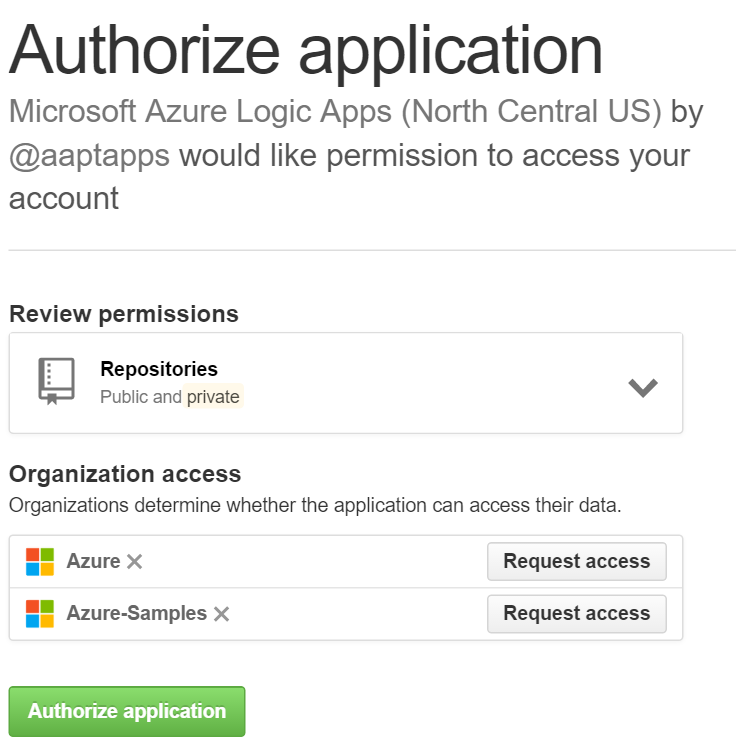
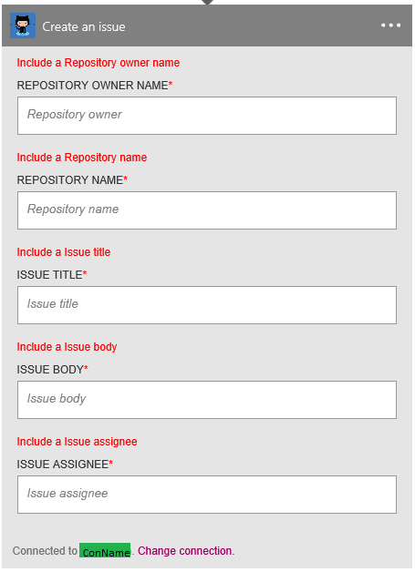

### Conditions préalables
- Un compte [GitHub](http://GitHub.com) 

Avant de pouvoir utiliser votre compte GitHub dans une application logique, vous devez autoriser l’application logique pour vous connecter à votre compte GitHub. Peut être effectué en, vous pouvez faire ceci facilement à partir d’au sein de votre application logique sur le portail Azure. 

Voici les étapes pour autoriser votre application logique pour vous connecter à votre compte GitHub :

1. Pour créer une connexion à GitHub, dans le Concepteur d’application logique, sélectionnez **afficher Microsoft managed API** dans la liste déroulante, puis entrez *GitHub* dans la zone de recherche. Sélectionnez l’ou les actions que vous allez utiliser :  
  
2. Si vous n’avez pas créé de toutes les connexions à GitHub avant, vous devez obtenir invité à fournir vos informations d’identification GitHub. Ces informations d’identification seront utilisées pour autoriser votre application logique pour vous connecter à et accéder aux données de votre compte GitHub :  
  
3. Entrez votre nom d’utilisateur GitHub et le mot de passe pour autoriser votre application logique :  
     
4. Confirmer vos intentions :  
     
5. Notez que la connexion a été créée dans le portail. Vous pouvez maintenant poursuivre et création de votre application logique et l’utilisation de GitHub qu’il contient :   
     
