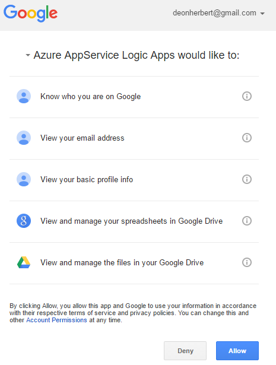

### Conditions préalables

- Un compte [GoogleDrive](https://www.google.com/drive/)  

Avant de pouvoir utiliser votre compte GoogleDrive dans une application logique, vous devez autoriser l’application logique pour vous connecter à votre compte GoogleDrive. Peut être effectué en, vous pouvez faire ceci facilement à partir d’au sein de votre application logique sur le portail Azure.  

Voici les étapes pour autoriser votre application logique pour vous connecter à votre compte GoogleDrive :  
1. Pour créer une connexion à GoogleDrive, dans le Concepteur d’application logique, sélectionnez **afficher Microsoft managed API** dans la liste déroulante, puis entrez *GoogleDrive* dans la zone de recherche. Sélectionnez l’ou les actions que vous allez utiliser :  
  
2. Si vous n’avez pas créé de toutes les connexions à GoogleDrive avant, vous devez obtenir invité à fournir vos informations d’identification GoogleDrive. Ces informations d’identification seront utilisées pour autoriser votre application logique pour vous connecter à et accéder aux données de votre compte GoogleDrive :  
  
3. Indiquer votre adresse de messagerie GoogleDrive :  
   
4. Entrez votre mot de passe GoogleDrive pour autoriser votre application logique :  

5. Autoriser la connexion à GoogleDrive  
  
6. Avez-vous remarqué la connexion a été créée et vous êtes maintenant libres de continuer avec les autres étapes dans votre application logique :  
  

