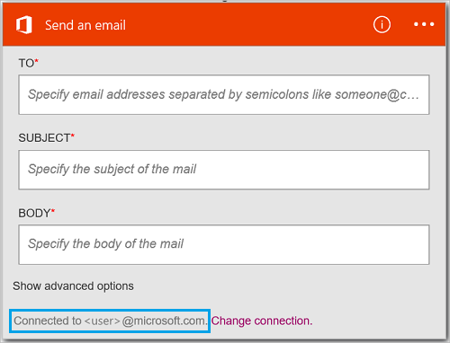

#### Conditions préalables
- Un compte Azure ; Vous pouvez créer un [compte gratuit](https://azure.microsoft.com/free)
- Un compte [Office 365](https://office365.com)  

Avant d’utiliser votre compte Office 365 dans une application logique, autoriser l’application logique pour vous connecter à votre compte Office 365. Vous pouvez le faire facilement au sein de votre application logique sur le portail Azure.  

Autoriser votre application logique pour vous connecter à votre compte Office 365 à l’aide de la procédure suivante :

1. Créer une application logique. Dans le concepteur logique applications, sélectionnez **afficher Microsoft managed API** dans la liste déroulante, puis entrez « office 365 » dans la zone de recherche. Sélectionnez une des actions déclencheurs :  
      

2. Si vous n’avez pas encore créé toutes les connexions à Office 365, vous êtes invité à se connecter à l’aide de vos informations d’identification Office 365 :  
      

3. Sélectionnez **se connecter**, puis entrez votre nom d’utilisateur et mot de passe. Sélectionnez **se connecter**:  
    

    Ces informations sont utilisées pour autoriser votre application logique pour vous connecter à et accéder à votre compte Office 365. 

4. Notez que la connexion a été créée. À présent, effectuez les autres étapes dans votre application logique :   
      
  