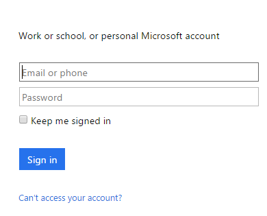

### Conditions préalables

- Un compte [Office 365 vidéo](https://support.office.com/article/Meet-Office-365-Video-ca1cc1a9-a615-46e1-b6a3-40dbd99939a6)  

Avant de pouvoir utiliser votre compte Office 365 vidéo dans une application logique, vous devez autoriser l’application logique pour vous connecter à votre compte Office 365 vidéo. Peut être effectué en, vous pouvez faire ceci facilement à partir d’au sein de votre application logique sur le portail Azure.  

Voici les étapes pour autoriser votre application logique pour vous connecter à votre compte Office 365 vidéo :  
1. Pour créer une connexion à Office 365 vidéo, dans le Concepteur d’application logique, sélectionnez **afficher Microsoft managed API** dans la liste déroulante, puis entrez *Office 365 vidéo* dans la zone de recherche. Sélectionnez l’ou les actions que vous allez utiliser :  
  
2. Si vous n’avez pas créé de toutes les connexions à Office 365 vidéo avant, vous devez obtenir invité à fournir vos informations d’identification Office 365 vidéo. Ces informations d’identification seront utilisées pour autoriser votre application logique pour vous connecter à et accéder aux données de votre compte Office 365 vidéo :  
  
3. Fournir vos informations d’identification pour vous connecter à Office 365 vidéo :  
   
4. Avez-vous remarqué la connexion a été créée et vous êtes maintenant libres de continuer avec les autres étapes dans votre application logique :  
  
