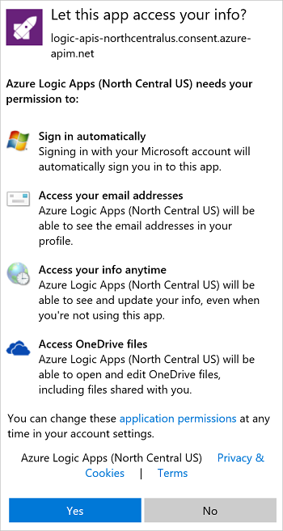

#### Conditions préalables
- Un compte Azure ; Vous pouvez créer un [compte gratuit](https://azure.microsoft.com/free)
- Un compte [OneDrive](https://www.microsoft.com/store/apps/onedrive/9wzdncrfj1p3) 

Avant de pouvoir utiliser votre compte OneDrive dans une application logique, autoriser l’application logique pour vous connecter à votre compte OneDrive.  Vous pouvez le faire facilement au sein de votre application logique sur le portail Azure. 

Autoriser votre application logique pour vous connecter à votre compte OneDrive en utilisant les étapes suivantes :

1. Créer une application logique. Dans le concepteur logique applications, sélectionnez **afficher Microsoft managed API** dans la liste déroulante, puis entrez « onedrive » dans la zone de recherche. Sélectionnez une des actions déclencheurs :  
  
2. Si vous n’avez pas encore créé toutes les connexions à OneDrive, vous êtes invité à se connecter à l’aide de vos informations d’identification OneDrive :  
  
3. Sélectionnez **se connecter**, puis entrez votre nom d’utilisateur et mot de passe. Sélectionnez **se connecter**:  
     

    Ces informations sont utilisées pour autoriser votre application logique se connecter à, et accéder aux données dans votre compte OneDrive. 
4. Sélectionnez **Oui** pour autoriser l’application logique à utiliser votre compte OneDrive :  
     
5. Notez que la connexion a été créée. À présent, effectuez les autres étapes dans votre application logique :  
  
