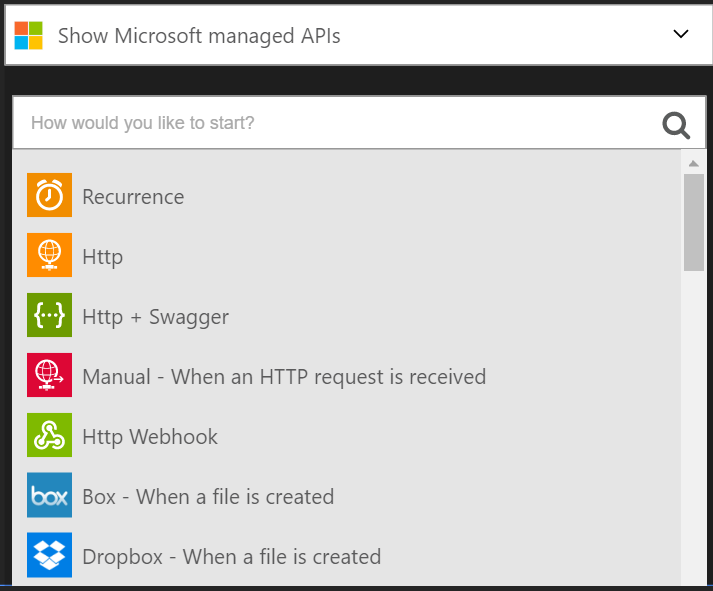
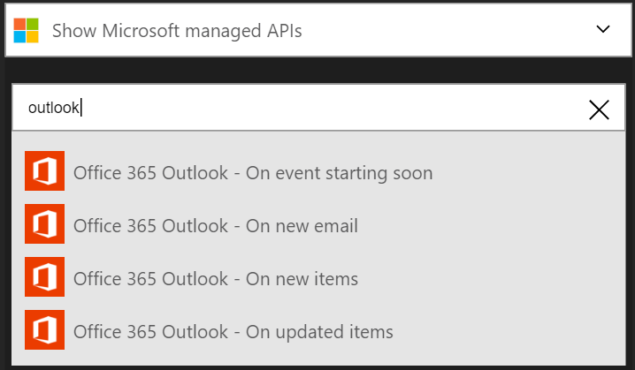

## Se connecter à Outlook.com

### Conditions préalables
- Un compte Outlook.com

Avant de pouvoir utiliser votre compte Outlook.com dans une application logique, vous devez autoriser l’application logique pour vous connecter à votre compte Outlook.com. Peut être effectué en, vous pouvez faire ceci facilement à partir d’au sein de votre application logique sur le portail Azure. 

Voici les étapes pour autoriser votre application logique pour vous connecter à votre compte Outlook.com :

1. Toutes les applications logique doivent être démarrée par un déclencheur une fois que vous avez créé votre application logique, le concepteur ouvre et affiche une liste de déclencheurs que vous pouvez utiliser pour démarrer votre application logique :

  
2. Entrez « outlook » dans la zone de recherche. Remarquez que la liste est filtrée pour répertorier tous les déclencheurs avec « Outlook » dans le nom :
3. Sélectionnez **Office 365 Outlook - sur Nouveau message électronique**.   
  Si vous n’avez pas créé de toutes les connexions à Outlook avant, vous devez obtenir invité à fournir vos informations d’identification Outlook.com. Ces informations d’identification seront utilisées pour autoriser votre application logique pour vous connecter à et accéder aux données de votre compte Outlook.com :
4. Fournir vos informations d’identification pour Outlook et se connecter :  
  Voilà. Vous venez de créer une connexion à Outlook. Cette connexion sera disponible pour une utilisation dans une autre application logique que vous créez.

