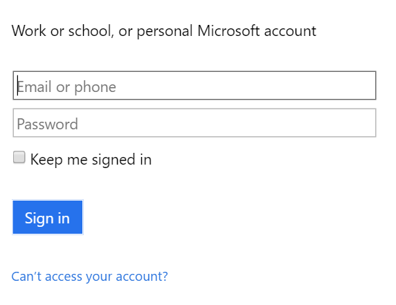

### Conditions préalables
- Un compte [Project Online](https://products.office.com/Project/project-online-with-project-for-office-365) 

Avant de pouvoir utiliser votre compte Project Online dans une application logique, vous devez autoriser l’application logique pour vous connecter à votre compte Project Online. Peut être effectué en, vous pouvez faire ceci facilement à partir d’au sein de votre application logique sur le portail Azure. 

Voici les étapes pour autoriser votre application logique pour vous connecter à votre compte Project Online :

1. Pour créer une connexion à Project Online, dans le Concepteur d’application logique, sélectionnez **afficher Microsoft managed API** dans la liste déroulante, puis entrez *Project Online* dans la zone de recherche. Sélectionnez l’ou les actions que vous allez utiliser :  
  
2. Si vous n’avez pas créé de toutes les connexions à Project Online avant, vous devez obtenir invité à fournir vos informations d’identification Project Online. Ces informations d’identification seront utilisées pour autoriser votre application logique pour vous connecter à et accéder aux données de votre compte Project Online :  
  
3. Entrez votre nom d’utilisateur Project Online et le mot de passe pour autoriser votre application logique :  
     
4. Avez-vous remarqué la connexion a été créée et vous êtes maintenant libres de continuer avec les autres étapes dans votre application logique :  
     
