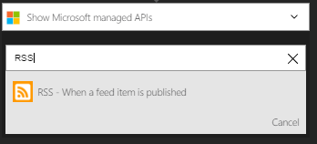

### Conditions préalables

- Un compte [RSS](https://wikipedia.org/wiki/RSS)  

Avant de pouvoir utiliser votre compte RSS dans une application logique, vous devez autoriser l’application logique pour vous connecter à votre compte RSS. Peut être effectué en, vous pouvez faire ceci facilement à partir d’au sein de votre application logique sur le portail Azure.  

Voici les étapes pour autoriser votre application logique pour vous connecter à votre compte RSS :  
1. Pour créer une connexion à RSS, dans le Concepteur d’application logique, sélectionnez **afficher Microsoft managed API** dans la liste déroulante, puis entrez *RSS* dans la zone de recherche. Sélectionnez l’ou les actions que vous allez utiliser :  
  
2. Sélectionnez **créer une connexion** :  
  
3. Avez-vous remarqué la connexion a été créée et vous êtes maintenant libres de continuer avec les autres étapes dans votre application logique :  
   
