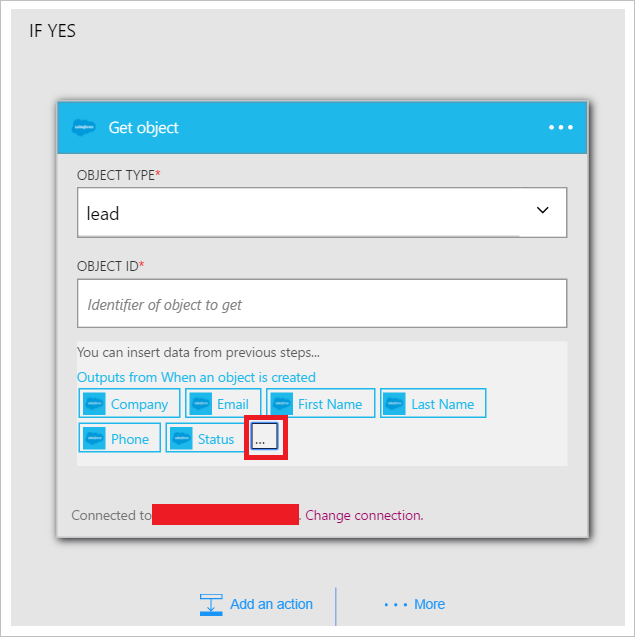

Maintenant que vous avez ajouté une condition, il est temps de faire quelque chose intéressantes avec les données qui sont générées par le déclencheur. Suivez ces étapes pour ajouter l’action **Salesforce - obtention de l’objet** . Cette action obtenez les données chaque fois qu’un prospect est créé. Vous allez également ajouter une deuxième action qui utilisera les données à partir de la force de vente - obtenir une action d’objet pour envoyer un message électronique à l’aide du connecteur Office 365.  

Pour configurer cette action, vous devrez fournir les informations suivantes. Vous remarquerez qu’est générées par le déclencheur en tant qu’entrée pour certaines des propriétés pour le nouveau fichier de données facile à utiliser :

|Créer des propriétés de fichier|Description|
|---|---|
|Type d’objet|Il s’agit du type d’objet Salesforce que qui vous intéresse. Prospect, compte, etc. sont des exemples.|
|ID d’objet|Il s’agit d’un identificateur de l’objet.|

1. Sélectionnez le lien **Ajouter une action** . Ce bouton ouvre la zone de recherche qui permet de rechercher d’une action que vous voulez prendre. Dans cet exemple, Salesforce actions sont utiles.      
  
- Entrez *salesforce* pour rechercher des actions associées à force de vente.
- Sélectionnez **Salesforce - obtention de l’objet** en tant que l’action à effectuer.   **Remarque**: vous devrez autoriser votre application logique pour accéder à votre compte Salesforce si vous n'avez pas fait précédemment.    
    
- Le contrôle **d’obtenir l’objet** s’ouvre.  
- Sélectionnez *prospect* en tant que le type d’objet.
- Sélectionnez le contrôle de **l’ID de l’objet** .
- Sélectionnez **...** pour développer la liste des jetons qui peut être utilisé comme entrée pour les actions.       
    
- Contrôle de sélection **ID prospect** s’ouvre.   
     
- Notez que le jeton ID prospect est désormais dans le contrôle de l’ID de l’objet, indiquant que l’action de l’objet Get recherche un prospect avec un numéro d’identification est égal à l’ID de prospect du prospect qui a déclenché cette application logique.  
  
- Enregistrez votre travail. Par conséquent, vous avez ajouté l’action de l’objet Get à votre application logique. Votre reprendre le contrôle objet doit ressembler à ceci :    
  

Maintenant que vous avez ajouté une action pour obtenir un prospect, vous souhaiterez effectuer une opération intéressantes au prospect nouvellement créé. Dans une entreprise, vous pouvez souhaiter envoyer un message électronique pour être averti une liste de distribution qu’un prospect a été créé. Nous allons utiliser le connecteur Office 365 pour envoyer un message électronique avec une partie des informations pertinentes du nouvel objet prospect dans Salesforce.  

1. Sélectionnez **Ajouter une action** , puis entrez *messagerie* dans le contrôle de recherche. Cela permet de filtrer les actions à ceux qui sont liées à l’envoi et réception de courrier électronique.  
- Sélectionnez l’élément de liste **Office 365 Outlook - envoyer un message électronique** . Si vous n’avez pas déjà créé une *connexion* à votre compte Office 365, vous devrez entrer vos informations d’identification Office 365 pour créer maintenant. Une fois que vous avez terminé, le contrôle **Envoyer un message électronique** s’ouvre.        
  
- Entrez l’adresse de messagerie que vous voulez envoyer un message électronique dans le contrôle **à** .
-  Dans le contrôle de **l’objet** , entrez le *nouveau prospect créé* -, puis sélectionnez le jeton de *société* . Le champ *entreprise* à partir du nouveau prospect créé dans Salesforce s’affiche.  
-  Dans le **corps du** contrôle, vous pouvez sélectionner un des jetons dans le nouvel objet prospect, et vous pouvez également entrer le texte que vous voulez afficher dans le corps du message. Voici un exemple :  
   
- Enregistrez votre flux de travail.  

Voilà. Votre application logique est terminée.  

À présent, vous pouvez tester votre application logique : dans Salesforce, créer un prospect qui répond à la condition que vous avez créé.  Si vous avez suivi cette procédure entièrement, créez simplement un prospect avec une adresse de messagerie qui contient *amazon.com* qu’il contient. Après quelques secondes votre application logique doit être déclenchée et les résultats peuvent ressembler à ceci :  
  

