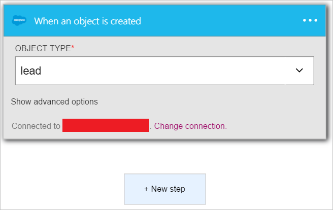
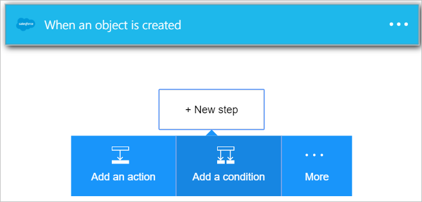
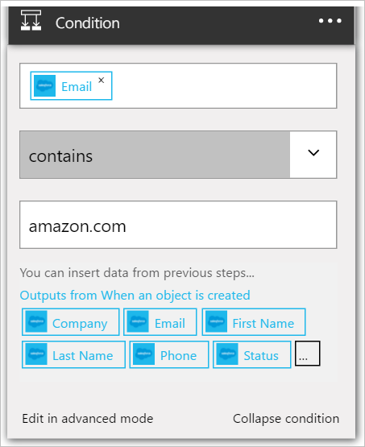

Cette condition correspond le champ adresse de messagerie de chaque nouveau prospect Salesforce. Si l’adresse de messagerie contient *amazon.com*, le résultat de la condition sera *True*.

1. Sélectionnez **+ nouvelle étape**.  
   
- Sélectionnez **Ajouter une condition**.    
  
- Sélectionnez **Choisir une valeur**.    
  
- Sélectionnez le jeton de *messagerie* à partir du prospect du déclencheur.    
  
- Sélectionnez *contient*.      
  
- Sélectionnez **Choisir une valeur** dans la partie inférieure du contrôle.     
  
- Entrer *amazon.com* en tant que la valeur que vous voulez évaluer l’adresse de messagerie du nouveau prospect. Si l’adresse de messagerie contient *amazon.com*, la condition correspond à *Vrai* et poursuivre les autres étapes dans votre application logique.    
  
- Enregistrez vos applications logique.  

