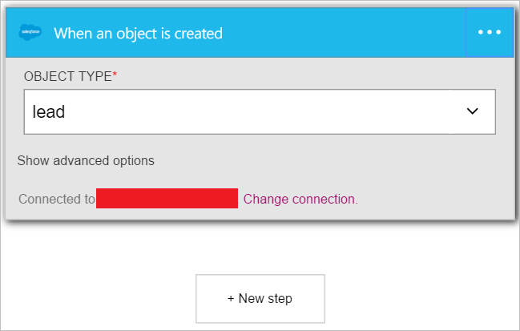

Dans cette procédure, vous allez apprendre à utiliser le déclencheur **Salesforce - lorsqu’un objet est créé** pour démarrer un flux de travail de l’application logique lorsqu’un prospect est créé dans votre force de vente.

>[AZURE.NOTE]Vous sera invité à vous connecter à votre compte Salesforce si vous n’avez pas encore créé une *connexion* à force de vente.  

1. Entrez *salesforce* dans la zone de recherche dans le Concepteur d’applications logique, puis cliquez sur le déclencheur **Salesforce - lorsqu’un objet est créé** .  
   
- Le contrôle **lors de la création d’un objet** est affiché.  
   
- Sélectionnez le **Type d’objet** , puis sélectionnez *prospect* dans la liste d’objets. Dans cette étape vous indiquez que vous créez un déclencheur qui vous avertit votre application logique quand un prospect est créé dans Salesforce.   
   
- Voilà. Vous avez créé le déclencheur. Toutefois, vous devez créer au moins une action afin de pouvoir pour modifier ce une application logique valide.    
   

À ce stade, votre application logique a été configurée avec un déclencheur qui va commencer une exécution des autres déclencheurs et actions dans le flux de travail lorsqu’un nouvel élément est créé dans votre force de vente.  