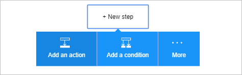

Maintenant que vous avez ajouté un déclencheur, il est temps pour effectuer une opération intéressantes avec les données qui sont générées par le déclencheur. Suivez ces étapes pour ajouter l’action **Bus des services - envoyer le message** . Cette action envoie un message au Service Bus.  

Suivez ces étapes pour créer l’action d’envoi de message :  

1. Sélectionnez **+ nouvelle étape** pour ajouter l’action.  
- Sélectionnez **Ajouter une action**. Ce bouton ouvre une zone de recherche, qui permet de rechercher d’une action que vous voulez prendre. Dans cet exemple, les actions de Bus des services sont utiles.    
   
- Entrez *bus des services*.  
- Sélectionnez **Service Bus - envoyer** en tant que l’action à effectuer.  
    
- Entrez le contenu du message. Cela est nécessaire.  
- Entrez le nom de file d’attente ou une rubrique à laquelle le message sera envoyé. Il est également requis.   
- Fournir des autres détails sur le message. Cette étape est facultative.     
    
- Enregistrer les modifications dans votre flux de travail.   
     
