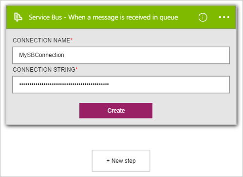
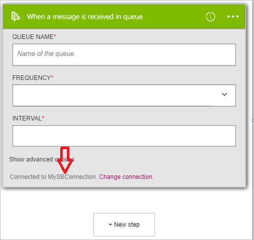

### Conditions préalables

Vous devez disposer d’un compte de [Service Bus](https://azure.microsoft.com/services/service-bus/) .  

Avant de pouvoir utiliser votre compte Bus des services Azure dans une application logique, vous devez autoriser l’application logique pour vous connecter à votre compte de service de bus. Peut être effectué en, vous pouvez faire ceci facilement à partir d’au sein de votre application logique sur le portail Azure.  

Voici les étapes pour autoriser votre application logique pour vous connecter à votre compte de Service Bus :  

1. Pour créer une connexion à Bus des services, dans le Concepteur d’application logique, sélectionnez **afficher Microsoft managed API** dans la liste déroulante. Entrez puis **bus des services** dans la zone de recherche. Sélectionnez le déclencheur ou l’action que vous souhaitez utiliser.  
      

2. Si vous n’avez pas créé de toutes les connexions au Service Bus avant, vous êtes invité à fournir vos informations d’identification Bus des services. Ces informations sont utilisées pour autoriser votre application logique se connecter à et accéder aux données de votre compte de Service Bus. Le connecteur Service doit la chaîne de connexion pour l’espace de noms Bus des services. Elle nécessite également **Gérer** les autorisations. Un bon moyen de déterminer si votre chaîne de connexion est l’espace de noms ou une entité spécifique est si elle contient la `EntityPath` paramètre. Si c’est le cas, il n’est pas la chaîne de connexion appropriée pour une application logique.  
    

1. Une fois que vous avez reçu la chaîne de connexion pour l’espace de noms, vous pouvez l’utiliser pour la connexion de l’API dans les applications logique.  
      

3. Notez la connexion a été créée et que vous êtes maintenant libres de continuer avec les autres étapes dans votre application logique.  
       
