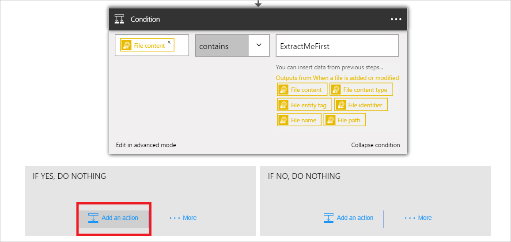
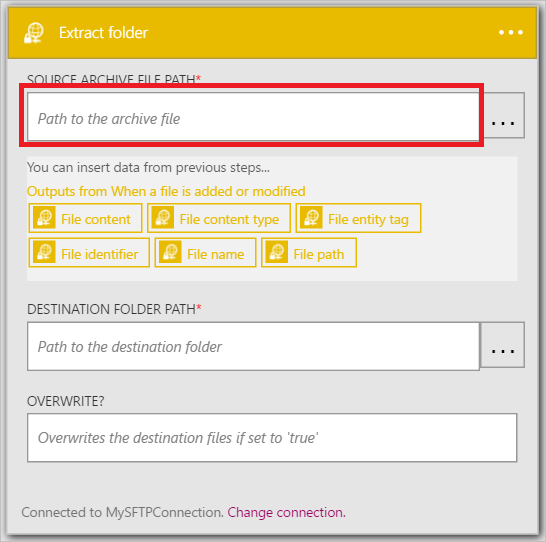
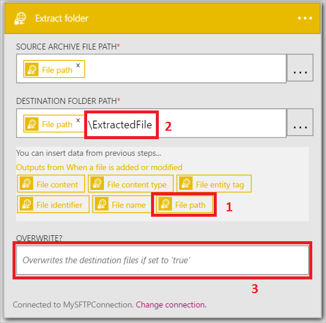

Maintenant que vous avez ajouté un déclencheur, il est temps de faire quelque chose intéressantes avec les données qui sont générées par le déclencheur. Suivez ces étapes pour ajouter un l’action **SFTP - dossier d’extraction** . Cette action extrait le contenu d’un fichier si les conditions définies. 

Pour configurer cette action, vous devrez fournir les informations suivantes. Vous remarquerez qu’il est facile d’utilisation données générées par le déclencheur comme entrée pour certaines des propriétés pour le nouveau fichier :

|SFTP - extrait dossier propriété|Description|
|---|---|
|Chemin de fichier d’archive source|Il s’agit le chemin d’accès du fichier en cours d’extraction. Vous pouvez sélectionner un des jetons à partir d’une action antérieure ou parcourir le serveur SFTP pour rechercher le chemin d’accès du fichier.|
|Chemin d’accès du dossier de destination|Il s’agit le chemin d’accès où les fichiers extraits seront placés. Vous pouvez sélectionner un des jetons à partir d’une action antérieure en tant que le chemin d’accès de destination ou parcourir le serveur SFTP et sélectionnez un chemin d’accès.|
|Remplacer ?|Indique si un fichier avec le même nom que le fichier extrait se trouve dans le chemin d’accès du dossier de destination si le fichier existant doit être remplacé ou non.|

Prise en main Ajout de l’action pour extraire les fichiers si la condition définie précédemment a la valeur *True*. 

1. Sélectionnez **Ajouter une action**.        
   
- Sélectionnez l’action **SFTP - dossier d’extraction**      
   
- Sélectionnez le **chemin d’accès du fichier Source archive**              
   
- Sélectionnez le jeton de **chemin d’accès du fichier** . Cela signifie que vous utiliserez le chemin d’accès de fichier du fichier que le déclencheur introuvable en tant que le chemin du fichier source archive.           
   
- Sélectionnez le **chemin d’accès du dossier de Destination**           
   
- Sélectionnez le jeton de **chemin d’accès du fichier** . Cela signifie que vous utiliserez le chemin d’accès de fichier du fichier que le déclencheur introuvable en tant que le chemin d’accès de destination pour les fichiers extraits.   
- Entrez *\ExtractedFile* dans le contrôle de **chemin d’accès du dossier de Destination** . Procédez comme suit juste après le jeton de chemin d’accès de fichier dans le contrôle de chemin d’accès de dossier de Destination.         
   
- Entrez *True* dans la **Remplacer ?* contrôle pour indiquer que les fichiers existants doivent être remplacés s’ils ont le même nom que les fichiers extraits.      
   
- Enregistrer les modifications dans votre flux de travail  
