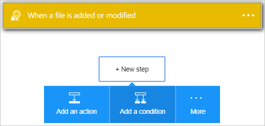
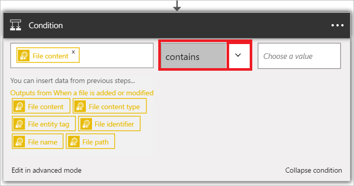

1. Sélectionnez **+ nouvelle étape** pour ajouter l’action.  
- Sélectionnez le lien **Ajouter une action** . Ce bouton ouvre la zone de recherche qui permet de rechercher d’une action que vous voulez prendre. Dans cet exemple, les actions de SharePoint sont utiles.    
    
- Sélectionnez **Choisir une valeur** sur la gauche. 
    
- Sélectionnez le **contenu du fichier** pour indiquer que vous voulez évaluer le contenu du fichier dans la condition.      
   
- Dans la liste des opérateurs, sélectionnez *contient* .       
   
- Sélectionnez **Choisir une valeur** sur la droite, entrez *ExtractMeFirst*. Dans cet exemple, ExtractMeFirst est une valeur qui est censée se trouver dans un fichier à des personnes qui ont accès au dossier SFTP pour indiquer qu’il s’agit d’un fichier d’archive qui doit être ajoutée.  
   