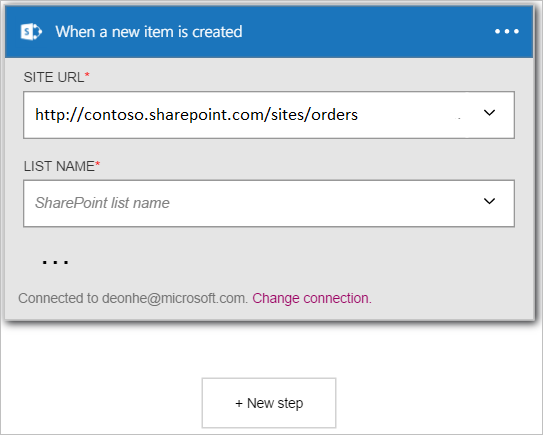

Dans cet exemple, je vous montrent comment utiliser le déclencheur **SharePoint Online - lorsqu’un nouvel élément est créé** pour démarrer un flux de travail de l’application logique lorsqu’un nouvel élément est créé dans une liste SharePoint Online.

>[AZURE.NOTE]Vous sera invité à se connecter à votre compte SharePoint si vous n’avez pas encore créé une *connexion* à SharePoint Online.  

1. Entrez *sharepoint* dans la zone de recherche dans le Concepteur d’applications logique, puis cliquez sur le déclencheur **SharePoint Online - lorsqu’un nouvel élément est créé** .  
  
- Le contrôle **lors de la création d’un nouvel élément** est affiché.  
   
- Sélectionnez une **URL de Site**. Il s’agit du site SharePoint online que vous souhaitez surveiller pour les nouveaux éléments déclencher votre flux de travail.  
   
- Sélectionnez un **nom de la liste**. Il s’agit de la liste sur le site SharePoint Online que vous souhaitez suivre les nouveaux éléments qui doit déclencher votre flux de travail.  
   

À ce stade, votre application logique a été configurée avec un déclencheur qui va commencer une exécution des autres déclencheurs et actions dans le flux de travail. Cela exécutée chaque fois qu’un nouvel élément est créé dans SharePoint Online liste sélectionnée.  