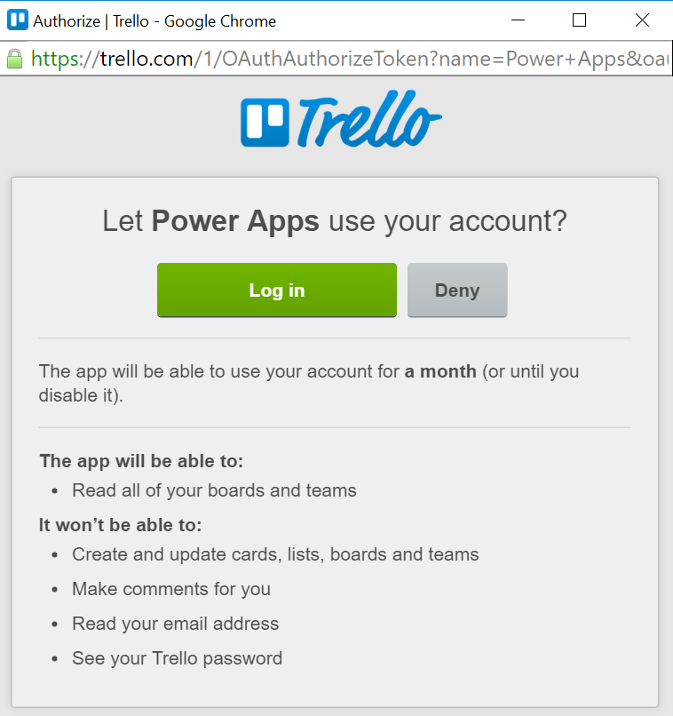

### Conditions préalables
- Un compte [Trello](http://trello.com) 

Avant de pouvoir utiliser votre compte Trello dans une application logique, vous devez autoriser l’application logique pour vous connecter à votre compte Trello. Peut être effectué en, vous pouvez faire ceci facilement à partir d’au sein de votre application logique sur le portail Azure. 

Voici les étapes pour autoriser votre application logique pour vous connecter à votre compte Trello :

1. Pour créer une connexion à Trello, dans le Concepteur d’application logique, sélectionnez **afficher Microsoft managed API** dans la liste déroulante, puis entrez *Trello* dans la zone de recherche. Sélectionnez l’ou les actions que vous allez utiliser :  
  
2. Si vous n’avez pas créé de toutes les connexions à Trello avant, vous devez obtenir invité à fournir vos informations d’identification Trello. Ces informations d’identification seront utilisées pour autoriser votre application logique pour vous connecter à et accéder aux données de votre compte Trello :  
   
3. Nous permettent de vous connecter à Trello :  
     
4. Entrez votre nom d’utilisateur Trello et le mot de passe pour autoriser votre application logique :  
    
5. Avez-vous remarqué la connexion a été créée et vous êtes maintenant libres de continuer avec les autres étapes dans votre application logique :  
  
