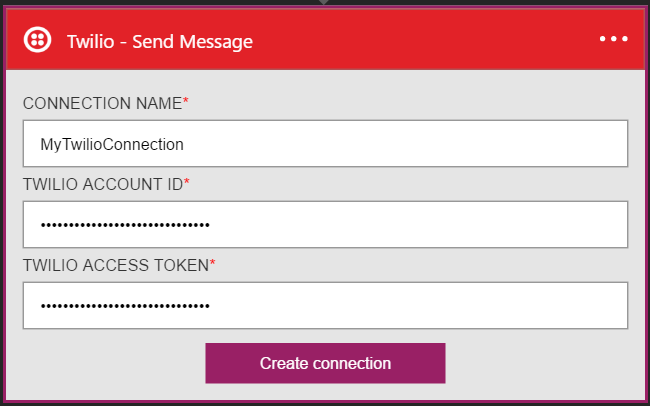
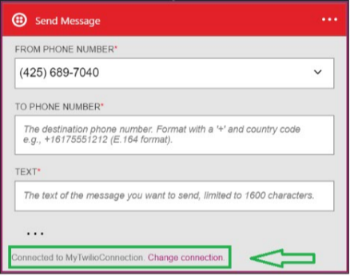

### Conditions préalables
- Un compte Twilio
- Un numéro de téléphone Twilio certifié doit peut recevoir des SMS
- Un numéro de téléphone Twilio certifié qui peut envoyer des SMS

>[AZURE.NOTE] Si vous utilisez un compte d’évaluation Twilio, vous pouvez uniquement envoyer des SMS **vérifié** les numéros de téléphone.  

Avant de pouvoir utiliser votre compte Twilio dans une application logique, vous devez autoriser l’application logique pour vous connecter à votre compte Twilio. Peut être effectué en, vous pouvez faire ceci facilement à partir d’au sein de votre application logique sur le portail Azure. 

Voici les étapes pour autoriser votre application logique pour vous connecter à votre compte Twilio :

1. Pour créer une connexion à Twilio, dans le Concepteur d’application logique, sélectionnez **afficher Microsoft managed API** dans la liste déroulante, puis entrez *Twilio* dans la zone de recherche. Sélectionnez l’ou les actions que vous allez utiliser :  
  
2. Si vous n’avez pas créé de toutes les connexions à Twilio avant, vous devez obtenir invité à fournir vos informations d’identification Twilio. Ces informations d’identification seront utilisées pour autoriser votre application logique pour vous connecter à et accéder aux données de votre compte Twilio :  
    
3. Vous devez **l’id de compte Twilio** et le **jeton d’accès Twilio** dans le tableau de bord Twilio, donc se connecter à votre compte Twilio maintenant permettent de récupérer ces deux éléments d’information :  
    
4. Applications Twilio et logique permet d’identifier ces deux éléments d’information des noms différents. Voici comment vous devez faites-les correspondre à la boîte de dialogue applications logique :  
5. Sélectionnez le bouton **créer une connexion** :  
  
6. Avez-vous remarqué la connexion a été créée et vous êtes maintenant libres de continuer avec les autres étapes dans votre application logique :  
  