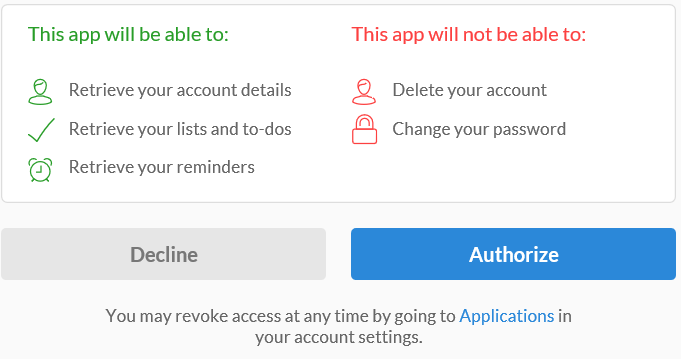

### Conditions préalables
- Un compte Wunderlist  

Avant de pouvoir utiliser votre compte Wunderlist dans une application logique, vous devez autoriser l’application logique pour vous connecter à votre compte Wunderlist. Peut être effectué en, vous pouvez faire ceci facilement à partir d’au sein de votre application logique sur le portail Azure. 

Voici les étapes pour autoriser votre application logique pour vous connecter à votre compte Wunderlist :

1. Pour créer une connexion à Wunderlist, dans le Concepteur d’application logique, sélectionnez **afficher Microsoft managed API** dans la liste déroulante, puis entrez *Wunderlist* dans la zone de recherche. Sélectionnez l’ou les actions que vous allez utiliser :  
  
2. Si vous n’avez pas créé de toutes les connexions à Wunderlist avant, vous devez obtenir invité à fournir vos informations d’identification Wunderlist. Ces informations d’identification seront utilisées pour autoriser votre application logique pour vous connecter à et accéder aux données de votre compte Wunderlist :   
    
2. Fournir vos informations d’identification, puis cliquez sur le bouton se connecter  
    
3. Vous devez ensuite informé que l’application logique disposerez d’autorisations faire avec votre compte Wunderlist. Si vous êtes d’accord, sélectionnez le bouton pour indiquer votre contrat. 
    
4. Enfin, sélectionnez le bouton **Autoriser**  
    

