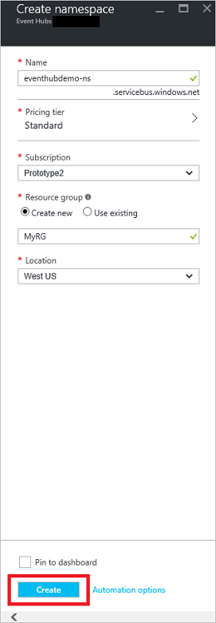
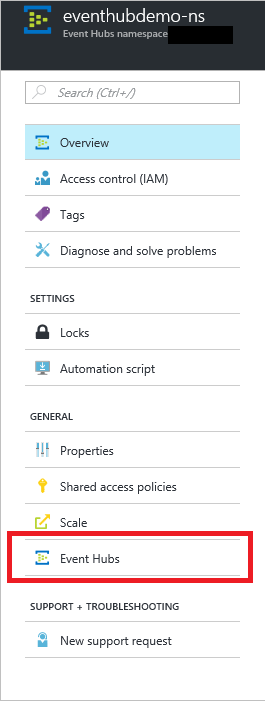

## Créer un concentrateur de l’événement

1. Connectez-vous au [portail Azure][], puis cliquez sur **Nouveau** dans la partie supérieure gauche de l’écran.

2. Cliquez sur **données + Analytique**, puis cliquez sur **Événement Hubs**.

    

3. Dans la carte de **l’espace de noms de créer** , entrez un nom de l’espace de noms. Le système vérifie immédiatement si le nom est disponible.

    

4. Après avoir apporté que l’espace de noms nom n’est disponible, choisissez le niveau de tarification (Basic ou Standard). En outre, choisissez un abonnement Azure, un groupe de ressources et un emplacement dans lequel vous souhaitez créer la ressource. 

2. Cliquez sur **créer** pour créer l’espace de noms.

6. Dans la liste d’espace de noms Hubs événement, cliquez sur l’espace de noms nouvellement créé.      

    

7. Dans la carte de l’espace de noms, cliquez sur **Événement Hubs**.

    

8. En haut de la carte, cliquez sur **Ajouter des événements concentrateur**.

    

3. Tapez un nom pour votre plateforme d’événement, puis cliquez sur **créer**.

    

4. Dans la liste des événements Hubs, cliquez sur le nom d’événement concentrateur nouvellement créé. 

    

5. Dans l’espace de noms carte (pas la carte événement concentrateur spécifique), cliquez sur **stratégies d’accès Shared**, puis cliquez sur **RootManageSharedAccessKey**.

    

5. Cliquez sur le bouton Copier pour copier la chaîne de connexion **RootManageSharedAccessKey** dans le Presse-papiers. Enregistrez cette chaîne de connexion à utiliser plus loin dans le didacticiel.

    

Votre plateforme d’événement est créée, et que vous avez les chaînes de connexion que vous devez envoyer et recevoir des événements.

[Portail Azure]: https://portal.azure.com/