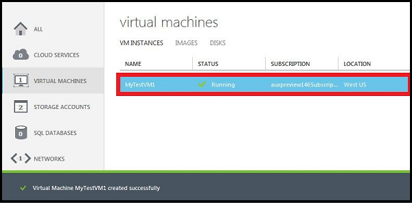

#Comment créer une Machine virtuelle personnalisé

Une machine virtuelle *personnalisé* fait référence à une machine virtuelle que vous créez à l’aide de la méthode **De la galerie** , car il vous permet de configurer davantage d’options que la méthode **Rapide Créer** . Ces options incluent :

- Afficher d’autres options de l’image à utiliser pour créer la machine virtuelle)
- Connexion de la machine virtuelle à un réseau virtuel
- Ajout de la machine virtuelle à un service cloud existant
- Ajout de la machine virtuelle à un jeu de disponibilité

> [AZURE.IMPORTANT] Si vous souhaitez que votre machine virtuelle pour utiliser un réseau virtuel afin que vous pouvez vous connecter directement par nom d’hôte ou configurer des connexions entre local, vérifiez que vous spécifiez le réseau virtuel lorsque vous créez la machine virtuelle. Une machine virtuelle peut être configurée pour participer à un réseau virtuel uniquement lorsque vous créez la machine virtuelle. Pour plus d’informations sur les réseaux, voir [Vue d’ensemble du réseau virtuel Azure](http://go.microsoft.com/fwlink/p/?LinkID=294063).

1. Connectez-vous au [portail Azure](http://manage.windowsazure.com).

2. Dans la barre de commandes, cliquez sur **Nouveau**.

3. Cliquez sur **Calculer**, cliquez sur **Machine virtuelle**, puis cliquez sur **à partir de la galerie**.

4. Sélectionnez l’image que vous voulez utiliser, puis cliquez sur la flèche pour continuer.

5. Si plusieurs versions de l’image sont disponibles, dans la **Version Release Date**, sélectionnez la version que vous voulez utiliser.

6. Dans la zone **Nom de la Machine virtuelle**, tapez le nom que vous voulez utiliser pour la machine virtuelle.

7. Utiliser **niveau** et **la taille** pour sélectionner la taille appropriée pour la machine virtuelle. La taille que vous sélectionnez affecte la configuration maximale de la machine virtuelle, ainsi que le prix. Pour plus d’informations, voir [Machine virtuelle et les tailles de Service Cloud pour Azure](http://go.microsoft.com/fwlink/p/?LinkID=389844).

8. Dans la zone **Nouveau nom d’utilisateur**, tapez un nom pour le compte d’administrateur que vous souhaitez utiliser pour gérer le serveur.

9. Dans le **Nouveau mot de passe**, tapez un mot de passe pour le compte d’administrateur. Dans **Confirmer le mot de passe**, retapez le mot de passe.

10. Cliquez sur la flèche pour continuer.

11. Dans le **Service Cloud**, effectuez l’une des opérations suivantes :

    - S’il s’agit de la machine virtuelle première ou uniquement dans le service cloud, sélectionnez **créer un nouveau Service Cloud**. Puis, dans la zone **Nom du Cloud Service DNS**, tapez un nom qui utilise entre 3 et 24 toutes les lettres minuscules et les nombres. Ce nom devient partie de l’URI qui est utilisé pour contacter la machine virtuelle via le service cloud.
    - Si cet ordinateur virtuel est ajouté à un service cloud, sélectionnez-la dans la liste.

    > [AZURE.NOTE] Pour plus d’informations sur le placement des machines virtuelles dans le même service cloud, Découvrez [comment connecter des machines virtuelles dans un service cloud](https://azure.microsoft.com/manage/windows/how-to-guides/connect-to-a-cloud-service/).

12. Dans la **Région/affinité groupe/virtuelle réseau**, sélectionnez region, groupe affinité ou réseau virtuel que vous voulez utiliser pour la machine virtuelle. Pour plus d’informations sur les groupes affinité, voir [à propos des groupes affinité pour réseau virtuel](../virtual-network/virtual-networks-migrate-to-regional-vnet.md).

13. Dans le **Compte de stockage**, sélectionnez un compte de stockage existant pour le fichier de disque dur virtuel, ou utilisez un compte de stockage générée automatiquement. Un seul compte de stockage par région est créé automatiquement. Toutes les autres machines virtuelles que vous créez avec ce paramètre se trouvent dans ce compte de stockage. Vous êtes limité à 20 comptes de stockage.

14. Si vous souhaitez que la machine virtuelle doit appartenir à un jeu de disponibilité, **Définir de disponibilité**, sélectionnez **un jeu de disponibilité de créer** ou ajouter à un jeu existant de la disponibilité.

    **Remarque**: machines virtuelles dans un jeu de disponibilité sont déployés sur les domaines d’erreur différents. En plaçant plusieurs machines virtuelles dans une disponibilité ensemble permet de garantir que votre application est disponible lors des échecs de réseau, défaillances matérielles disque local et tout arrêt programmé.

15.  Sous **points de terminaison**, passez en revue les nouveaux points de terminaison qui seront créés pour autoriser les connexions à la machine virtuelle, par exemple via le Bureau à distance ou un client SSH (Secure Shell). Vous pouvez également ajouter des points de terminaison maintenant ou les créer plus tard. Pour savoir comment les créer plus tard, voir [comment définir des points de terminaison pour une Machine virtuelle](../articles/virtual-machines/virtual-machines-windows-classic-setup-endpoints.md).

16.  Sous **Agent machine virtuelle**, décider si vous installez l’Agent machine virtuelle. Cet agent fournit l’environnement pour vous permet d’installer les extensions qui peuvent vous aider à interagir avec la machine virtuelle. Pour plus d’informations, voir [Gérer les Extensions](http://go.microsoft.com/FWLink/p/?LinkID=390493).

17. Cliquez sur la flèche pour créer la machine virtuelle.

    

##Étapes suivantes##
Une fois la machine virtuelle est créée, il est démarré automatiquement. Lorsque le portail affiche l’état en cours d’exécution, vous pouvez vous connecter à la machine virtuelle. Pour plus d’informations, voir un des articles suivants :

- [Comment se connecter à une Machine virtuelle Linux en cours d’exécution](../articles/virtual-machines/virtual-machines-linux-mac-create-ssh-keys.md)
- [Comment se connecter à une Machine virtuelle exécutant Windows Server](../articles/virtual-machines/virtual-machines-windows-classic-connect-logon.md)

