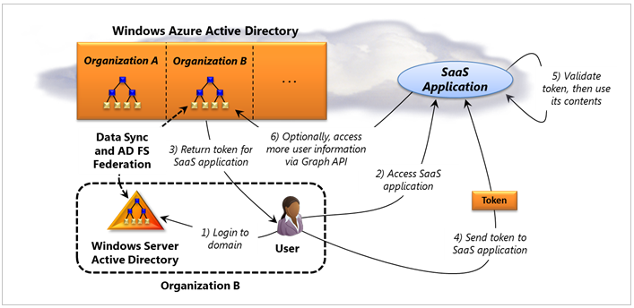

Gestion des identités est tout aussi important dans le cloud public étant en local. Pour faciliter cette tâche, Azure prend en charge plusieurs technologies d’identité nuage différent. Ils sont les suivants :

- Vous pouvez exécuter Windows Server Active Directory (c'est-à-dire, simplement AD) dans le cloud à l’aide de machines virtuelles créées avec machines virtuelles Azure. Cette approche est préférable lorsque vous utilisez Azure pour étendre votre centre de données locales dans le cloud.

- Vous pouvez utiliser Azure Active Directory pour donner à vos utilisateurs de l’authentification unique aux applications [logicielles en tant que Service (SaaS)](https://azure.microsoft.com/overview/what-is-saas/) . Office 365 de Microsoft utilise cette technologie, par exemple, et applications qui s’exécutent sur Azure ou d’autres plateformes cloud peuvent également l’utiliser.

- Applications en cours d’exécution dans le nuage ou sur site peuvent utiliser contrôle d’accès Azure Active Directory pour permettre aux utilisateurs connecté à l’aide des identités de Facebook, Google, Microsoft et d’autres fournisseurs d’identité.

Cet article décrit les trois options suivantes.

## Table des matières

- [Exécutant Windows Server Active Directory dans des machines virtuelles](#adinvm)

- [Utilisation d’Azure Active Directory](#ad)

- [Contrôler l’accès aux Azure Active Directory](#ac)

## Exécutant Windows Server Active Directory dans des machines virtuelles

Exécutant Windows Server AD dans Azure machines virtuelles ressemble beaucoup à exécuter en local. [Figure 1](#fig1) montre un exemple classique d’à quoi il ressemble.

Figure 1 : Active Directory Windows Server peut exécuter sur des machines virtuelles Azure connectés au centre de données locale d’une organisation à l’aide de réseau virtuel Azure.

Dans l’exemple montré ici, Windows Server AD s’exécute en machines virtuelles créées à l’aide de la technologie de la plateforme IaaS Machines virtuelles Azure. Ces machines virtuelles et quelques autres sont regroupées dans un réseau virtuel connecté à un centre de données locale à l’aide de réseau virtuel Azure. Le réseau virtuel carves sortie d’un groupe de machines virtuelles cloud qui interagissent avec le réseau local via une connexion de réseau privé virtuel (VPN). Effectuant permet ces machines virtuelles Azure ressemblent simplement un autre sous-réseau au centre de données locale. Comme le montre la figure, deux de ces ordinateurs virtuels en cours d’exécution superflus Windows Server AD. Les autres machines virtuelles dans le réseau virtuel peut s’exécuter applications, tels que SharePoint ou utilisée dans une autre façon, tels que de développement et de test. Le centre de données locale fonctionne également deux contrôleurs de domaine Active Directory du serveur Windows.

Il existe plusieurs options pour la connexion contrôleur du cloud à ceux en cours d’exécution en local :

- Effectuer toutes les parties d’un seul domaine Active Directory.

- Créer distincte AD domaines en local et dans le cloud qui font partie de la même forêt.

- Créer des forêts AD distinctes dans le cloud et en local, puis se connecter les forêts à l’aide de forêt croisée approbations ou Windows Server Active Directory Federation Services AD FS (), que vous pouvez également exécuter dans machines virtuelles sur Azure.

Quelle que soit choix est effectuée, un administrateur doit s’assurer que les demandes d’authentification des utilisateurs locaux cloud risquez uniquement lorsque cela est nécessaire, étant donné que le lien vers le cloud est susceptible d’être plus lente que les réseaux locaux. Un autre facteur à prendre en compte dans les connexion cloud et en local est le trafic généré par la réplication. Contrôleurs de domaine dans le cloud sont généralement dans leur propre site AD, ce qui permet à un administrateur planifier la fréquence à laquelle la réplication est effectuée. Frais d’Azure pour le trafic envoyé déconnecter un centre de données Azure, mais ne pas pour les octets envoyés dans, qui peuvent affecter les choix de réplication de l’administrateur. Il est également important de souligner que tandis que Azure ne fournit sa propre prise en charge du nom de domaine (DNS), ce service il manque des fonctionnalités requises par Active Directory (par exemple, la prise en charge pour les enregistrements dynamiques DNS et SRV). Pour cette raison, exécutant Windows Server AD sur Azure requiert la configuration de vos propres serveurs DNS dans le cloud.

Exécutant Windows Server AD dans Azure machines virtuelles pouvez représentatives dans plusieurs situations. Voici quelques exemples :

- Si vous utilisez des Machines virtuelles Azure comme une extension de votre propre centre de données, vous pouvez exécuter des applications dans le cloud nécessitant un contrôleur de domaine local pour gérer des éléments tels que les demandes de l’authentification Windows intégrée ou des requêtes LDAP. SharePoint, par exemple, interagit fréquemment avec Active Directory, et donc s’il est possible d’exécuter une batterie de serveurs SharePoint sur Azure à l’aide d’un répertoire local, définissant un contrôleur de domaine dans le cloud sensiblement améliore les performances. (Il est important de savoir que ce n’est pas nécessairement requis, cependant ; beaucoup d’applications peuvent s’exécuter dans le cloud utiliserez contrôleur de domaine local uniquement).

- Supposons qu'une succursale habitent ne dispose pas les ressources pour exécuter sa propre domaine. Aujourd'hui, ainsi que les utilisateurs doivent s’authentifier risquez de l’autre côté du monde - connexions sont lentes. En cours d’exécution Active Directory sur Azure dans un centre de données Microsoft Aperçu pouvez accélérer ce processus sans avoir besoin de davantage de serveurs de la succursale.

- Une organisation qui utilise Azure sinistre peuvent choisir de conserver un ensemble réduit de machines virtuelles actives dans le cloud, y compris un contrôleur de domaine. Il peut être préparé pour développer ce site nécessaire pour prendre le contrôle des échecs ailleurs.

Il existe également d’autres possibilités. Par exemple, vous n’êtes pas requis pour vous connecter Windows Server AD dans le cloud à un centre de données locale. Si vous voulez exécuter une batterie de serveurs SharePoint pris en charge un ensemble spécifique d’utilisateurs, par exemple, qui serait connectez-vous uniquement avec les identités sur le nuage, vous pouvez créer une forêt autonome sur Azure. Comment vous utilisez cette technologie dépend que vos objectifs. (Pour des instructions plus détaillées sur l’utilisation de Windows Server AD avec Azure, [voir ici](http://msdn.microsoft.com/library/windowsazure/jj156090.aspx).)

## Utilisation d’Azure Active Directory

Applications SaaS devenant plus courantes, ils déclenchent une question évidente : quel type de service d’annuaire ces applications sur le nuage doivent utiliser ? Réponse de Microsoft à cette question est Azure Active Directory.

Il existe deux options principales pour l’utilisation de ce service d’annuaire dans le cloud :

- Personnes et organisations qui utilisent uniquement des applications SaaS peuvent compter sur Azure Active Directory en tant que leur service d’annuaire unique.

- Organisations qui exécutent Windows Server Active Directory, vous peuvent connecter leur répertoire local à Azure Active Directory, puis utilisez-le pour donner à leur utilisateurs de l’authentification unique pour les applications SaaS.

[Figure 2](#fig2) illustre la première de ces deux options, où Azure Active Directory est tout ce que nécessaire.

Figure 2 : Azure Active Directory donne aux utilisateurs de l’authentification unique d’une organisation pour les applications SaaS, y compris Office 365.

Comme le montre la figure, Azure AD est un service client multiples. Cela signifie qu’il peut simultanément prendre en charge plusieurs organisations, le stockage des informations d’annuaire relatives aux utilisateurs à chacun d’eux. Dans cet exemple, un utilisateur au sein de l’organisation A tente d’accéder à une application SaaS. Cette application peut-être faire partie d’Office 365, tels que SharePoint Online, ou il peut s’avérer autre chose : applications non-Microsoft peuvent également utiliser cette technologie. Azure AD prenant en charge le protocole SAML 2.0, tout ce qui est nécessaire à partir d’une application est la possibilité d’interagir à l’aide de cette norme. (En fait, les applications qui utilisent Azure AD peuvent s’exécuter dans n’importe quel centre de données, et pas seulement un centre de données Azure.)

Le processus commence lorsque l’utilisateur accède à une application SaaS (étape 1). Pour utiliser cette application, l’utilisateur doit présenter un jeton émis par Azure AD.

Ce jeton contient des informations qui identifie l’utilisateur, et il est signé numériquement par Azure Active Directory. Pour obtenir le jeton, l’utilisateur s’authentifie lui-même Azure AD en fournissant un nom d’utilisateur et mot de passe (étape 2). Azure AD puis retourne le jeton il doit (étape 3).

Ce jeton est ensuite envoyé à l’application SaaS (étape 4), qui valide signature du jeton et utilise son contenu (étape 5). En règle générale, l’application utilisera les informations d’identité que le jeton contient pour déterminer quelles informations l’utilisateur est autorisé à access et éventuellement d’une autre façon.

Si l’application a besoin de plus d’informations sur l’utilisateur à ce qui est inclus dans le jeton, il peut demander cela directement à partir d’Azure AD à l’aide de l’API Azure AD Graph (étape 6). Dans la version initiale d’Azure AD, le schéma d’annuaire est très simple : elle contient uniquement les utilisateurs et les groupes et les relations entre elles. Applications peuvent utiliser ces informations pour en savoir plus sur les connexions entre les utilisateurs. Par exemple, supposons qu'une application a besoin de savoir qui est responsable de cet utilisateur décider si il a autorisé à accéder à un bloc de données. Il peut apprendre cela en demandant Azure AD via l’API de graphique.

L’API Graph utilise un protocole RESTful ordinaire, qui simplifie l’utilisation de la plupart des clients, y compris les appareils mobiles. L’API prend également en charge les extensions définies par OData, ajout d’éléments tels que l’un langage de requête pour permettre aux clients accéder aux données de manière plus utile. (Pour plus d’informations sur OData, voir [Présentation OData](http://download.microsoft.com/download/E/5/A/E5A59052-EE48-4D64-897B-5F7C608165B8/IntroducingOData.pdf)). Étant donné que l’API graphique peut être utilisée pour en savoir plus sur les relations entre les utilisateurs, il permet aux applications comprendre le graphique social qui est incorporé dans le schéma de Azure Active Directory par l’entreprise (c’est pourquoi il s’agit de l’API Graph). Et pour s’authentifier auprès d’Azure AD pour les demandes d’API de graphique, une application utilise OAuth 2.0.

Si une organisation n’utilise pas Active Directory Windows Server - elle n’a pas sur les serveurs locaux ou domaines - et utilise uniquement les applications cloud qui utilisent Azure AD, à l’aide de simplement ce répertoire cloud devez attribuer aux utilisateurs de l’authentification unique l’entreprise pour chacun d'entre eux. Encore alors que ce scénario obtienne plus communes à tous les jours, la plupart des entreprises utilisent encore locale domaines créés avec Active Directory Windows Server. Azure AD a un rôle utile à lire ici, comme le montre la [Figure 3](#fig3) .

Figure 3 : une organisation pouvez fédérer Active Directory Windows Server avec Azure Active Directory pour donner à ses utilisateurs de l’authentification unique pour les applications SaaS.

Dans ce scénario, un utilisateur au sein de l’organisation B souhaite accéder à une application SaaS. Avant de commencer, les administrateurs de l’organisation répertoire doivent établir une relation de fédération avec Azure AD via AD FS, comme le montre l’illustration. Les administrateurs doivent également configurer la synchronisation des données entre locale Windows Server l’organisation AD et Azure AD. Cela copie automatiquement utilisateur et des informations sur le groupe à partir du répertoire local vers Azure AD. Notez que cela permet de : en vigueur, l’organisation s’étend son répertoire local dans le nuage. Combinaison de Windows Server AD et Azure AD de cette façon donne l’organisation un service d’annuaire pouvant être gérées comme une seule entité, tout en conservant un encombrement à la fois en local et dans le cloud.

Pour utiliser Azure AD, l’utilisateur tout d’abord connecte à son domaine Active Directory local comme d’habitude (étape 1). Quand l’utilisateur essaie d’accéder à l’application SaaS (étape 2), le processus de fédération résultat Azure AD lui émettre un jeton de cette application (étape 3). (Pour plus d’informations sur le fonctionne de fédération, voir [identité basée sur les revendications pour Windows : Technologies et scénarios](http://www.davidchappell.com/writing/white_papers/Claims-Based_Identity_for_Windows_v3.0--Chappell.docx).) Comme avant, ce jeton contient des informations qui identifie l’utilisateur, il est signé numériquement par Azure Active Directory. Ce jeton est ensuite envoyé à l’application SaaS (étape 4), qui valide signature du jeton et utilise son contenu (étape 5). Et se trouve dans l’exemple précédent, la SaaS application peut utiliser l’API Graph pour en savoir plus sur cet utilisateur si nécessaire (étape 6).

Aujourd'hui, Azure AD n’est pas un remplacement complet pour local Windows Server AD. Comme indiqué précédemment, le répertoire cloud comporte un schéma beaucoup plus simple, et il manque également des éléments tels que la stratégie de groupe, la possibilité de stocker des informations sur les ordinateurs et support pour LDAP. (En réalité, un ordinateur Windows ne peut pas être configuré pour permettre aux utilisateurs de se connecter à l’aide de rien d’autre qu’Azure AD - ce n’est pas un scénario pris en charge). À la place, les objectifs initiales de Azure AD incluent vous permettant des applications access aux utilisateurs d’entreprise dans le cloud sans conserver une connexion séparée et libérer local Administrateurs répertoire de synchroniser manuellement leur répertoire local avec toutes les applications SaaS que leur organisation utilise. Au fil du temps, cependant, attendez ce service d’annuaire cloud pour les destinataires d’un large éventail de scénarios.

## Contrôler l’accès aux Azure Active Directory

Sur le nuage identité technologies peuvent être utilisées pour résoudre de nombreux problèmes. Azure Active Directory permettent aux utilisateurs de l’authentification unique d’une organisation à plusieurs applications SaaS, par exemple. Mais technologies d’identité dans le nuage peuvent également être utilisés par d’autres moyens.

Supposons, par exemple, qu’une application souhaite permettre à ses utilisateurs de se connecter à l’aide des jetons émis par plusieurs *fournisseurs d’identité (IdPs)*. Un nombre important de fournisseurs d’identité autre existe aujourd'hui, y compris Facebook, Google, Microsoft et autres personnes, et applications fréquemment permettre aux utilisateurs de se connecter à l’aide d’une de ces identités. Pourquoi doit une application pour conserver sa propre liste des utilisateurs et les mots de passe lorsque dépendent plutôt identités qui existent déjà Accepter les identités existantes simplifie la tâche à la fois pour les utilisateurs qui ont une moins nom d’utilisateur et mot de passe à retenir et pour les personnes qui créent l’application, qui n’avez plus besoin de mettre à jour leurs propres listes de noms d’utilisateur et les mots de passe.

Mais alors que chaque fournisseur d’identité problèmes quelconque du jeton, ces jetons ne sont pas standards : chaque IdP possède son propre format. En outre, les informations contenues dans ces jetons n’est pas standards. Une application qui souhaite accepter les jetons émis par, par exemple, Facebook, Google et Microsoft est confrontée à la difficulté d’écrire code unique de gestion de chacune de ces différents formats.

Mais pourquoi cela ? Pourquoi ne pas à la place créer un intermédiaire qui permet de générer un seul format jeton avec une représentation commune des informations d’identité ? Cette approche serait vie plus simple pour les développeurs qui créent des applications, dans la mesure où dont elles ont besoin maintenant gérer qu’un seul type de jetons. Azure Active Directory Access contrôle s’en charge exactement, fournissant un intermédiaire dans le cloud pour l’utilisation de jetons centralisées. [La figure 4](#fig4) montre comment cela fonctionne

Figure 4 : contrôle d’accès Azure Active Directory simplifie pour les applications accepter des jetons d’identité émis par différents fournisseurs d’identité.

Le processus commence lorsqu’un utilisateur tente d’accéder à l’application à partir d’un navigateur. L’application redirige lui un IdP de son choix (et que l’application approuve également). Elle s’authentifie elle-même cette IdP, par exemple en entrant un nom d’utilisateur et mot de passe (étape 1), et la IdP retourne un jeton contenant les informations de son (étape 2).

Comme le montre la figure, le contrôle d’accès prend en charge une plage de différentes IdPs sur le nuage, y compris les comptes créés par Google, Yahoo, Facebook, Microsoft (auparavant appelé Windows Live ID) et n’importe quel fournisseur OpenID. Il prend également en charge les identités créées à l’aide d’Azure Active Directory et, de la fédération avec AD FS, Active Directory de Windows Server. L’objectif consiste à expliquer les identités plus couramment utilisées aujourd'hui, indique si elles vous émis par IdPs dans le nuage ou sur site.

Une fois que le navigateur de l’utilisateur possède un jeton IdP à partir de son IdP choisi, il envoie ce jeton au contrôle d’accès (étape 3). Contrôle d’accès valide le jeton, en vérifiant qu’il vraiment a été émis par cet IdP, puis crée un nouveau jeton conforme aux règles qui ont été définies pour cette application. Comme Azure Active Directory, le contrôle d’accès est un service client multiples, mais les clients sont applications plutôt que par les organisations de client. Chaque application peut obtenir son propre espace de noms, comme le montre l’illustration et pouvez définir des règles d’autorisation, et plus encore.

Les règles suivantes permettent de définir les modalités de transformation de jetons à partir de divers IdPs dans un jeton de contrôle d’accès administrateur de chaque application. Par exemple, si IdPs différents utilisent des types différents de représenter les noms d’utilisateur, les règles de contrôle d’accès peuvent transformer tous ces éléments dans un type de nom d’utilisateur commun. Contrôle d’accès renvoie ce nouveau jeton au navigateur (étape 4), ce qui a été envoyé à l’application (étape 5). Une fois qu’il a le jeton de contrôle d’accès, l’application a vérifié que ce jeton vraiment a été émis par le contrôle d’accès, puis utilise les informations qu’il contient (étape 6).

Bien que ce processus peut sembler un peu compliqué, elle utilise effectivement vie beaucoup plus simple pour le créateur de l’application. Plutôt que gérer les jetons centralisées contenant des informations différentes, l’application peut accepter les identités émises par plusieurs fournisseurs d’identité lors de la réception toujours uniquement un seul jeton avec les informations familiers. En outre, au lieu d’exiger chaque application doit être configuré pour faire confiance à divers IdPs, ces relations d’approbation à la place conservées par le contrôle d’accès : une application devez uniquement approuver.

Il est important de noter que rien ne contrôle d’accès est liée à Windows - elle aussi bien peut être utilisée dans une application Linux accepté uniquement les identités Google et Facebook. Et même si le contrôle d’accès fait partie de la famille Azure Active Directory, vous pouvez considérer comme un service totalement distinct de ce qui a été décrit dans la section précédente. Tandis que les deux technologies d’assistance fonctionnent avec identité, elles répondent à des problèmes très différents (même si Microsoft a dit qu’elle attend intégrer les deux à un moment donné).

Utilisation des identités est importante dans presque toutes les applications. L’objectif du contrôle d’accès est pour le rendre plus facile pour les développeurs de créer des applications qui acceptent les identités de fournisseurs d’identité centralisée. En plaçant ce service dans le cloud, Microsoft rend disponible pour n’importe quelle application en cours d’exécution sur n’importe quelle plate-forme.

##À propos de l’auteur

David Chappell est directeur de Chappell & Associates [www.davidchappell.com](http://www.davidchappell.com) à San Francisco, Californie.
