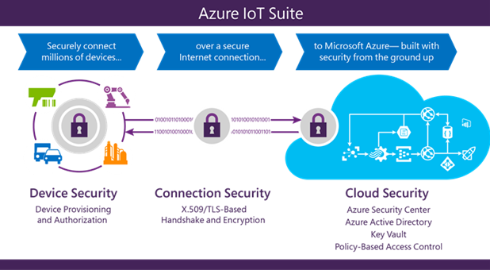

# Sécurité Internet des objets de bas en haut

L’Internet des objets (IoT) présente des défis uniques de sécurité, de confidentialité et de conformité pour les entreprises du monde entier. Contrairement à la technologie cyber traditionnel où ces problèmes sont axés sur les logiciels et la façon dont il est implémenté, IoT concerne ce qui se passe lorsque les cybercriminels et les mondes physiques convergent. IoT solutions de protection nécessite de garantir la mise en service sécurisé des périphériques, des connexions sécurisées entre ces périphériques et le nuage et protection de sécuriser les données dans le nuage pendant le traitement et le stockage. Utilisation par rapport à ces fonctionnalités, cependant, sont des périphériques à ressources limitées, la répartition géographique des déploiements et un grand nombre de périphériques au sein d’une solution.

Cet article explore comment Microsoft Azure IoT Suite fournit une solution de nuage Internet des objets sécurisée et privée. La Suite de IoT Azure offre une solution complète de bout en bout, avec sécurité intégrée à chaque étape de bas en haut. Chez Microsoft, développement de logiciels sécurisés fait partie de l’exercice du génie logiciel, enraciné dans nos dernières décennies longue expérience de développement de logiciels sécurisés. Pour ce faire, du cycle de vie de développement de sécurité (SDL) est la méthodologie de développement de base, associée à un hôte au niveau de l’infrastructure de services de sécurité tels que l’Assurance de sécurité opérationnelle (OSA) et l’unité de Crimes numérique de Microsoft, Microsoft Security Response Center et Centre de protection Microsoft contre les programmes malveillants. 

La Suite de IoT Azure offre des fonctionnalités uniques qui marque le provisionnement, la connexion à et stocker des données à partir de périphériques IoT faciles et transparents, et, le plus sûr. Dans ce document, nous examinons les fonctionnalités de sécurité Azure IoT Suite et les stratégies de déploiement afin de garantir la sécurité, de confidentialité et les défis de conformité sont adressés. 

## Introduction

L’Internet des objets (IoT) est la vague de l’avenir, proposant ainsi aux entreprises immédiates et réels des opportunités pour réduire les coûts, d’augmenter vos revenus et transformer leur activité. Toutefois, la plupart des entreprises, sont hésitent à déployer IoT dans leurs organisations en raison de problèmes de sécurité, de confidentialité et de conformité. Un point important de préoccupation provient de l’unicité de l’infrastructure IoT, qui fusionne les cybercriminels et les mondes physiques ensemble, composée des risques inhérents à ces deux mondes. Sécurité de IoT se rapporte à assurer l’intégrité du code s’exécutant sur les périphériques, fournissant une authentification utilisateur et périphérique, définition de la propriété clear de périphériques (ainsi que les données générées par les périphériques) et étant résistants aux attaques physiques et de cyber. 

Puis, le problème est de la vie privée. Les entreprises veulent transparence concernant la collecte de données, comme dans ce qui est collecté et pourquoi, ce qui peut voir, qui contrôle l’accès et ainsi de suite. Enfin, il y a des questions de sécurité générale de l’équipement, ainsi que les personnes, leur fonctionnement et les problèmes de maintien des normes de conformité.

Compte tenu de la sécurité, la confidentialité, transparence et les problèmes de conformité, choisir le fournisseur de solution IoT droit demeure un défi. Assembler des éléments individuels de IoT logiciels et services proposés par divers fournisseurs présente des lacunes dans la sécurité, de confidentialité, de transparence et de la conformité qui peut-être être difficile à détecter, sans parler de résoudre. Le choix de la bonne IoT fournisseur de logiciels et de services est basé sur la recherche de fournisseurs qui ont une grande expérience qui exécute les services qui s’étendent sur des marchés verticaux et zones géographiques, mais sont également capables d’évoluer de manière sécurisée et transparente. De même, il est utile pour le fournisseur sélectionné doit avoir des dizaines d’années d’expérience dans le développement de logiciels sécurisés en cours d’exécution sur des milliards d’ordinateurs dans le monde entier et ont la possibilité d’apprécier le paysage des menaces posé par ce nouveau monde de l’Internet des objets.

## Infrastructure sécurisée de bas en haut 

L’infrastructure de [Cloud de Microsoft](https://www.microsoft.com/enterprise/microsoftcloud/default.aspx#fbid=WzBsRQi6aGk) prend en charge les clients de plus d’un milliard de 127 pays. Dessin de notre expérience décennies de longueur de création de logiciels d’entreprise et certains des plus grands services en ligne en cours d’exécution dans le monde entier, nous fournissons des niveaux élevés de sécurité, de confidentialité, de conformité et de menace des pratiques de minimisation que la plupart des clients peut atteindre sur leurs propres.

Notre [Cycle de développement de sécurité (SDL)](https://www.microsoft.com/sdl/) fournit un processus de développement d’entreprise obligatoires qui incorpore des exigences de sécurité dans le cycle de vie de tout logiciel. Pour vous assurer que les activités opérationnelles suivent le même niveau de sécurité, nous utilisons les consignes de sécurité rigoureux dans notre processus d’Assurance de sécurité opérationnelle (OSA). Nous travaillons également avec des entreprises d’audit tiers pour la vérification en cours que nous respecter nos obligations de respect de la réglementation, et nous s’engager dans les efforts de sécurité large grâce à la création de centres d’excellence, y compris l’unité de Crimes numérique de Microsoft, Microsoft Security Response Center et Centre de protection Microsoft contre les programmes malveillants.

## Microsoft Azure – l’infrastructure IoT sécurisée pour votre entreprise

Microsoft Azure offre une solution complète de nuage, qui combine une collection constamment des services en nuage intégré — analytique, apprentissage automatique, stockage, sécurité, réseau et web, avec un engagement de pointe pour la protection et la confidentialité de vos données. Notre stratégie [suppose la violation de](https://azure.microsoft.com/blog/red-teaming-using-cutting-edge-threat-simulation-to-harden-the-microsoft-enterprise-cloud/) l’utilise une « rouge équipe dédiée » de spécialistes de la sécurité qui simuler des attaques, tester la capacité d’Azure pour détecter, protection contre les menaces émergentes et récupérer des violations de. Notre équipe [global](https://www.microsoft.com/TrustCenter/Security/DesignOpSecurity) fonctionne la nuit pour atténuer les effets des attaques malveillantes. L’équipe suit les procédures établies pour la gestion des incidents, de communication et de récupération et utilise les interfaces détectables et prévisibles avec des partenaires internes et externes.

Nos systèmes fournissent la détection d’intrusion en continu et prévention, prévention des attaques de service, des tests de pénétration régulière et outils d’expertise qui aident à identifier et à atténuer les menaces. [Authentification multifactorielle](../articles/multi-factor-authentication/multi-factor-authentication.md) fournit une couche supplémentaire de sécurité aux utilisateurs finaux d’accéder au réseau. Et pour l’application et le fournisseur de l’hôte, offre un contrôle d’accès, la surveillance, les logiciels anti-malware, l’analyse des vulnérabilités, correctifs et gestion de la configuration.

Microsoft Azure IoT Suite tire parti de la sécurité et de confidentialité intégrées à la plateforme Azure avec nos processus de développement sécurisé et du fonctionnement de tous les logiciels Microsoft de SDL et OSA. Ces procédures constituent la protection de l’infrastructure, la protection réseau et gestion des identités et des fonctionnalités fondamentales de la sécurité de toute solution. 

[Azure IoT Hub](../articles/iot-hub/iot-hub-what-is-iot-hub.md) au sein de la [Suite de IoT](../articles/iot-suite/iot-suite-what-is-azure-iot.md) offre un service entièrement géré qui permet à fiable et de sécuriser la communication bidirectionnelle entre des services Azure, tels que la [Formation de Machine Azure](../articles/machine-learning/machine-learning-what-is-machine-learning.md) et [d’Azure flux Analytique](../articles/stream-analytics/stream-analytics-introduction.md) et les périphériques de IoT à l’aide des informations d’identification de sécurité de périphérique et de contrôle d’accès.  

Pour mieux communiquer les fonctionnalités de sécurité et confidentialité intégrées à la Suite de IoT Azure, nous avons divisé la suite dans les trois zones de sécurité. 

### Mise en service du dispositif de sécurité et authentification

La Suite de IoT Azure sécurise les périphériques lorsqu’ils sont dans le champ en fournissant une clé d’identité unique pour chaque périphérique, ce qui peut être utilisé par l’infrastructure IoT pour communiquer avec le périphérique en cours d’opération. Le processus est rapide et facile pour le programme d’installation. La clé générée avec un ID de périphérique de sélectionné par l’utilisateur constitue la base d’un jeton utilisé dans toutes les communications entre le périphérique et le concentrateur IoT Azure.

ID de périphérique peuvent être associés à un périphérique lors de la fabrication (c'est-à-dire flashée dans un module de confiance du matériel) ou peuvent utiliser une identité fixe en tant que proxy (par exemple, les numéros de série de processeur) existante. Dans la mesure où la modification de ces informations d’identification dans le périphérique n’est pas simple, il est important d’introduire des ID de périphériques logiques dans le cas où les modifications sur le matériel périphérique sous-jacent mais le périphérique logique reste la même. Dans certains cas, l’association d’une identité de périphérique peut se produire au moment du déploiement périphérique (par exemple, un technicien authentifié physiquement configure un nouveau périphérique lors de la communication avec le serveur principal chargé de la solution IoT). Le [Registre d’identité Azure IoT Hub](../articles/iot-hub/iot-hub-devguide.md) offre un stockage sécurisé des identités des appareils et des clés de sécurité pour une solution. Individu ou des groupes d’identités de périphérique peuvent être ajoutés à une liste ou une liste d’interdiction, permettant le contrôle total sur l’accès au périphérique.
 
Politiques de contrôle d’accès Azure IoT concentrateur dans le nuage activent l’activation et la désactivation de n’importe quelle identité de périphérique, en fournissant un moyen de dissocier un périphérique provenant d’un déploiement IoT lorsque cela est nécessaire. Cette association et la dissociation de périphériques est basé sur l’identité de chaque périphérique.

Les fonctionnalités de sécurité de périphérique supplémentaire sont les suivantes :

- Appareils n’acceptent pas les connexions réseau non sollicité. Ils établissent toutes les connexions et les itinéraires de manière sortant uniquement. Pour un périphérique de recevoir une commande à partir du serveur principal, le périphérique doit lancer une connexion pour vérifier les commandes en attente de traitement. Lorsque la connexion entre le périphérique et le concentrateur de IoT est établie en toute sécurité, messagerie dans le nuage sur le périphérique et le périphérique vers le nuage peut être envoyée en toute transparence.  
- Périphériques de se connectent à ou établissent des itinéraires pour les services connus, avec lesquels ils sont ressources, tel qu’un concentrateur de IoT Azure uniquement.
- Authentification et autorisation de niveau système utilisent les identités par périphérique, rendre les informations d’accès et des autorisations proches-instantanément révocable.

### Sécurisation de la connectivité 

Durabilité de la messagerie est une fonctionnalité importante de toute solution IoT. La nécessité de livrer les commandes durablement et/ou de recevoir des données à partir de périphériques est soulignée par le fait que IoT périphériques connectés sur Internet, ou d’autres réseaux similaires qui peut ne pas être fiables. Azure IoT Hub offre la durabilité de la messagerie entre cloud et périphériques via un système d’accusés de réception en réponse aux messages. Durabilité supplémentaire pour la messagerie est obtenue en mettant en cache les messages dans le concentrateur IoT pendant sept jours de télémétrie et de deux jours pour les commandes.
 
L’efficacité est importante afin de garantir la conservation des ressources et le fonctionnement dans un environnement soumis à des contraintes de ressources. HTTPS (HTTP sécurisé), la version sécurisée de la norme de protocole http les plus courants, est pris en charge par le concentrateur IoT Azure, en permettant une communication efficace. Avancées format Message Queuing Protocol (AMQP) et Message Queuing télémétrie Transport (MQTT), pris en charge par le concentrateur de IoT Azure, sont conçus non seulement pour l’efficacité en termes d’utilisation des ressources, mais aussi livraison fiable des messages. 

L’évolutivité nécessite la possibilité d’interagir en toute sécurité avec une large gamme de périphériques. Azure IoT hub permet une connexion sécurisée à des périphériques activés-IP et non IP activé. Périphériques IP sont en mesure de se connecter directement et de communiquer avec le concentrateur IoT via une connexion sécurisée. Périphériques non-IP sont soumis à des contraintes de ressources et vous connecter uniquement via des protocoles de communication de courte distance, comme Zwave, ZigBee et Bluetooth. Une passerelle de champ utilisée pour regrouper ces périphériques et effectue la traduction de protocole pour sécuriser la communication bidirectionnelle avec le nuage.

Les fonctionnalités de sécurité de connexion supplémentaires sont les suivantes :

- Le chemin de communication entre les périphériques et Azure IoT concentrateur ou entre les passerelles et concentrateur de IoT Azure, est sécurisé à l’aide de la norme sécurité TLS (Transport Layer) avec Azure IoT concentrateur est authentifié à l’aide du protocole X.509.
- Afin de protéger les périphériques à partir des connexions entrantes non sollicitées, Azure IoT Hub n’ouvre pas une connexion à l’appareil. Le périphérique lance toutes les connexions. 
- Concentrateur de IoT Azure stocke les messages pour les périphériques durablement et attend que le périphérique de se connecter. Ces commandes sont stockés pendant deux jours, l’activation des périphériques qui se connectent par intermittence, en raison de problèmes de connectivité ou d’alimentation, de recevoir ces commandes. Azure IoT Hub maintient une file d’attente par périphérique pour chaque périphérique.

### Sécurité de traitement et de stockage dans le nuage 

À partir de communications cryptées pour le traitement des données dans le nuage, la Suite de IoT Azure permet de protéger les données. Il fournit une flexibilité pour implémenter la gestion des clés de sécurité et de cryptage supplémentaire. À l’aide d’Azure Active Directory (DAS) pour l’autorisation et l’authentification des utilisateurs, Azure IoT Suite peut fournir un modèle d’autorisation basée sur la stratégie des données dans le nuage, permettant une gestion facile d’accès pouvant être auditée et révisée. Ce modèle permet également de révocation quasi instantanée d’accès aux données dans le nuage et de périphériques connectés à la Suite de IoT Azure.

Une fois les données dans le nuage, peut être traité et stocké dans un flux de travail définis par l’utilisateur. L’accès à chaque partie des données est contrôlée avec Azure Active Directory, en fonction du service de stockage utilisé.
   
Toutes les clés utilisées par l’infrastructure IoT sont stockés dans le nuage de manière sécurisée, avec la possibilité de restaurer en cas de clés doivent être à nouveau configuré. Données peuvent être stockées dans [DocumentDB](../articles/documentdb/documentdb-introduction.md) ou dans les [bases de données SQL](../articles/sql-database/sql-database-faq.md), permettant la définition du niveau de sécurité désiré. En outre, Azure fournit un moyen de surveiller et auditer tous les accès à vos données pour vous avertir de toute intrusion ou tout accès non autorisé.

## Conclusion

L’Internet des objets commence par vos opérations, les choses importantes pour les entreprises. IoT peut fournir une valeur pour l’entreprise en réduisant les coûts, augmenter le chiffre d’affaires et la révolution. La réussite de cette transformation dépend en grande partie le choix du fournisseur de logiciels et de services IoT droit. Cela signifie que la recherche d’un fournisseur qui non seulement catalyzes cette transformation par la compréhension des besoins et attentes, mais fournit également généré avec la sécurité, de confidentialité, de transparence et de conformité que les considérations relatives à la conception des logiciels et des services. Microsoft possède une grande expérience avec le développement et le déploiement des services et des logiciels sécurisés et continue d’être un leader dans cette nouvelle ère de l’Internet des objets. 

Microsoft Azure IoT Suite intègre des mesures de sécurité par conception, activation de l’analyse des actifs pour améliorer l’efficacité, les performances opérationnelles pour activer l’innovation et employer analytique avancée des données pour les entreprises de transformation sécurisée. Grâce à son approche en couches sécurité, plusieurs fonctionnalités de sécurité et modèles de conception, Azure IoT Suite permet de déployer une infrastructure qui peut être approuvée pour transformer toute entreprise. 

## Informations supplémentaires

Chaque solution préconfigurée Azure IoT Suite crée des instances des services Azure, telles que les suivantes :

- [**Concentrateur de IoT Azure**](https://azure.microsoft.com/services/iot-hub/): votre passerelle qui connecte le nuage à des « choses ». Vous pouvez mettre à l’échelle à des millions de connexions par le concentrateur et le processus d’immenses volumes de données avec prise en charge de l’authentification par périphérique pour vous aider à sécuriser votre solution.
- [**DocumentDB d’Azure**](https://azure.microsoft.com/services/documentdb/): un service de base de données évolutive et entièrement indexés pour fournir des données semi-structurées qui gère les métadonnées pour les périphériques vous mettre en service, telles que les attributs, la configuration et les propriétés de sécurité. DocumentDB offre un traitement hautes performances et haut débit, indépendant du schéma d’indexation des données et une interface de requête SQL riche.
- [**Analytique de flux Azure**](https://azure.microsoft.com/services/stream-analytics/): dans le cloud qui vous permet de rapidement développer et déployer une solution économique analytique pour découvrir des informations en temps réel à partir de périphériques, les capteurs, l’infrastructure et les applications de traitement de flux en temps réel. Les données de ce service entièrement géré peuvent s’adapter à n’importe quel volume tout en atteignant la résilience, une faible latence et un débit élevé.
- [**Services d’application Azure**](https://azure.microsoft.com/services/app-service/): une plate-forme de nuage pour construire des web puissante et des applications mobiles qui se connectent à des données de n’importe où. dans le nuage ou de locaux. Générer l’engagement des applications mobiles pour iOS, Android et Windows. Intégration avec le logiciel en tant que Service (SaaS) et des applications d’entreprise avec l’emploi d’une connectivité à des dizaines de services en nuage et les applications d’entreprise. Le code dans votre langage préféré et l’IDE, .NET, NodeJS, PHP, Python ou Java, pour générer des applications web et des API plus rapidement que jamais.
- [**Applications de logique**](https://azure.microsoft.com/services/app-service/logic/): fonctionnalité de l’applications de logique de Service d’application Azure permet d’intégrer votre solution IoT votre ligne existante de l’entreprise et d’automatiser les processus de workflow. Logique d’applications permet aux développeurs de concevoir des workflows qui démarre à partir d’un déclencheur et ensuite exécuter une série d’étapes, les règles et les actions qui utilisent des connecteurs puissants pour s’intégrer à vos processus d’entreprise. Logique d’applications offre une connectivité de-l’emploi pour une vaste écosystème de SaaS, basée sur le nuage et des applications sur site.
- [**Stockage de blob Azure**](https://azure.microsoft.com/services/storage/): stockage en nuage fiable et économique pour les données que vos périphériques envoyer vers le nuage.

