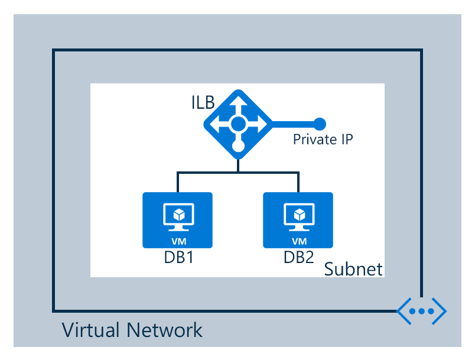

## Scénario

Vous créez un équilibreur de charge interne selon le scénario suivant

Un équilibreur de charge interne est configuré dans un réseau virtuel

- 2 ordinateurs virtuels appelés DB1 et DB2
- Points de terminaison
- Équilibreur de charge interne

