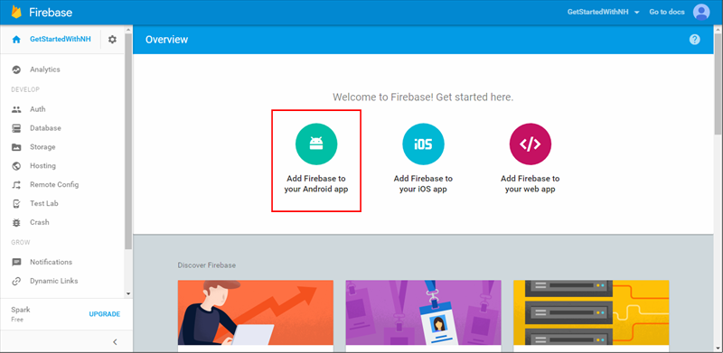

1. Connectez-vous à la [console Firebase](https://firebase.google.com/console/). Créer un nouveau projet Firebase si vous n’en avez pas déjà.
2. Après avoir créé votre projet sur **Firebase ajouter dans votre application Android** et suivez les instructions fournies.

    

3. Dans la Console Firebase, cliquez sur le rouage pour votre projet, puis sur **Paramètres de Project**.

    

4. Cliquez sur l’onglet **Messagerie Cloud** dans vos paramètres de projet et copiez la valeur de la **clé du serveur** et **l’ID de l’expéditeur**.  Ces valeurs serviront ultérieurement pour configurer le hub de notification stratégie d’accès et de votre gestionnaire de notification dans l’application.
  