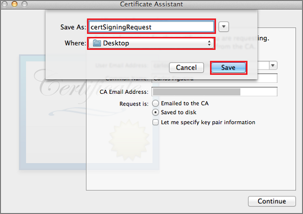
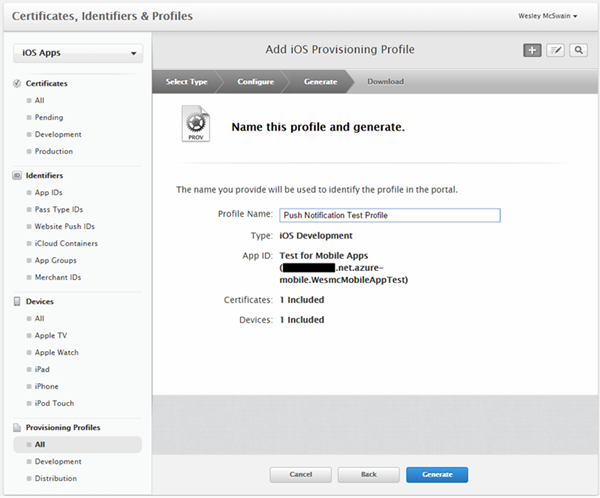

Pour enregistrer l’application pour les notifications de transmission par le biais Apple Push Notification Service (APNS), vous devez créer un nouveau certificat push, l’ID de l’application et mise en service de profil pour le projet sur portail des développeurs d’Apple. L’ID de l’application contient les paramètres de configuration qui permettent à votre application envoyer et recevoir des notifications de transmission. Ces paramètres doit inclure le certificat de notification push nécessaire pour authentifier avec Apple Push Notification Service (APNS) lors de l’envoi et réception de notifications de transmission. Pour plus d’informations sur ces concepts, consultez la documentation de [Service de Notification Push Apple](http://go.microsoft.com/fwlink/p/?LinkId=272584) officielle.

####Générer le fichier de demande de signature de certificat pour le certificat push

Ces étapes vous guident dans le processus de création de la demande de signature de certificat. Cela servira à générer un certificat push pour être utilisé avec APNS.

1. Sur votre Mac, exécutez l’outil de trousseau d’accès. Il peut être ouvert dans le dossier **utilitaires** ou **l’autre** dossier dans la zone de lancement.

2. Cliquez sur **Trousseau d’accès**, développez **Assistant Certificat**, puis cliquez sur **demander un certificat à partir d’une autorité de certification...**.

    

3. Sélectionnez votre **Adresse de messagerie** et le **Nom commun** , assurez-vous que **enregistrées sur le disque** est activée, puis cliquez sur **Continuer**. Laissez le champ **Adresse de messagerie autorité de certification** vide car il n’est pas obligatoire.

    

4. Tapez un nom pour le fichier de demande de signature de certificat (CSR) dans la zone **Enregistrer sous**, sélectionnez l’emplacement dans **l’emplacement**, puis cliquez sur **Enregistrer**.

    

    Le fichier du service clientèle est enregistré dans l’emplacement sélectionné ; l’emplacement par défaut est le bureau. N’oubliez pas de l’emplacement choisi pour ce fichier.

####Enregistrer votre application pour les notifications push

Créer un identifiant application explicite pour votre application avec Apple et également le configurer pour les notifications push.  

1. Accédez au [portail Provisioning iOS](http://go.microsoft.com/fwlink/p/?LinkId=272456) auprès du centre de développement Apple connectez-vous avec votre ID Apple et cliquez sur **identificateurs**, puis cliquez sur **Identifiants de l’application**, cliquez sur le **+** s’à enregistrer une nouvelle application.

    

2. Mettre à jour les trois champs suivants pour votre nouvelle application, puis sur **Continuer**:

    * **Nom**: tapez un nom descriptif pour votre application dans le champ **nom** dans la section **Description d’ID de l’application** .

    * **Ensemble de guides identificateur**: sous la section **ID application explicite** , entrez un **Identificateur de groupe** dans le formulaire `<Organization Identifier>.<Product Name>` comme indiqué dans le [Guide de Distribution d’application](https://developer.apple.com/library/mac/documentation/IDEs/Conceptual/AppDistributionGuide/ConfiguringYourApp/ConfiguringYourApp.html#//apple_ref/doc/uid/TP40012582-CH28-SW8). Il doit correspondre à quoi sert également dans le projet XCode, Xamarin ou Cordova pour votre application.

    * **Notifications de transmission**: Cochez l’option **Notifications de transmission** dans la section **Services d’application** ,.

    

3.  Dans la page Confirmer votre écran ID de l’application, passez en revue le paramètre et que vous avez vérifié les cliquez sur **Envoyer**

4.  Une fois que vous avez envoyé le nouvel ID de l’application, vous verrez l’écran **d’inscription terminée** . Cliquez sur **terminé**.

5. Dans le centre de développement, sous ID de l’application, recherchez l’ID de l’application que vous venez de créer et cliquez sur la ligne correspondante. Cliquez sur la ligne d’ID de l’application pour afficher les détails de l’application. Cliquez sur le bouton **Modifier** en bas.

6. Faites défiler vers le bas de l’écran, puis cliquez sur le bouton **Créer un certificat** sous la section **Développement le certificat SSL transmission**.

    

    L’assistant « Ajouter iOS certificat » s’affiche.

    > [AZURE.NOTE] Ce didacticiel utilise un certificat de développement. Le même processus est utilisé lors de l’enregistrement d’un certificat de production. Assurez-vous que vous utilisez le même type de certificat lors de l’envoi des notifications.

7. Cliquez sur **Choisir un fichier**, naviguez jusqu'à l’emplacement où vous avez enregistré le conseiller du service clientèle pour votre certificat push. Cliquez sur **Générer**.

    

8. Une fois que le certificat est créé par le portail, cliquez sur le bouton **Télécharger** .

    

    Cela télécharge le certificat de signature et enregistre sur votre ordinateur dans votre dossier Téléchargements.

    

    > [AZURE.NOTE] Par défaut, le fichier téléchargé un certificat de développement est nommé **aps_development.cer**.

9. Double-cliquez sur certificat de push téléchargé **aps_development.cer**. Il installe le nouveau certificat dans le trousseau, comme indiqué ci-dessous :

    

    > [AZURE.NOTE] Le nom de votre certificat peut être différent, mais il sera précédé **développement Apple iOS transmission Services :**.

10. Dans le trousseau d’accès, cliquez sur le nouveau certificat push que vous venez de créer dans la catégorie de **certificats** . Cliquez sur **Exporter**, nommez le fichier, sélectionnez le format **.p12** , puis sur **Enregistrer**.

    N’oubliez pas le nom de fichier et l’emplacement du certificat push .p12 exporté. Il est utilisée pour activer l’authentification avec APNS en le téléchargeant sur le portail classique Azure.

####Créer un profil de mise en service pour l’application

1. Dans <a href="http://go.microsoft.com/fwlink/p/?LinkId=272456" target="_blank">portail Provisioning iOS</a>, sélectionnez **Mise en service des profils**, sélectionner **tout**, puis sur le **+** bouton pour créer un nouveau profil. Cela démarre l’Assistant **Ajouter iOS Provisiong profil**

    

2. Sélectionnez **iOS développement d’applications** en cours de **développement** en tant que le type de profil provisiong, puis cliquez sur **Continuer**.

3. Ensuite, sélectionnez l’ID de l’application que vous venez de créer dans la liste déroulante **ID de l’application** , puis cliquez sur **Continuer**

    

4. Dans l’écran **Sélectionner les certificats** , sélectionnez le certificat de développement utilisé pour la signature de code, puis cliquez sur **Continuer**. Il s’agit d’un certificat de signature, pas le certificat push que vous venez de créer.

    

5. Ensuite, sélectionnez les **périphériques** à utiliser pour le test, puis cliquez sur **Continuer**

    

6. Enfin, sélectionnez un nom pour le profil dans la zone **Nom du profil**, cliquez sur **Générer**.

    
