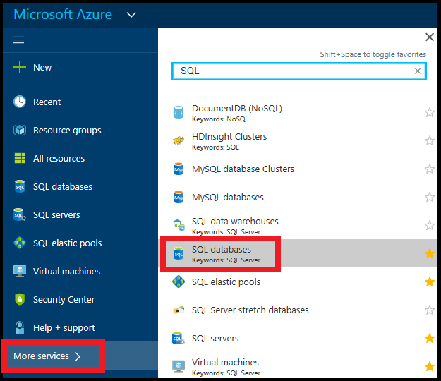

Ouvrez votre page de base de données SQL :

1.  Accédez au [portail Azure](https://portal.azure.com).
2.  Cliquez sur **plusieurs services de** > **bases de données SQL**:

    

3.  Cliquez sur la base de données SQL souhaitée.