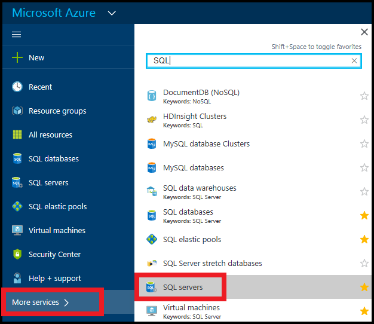

Ouvrir votre page de SQL server :

1.  Accédez au [portail Azure](https://portal.azure.com).
2.  Cliquez sur **plusieurs services de** > **serveurs SQL**:

    

3.  Cliquez sur le serveur SQL désiré.