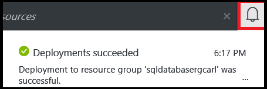

<!--
includes/sql-database-create-new-database-portal.md

Latest Freshness check:  2016-04-11 , carlrab.

As of circa 2016-04-11, the following topics might include this include:
articles/sql-database/sql-database-get-started-tutorial.md

-->
## Créer une nouvelle base de données SQL Azure

Utilisez les étapes suivantes dans le portail Azure pour créer une nouvelle base de données SQL Azure sur un serveur logique de base de données SQL Azure nouvel ou existant.

1. Si vous n’êtes pas actuellement connecté, vous connecter au [portail Azure](http://portal.azure.com).
2. Cliquez sur **Nouveau**, tapez **Base de données SQL**, puis cliquez sur **Base de données SQL (nouvelle base de données)**.

     

3. Cliquez sur **Base de données SQL (nouvelle base de données)**.

     

4. Cliquez sur **créer** pour créer une nouvelle base de données dans le service de base de données SQL.

     

5. Fournir les valeurs pour les propriétés du serveur suivants :

 - Nom de la base de données
 - Abonnement : Cela s’applique uniquement si vous avez plusieurs abonnements.
 - Groupe de ressources : Si vous venez juste de commencer, utilisez le groupe de ressources du serveur logique.
 - Sélectionner la source : vous pouvez choisir une base de données vide, exemples de données ou une sauvegarde de base de données Azure. Pour migrer une base de données SQL Server locale ou charger les données à l’aide de l’outil de ligne de commande BCP, consultez les liens à la fin de cet article.
 - Serveur : Un nouveau ou existant serveur logique.
 - Connexion au serveur d’administration
 - Mot de passe
 - Niveau de tarification : Si vous venez juste de commencer, utilisez la valeur par défaut S0.
 - Classement : Cela s’applique uniquement si une base de données vide a été activé.

        

6.  Cliquez sur **créer**. Dans la zone de notification, vous pouvez voir que déploiement a démarré.

     

7. Patienter pour le déploiement se termine avant de passer à l’étape suivante.

     
