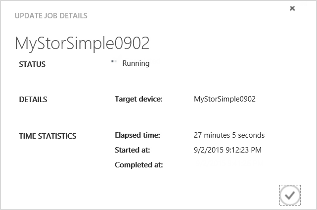

<!--author=SharS last changed: 01/15/2016-->

#### Pour installer la mise à jour 1.2 à partir du portail classique Azure

1. Dans la page service StorSimple, sélectionnez votre appareil. Accédez à **appareils** > **Maintenance**.

2. Dans la partie inférieure de la page, cliquez sur **Rechercher les mises à jour**. Une tâche est créée pour rechercher les mises à jour disponibles. Vous serez informé lorsque la tâche est terminée.

3. Dans la section **Mises à jour logicielles** sur la même page, vous verrez que les nouvelles mises à jour logicielles sont disponibles. Nous vous recommandons de consulter les notes de publication avant d’appliquer 1.2 mise à jour sur votre appareil.

    

4. Dans la partie inférieure de la page, cliquez sur **Installer les mises à jour**.

5. Vous demandera confirmation. Cliquez sur **OK**.

6. Une boîte de dialogue **Installer les mises à jour** s’affiche. Votre appareil doit respecter les tests répertoriés dans cette boîte de dialogue. Ces étapes ont été effectuées avant la mise à jour. Sélectionnez **je comprends l’exigence ci-dessus et suis prêt à mettre à jour mon périphérique**. Cliquez sur l’icône de vérification.

    

7. Un ensemble de vérifications préalables automatiques va démarrer. Parmi lesquels :

    - **Contrôleur vérifications** pour vérifier que les deux les contrôleurs appareil sont corrects et en ligne.
    
    - **Fonctionnement des composants matériels vérifie** pour vérifier que tous les composants matériels sur votre appareil StorSimple fonctionnent correctement.
    
    - **Données 0 vérifie** pour vérifier que les données 0 sont activées sur votre appareil. Si cette interface n’est pas activée, vous devez l’activer, puis réessayez.
    
    - **Données 2 et 3 de données vérifie** pour vérifier que les interfaces de réseau de données 2 et 3 de données ne sont pas activés. Si ces interfaces sont activées, puis vous devez les désactiver, puis tentez de mettre à jour votre périphérique. Ce test est effectué uniquement si vous mettez à jour à partir d’un périphérique en cours d’exécution disponibilité générale. Appareils exécutant versions 0,1, 0,2 ou 0,3 n'aurez pas besoin de ce test.
    
    - **Vérification de la passerelle** sur n’importe quel appareil exécute une version antérieure à la mise à jour 1. Ce test est effectué sur tous les périphériques en cours d’exécution avant mise à jour 1 logiciel mais ne fonctionne pas sur les appareils qui ont une passerelle est configurée pour une interface réseau différente de données 0.
 
    Mise à jour 1.2 être appliqué uniquement si tous les tests de mise à jour partielle ci-dessus sont bien été effectuées. Vous serez informé que vérifications préalables mises à jour sont en cours.
  
    

    Voici un exemple dans lequel la vérification de pré-mise à niveau a échoué. Vous avez besoin vérifier que les deux les contrôleurs appareil sont corrects et en ligne. Vous devrez également vérifier l’état d’intégrité des composants matériels. Dans cet exemple, contrôleur de 0 et 1 contrôleur composants une attention. Vous devrez peut-être contacter le Support Microsoft si vous ne pouvez pas résoudre ces problèmes par vous-même.

     

    > [AZURE.NOTE] Une fois que vous avez appliqué la mise à jour 1.2 sur votre appareil StorSimple, contrôles de données 2 et 3 de données et la vérification de la passerelle ne sera plus nécessaires pour les mises à jour ultérieures. Autres vérifications préalables sera encore requises.

8. Après avoir réalisé les tests de pré-mise à niveau avec succès, une tâche de mise à jour est créée. Vous serez informé lorsque la tâche mise à jour est créée avec succès.
 
    

    La mise à jour est appliquée sur votre appareil.
 
9. Pour surveiller l’avancement de la tâche mise à jour, cliquez sur **Afficher la tâche**. Dans la page **tâches** , vous pouvez voir la progression de la mise à jour. 

    

10. La mise à jour prendra quelques heures de travail. Vous pouvez afficher les détails de la tâche à tout moment.

    

11. Une fois la tâche est terminée, accédez à la page de **Maintenance** et faites défiler jusqu'à **Mises à jour logicielles**.

12. Vérifiez que votre appareil fonctionne **StorSimple 8000 série mise à jour 1.2 (6.3.9600.17584)**. La **dernière mise à jour date** doivent également être modifiées.

    

13. Vous verrez maintenant que les mises à jour du mode Maintenance sont disponibles. Ces mises à jour sont mises à jour sans interruption de service qui résultat dans le temps d’arrêt de l’appareil et ne peuvent être appliqués via l’interface Windows PowerShell de votre appareil. Suivez les instructions de [mises à jour en mode maintenance](storsimple-update-device.md#install-maintenance-mode-updates-via-windows-powershell-for-storsimple) pour installer ces mises à jour via le Windows PowerShell pour StorSimple.

> [AZURE.NOTE] Dans certains cas, le message indiquant que des mises à jour en mode maintenance peut être affiché vers le haut à 24 heures avant que les mises à jour du mode maintenance sont appliquées avec succès sur l’appareil.  

