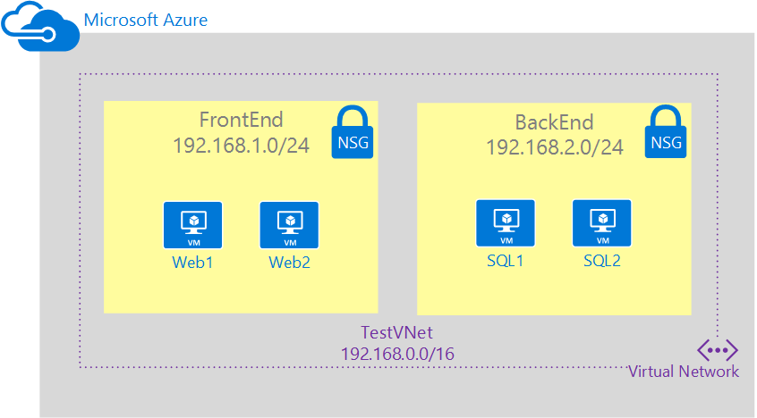

## Scénario

Pour mieux illustrer comment créer NSGs, ce document utilisera le scénario ci-dessous.

Dans ce scénario, vous allez créer un NSG de chaque sous réseau dans le réseau virtuel **TestVNet** , comme décrit ci-dessous : 

- **NSG FrontEnd**. Le serveur frontal NSG est appliquée au sous-réseau *FrontEnd* et contenir deux règles :  
    - **règle de rdp**. Cette règle autorise le trafic RDP au sous-réseau *FrontEnd* .
    - **règle web**. Cette règle autorise le trafic HTTP au sous-réseau *FrontEnd* .
- **NSG principal**. Le serveur principal NSG est appliquée au sous-réseau *principal* et contenir deux règles : 
    - **règle sql**. Cette règle autorise le trafic SQL uniquement à partir du sous-réseau *FrontEnd* .
    - **règle web**. Cette règle refuse liés à internet tout le trafic du sous-réseau *principal* .

La combinaison de ces règles créer un scénario j’aime DMZ, où le sous-réseau principal peut recevoir uniquement le trafic entrant pour SQL à partir du sous-réseau frontal et n’a pas accès à Internet, alors que le sous-réseau frontal peut communiquer avec Internet et recevoir les requêtes HTTP entrantes.
 
